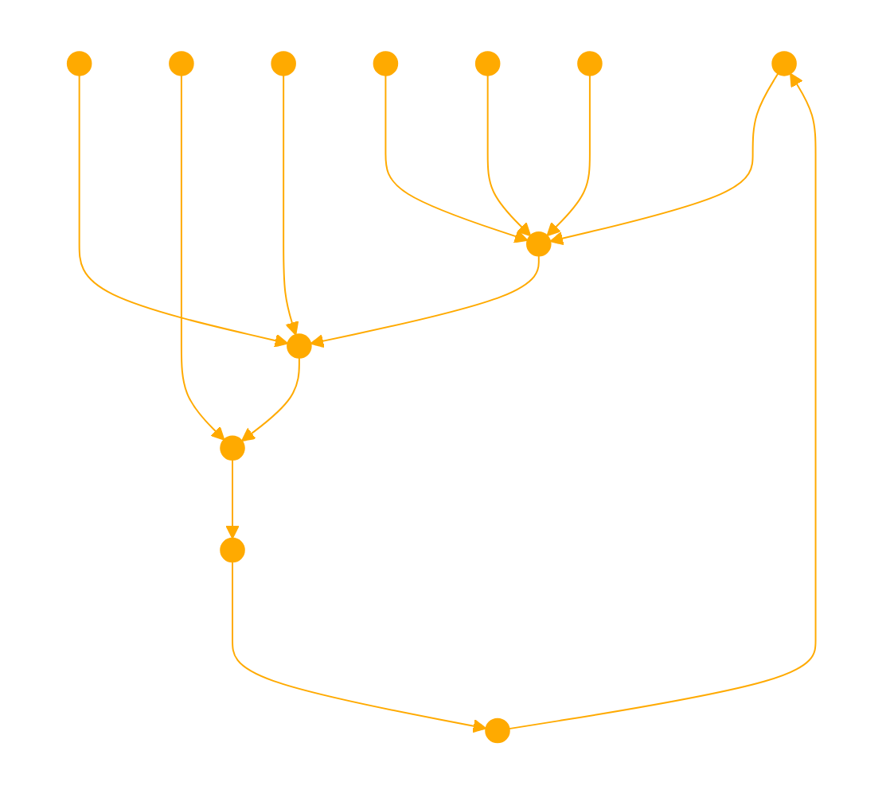

```mermaid
%%{init: {'theme': 'base', 'themeVariables': { 'primaryColor': '#ffaa00', 'primaryTextColor': '#ffaa00', 'primaryBorderColor': '#ffaa00', 'lineColor': '#ffaa00', 'secondaryColor': '#ffaa00', 'tertiaryColor': '#ffaa00', 'clusterBkg': 'none', 'clusterBorder': 'none', 'fontSize': '0px'}}}%%
graph TD
    A((A)) -->|Parse ABC Notation| B((B))
    B -->|Calculate Frequencies| C((C))
    C -->|Generate Sound Waves| D((D))
    D -->|Assemble Tune| E((E))
    E -->|Output WAV File| F((F))
    F -->|Feedback to Input| A
    
    G((G)) -->|Influence| C
    H((H)) -->|Used in| D
    I((I)) -->|Adjust| C
    J((J)) -->|Set Default Length| B
    K((K)) -->|Determine Tempo| B
    L((L)) -->|Fallback BPM| B
    
    subgraph Input
    A((A))
    end
    
    subgraph Process
    B((B))
    C((C))
    D((D))
    E((E))
    end
    
    subgraph Output
    F((F))
    end
    
    subgraph "Parameter Space"
    G((G))
    H((H))
    I((I))
    J((J))
    K((K))
    L((L))
    end
    

```
