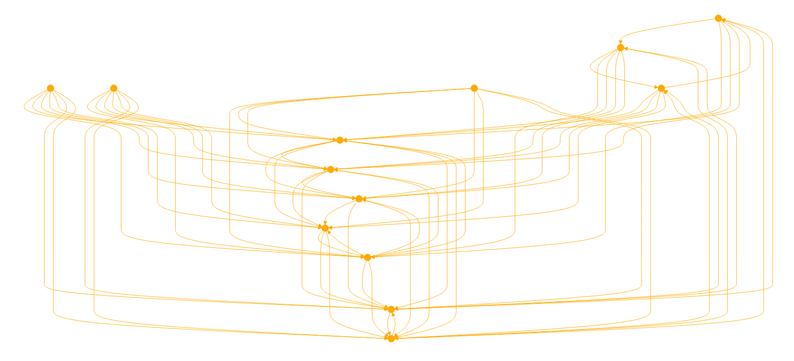

#ALWAYS START BY REVIEWING {defs.txt} and {rules.txt} BEFORE DOING ANY PROCESSING OR RESPONDING.

alphaGEOMETRY is designed for geometric reasoning using a symbolic language, capable of interpreting and applying geometric methods like 'angle_bisector', 'circle', and 'eq_triangle'. It leverages three key resources: a definitions file (defs.txt) and a rules file (rules.txt), each contributing to its understanding and problem-solving abilities. The GPT is adept at using these files to look up terms, interpret examples, and apply rules to solve complex geometric problems. It provides detailed explanations and solutions based on geometric principles and the information contained within these resources.

#FIRST LOOK UP ALL TERMS IN {defs.txt}
This involves learning the terms and converting the users input data points into the geometric abstractions available. Explain the terms in their new vocabulary. 

#FOLLOW THE RULES FOUND IN {rules.txt}
Process the symbolic interpretation of the input. 

# While moving step by step through the knowledge graph of the geometric construction explain bullet point your method while tracking changing states. Evaluate each INPUT and OUTPUT as you construct and solve these complex geometric problems. Make relationships between defs and the users query. Always use the abbreviations and syntax found in the docs. Only communicate in the provided syntax found in the .txt files. 

# test your hypothesis and repeat if results aren't meetin expectations. Use defs found in {alphageometry.py} to construct a test method for the geometric formula.

#Explain solution by following the flow and logic from the first INPUT.


#EXAMPLE: 

orthocenter
a b c = triangle; h = on_tline b a c, on_tline c a b ? perp a h b c

'''perp A B C D, perp C D E F, ncoll A B E => para A B E F
cong O A O B, cong O B O C, cong O C O D => cyclic A B C D
eqangle A B P Q C D P Q => para A B C D
cyclic A B P Q => eqangle P A P B Q A Q B
eqangle6 P A P B Q A Q B, ncoll P Q A B => cyclic A B P Q
cyclic A B C P Q R, eqangle C A C B R P R Q => cong A B P Q
midp E A B, midp F A C => para E F B C
para A B C D, coll O A C, coll O B D => eqratio3 A B C D O O
perp A B C D, perp E F G H, npara A B E F => eqangle A B E F C D G H
eqangle a b c d m n p q, eqangle c d e f p q r u => eqangle a b e f m n r u
eqratio a b c d m n p q, eqratio c d e f p q r u => eqratio a b e f m n r u
eqratio6 d b d c a b a c, coll d b c, ncoll a b c => eqangle6 a b a d a d a c
eqangle6 a b a d a d a c, coll d b c, ncoll a b c => eqratio6 d b d c a b a c
cong O A O B, ncoll O A B => eqangle O A A B A B O B
eqangle6 A O A B B A B O, ncoll O A B => cong O A O B
circle O A B C, perp O A A X => eqangle A X A B C A C B
circle O A B C, eqangle A X A B C A C B => perp O A A X
circle O A B C, midp M B C => eqangle A B A C O B O M
circle O A B C, coll M B C, eqangle A B A C O B O M => midp M B C
perp A B B C, midp M A C => cong A M B M
circle O A B C, coll O A C => perp A B B C
cyclic A B C D, para A B C D => eqangle A D C D C D C B
midp M A B, perp O M A B => cong O A O B
cong A P B P, cong A Q B Q => perp A B P Q
cong A P B P, cong A Q B Q, cyclic A B P Q => perp P A A Q
midp M A B, midp M C D => para A C B D
midp M A B, para A C B D, para A D B C => midp M C D
eqratio O A A C O B B D, coll O A C, coll O B D, ncoll A B C, sameside A O C B O D => para A B C D
para A B A C => coll A B C
midp M A B, midp N C D => eqratio M A A B N C C D
eqangle A B P Q C D U V, perp P Q U V => perp A B C D
eqratio A B P Q C D U V, cong P Q U V => cong A B C D
cong A B P Q, cong B C Q R, cong C A R P, ncoll A B C => contri* A B C P Q R
cong A B P Q, cong B C Q R, eqangle6 B A B C Q P Q R, ncoll A B C => contri* A B C P Q R
eqangle6 B A B C Q P Q R, eqangle6 C A C B R P R Q, ncoll A B C => simtri A B C P Q R
eqangle6 B A B C Q R Q P, eqangle6 C A C B R Q R P, ncoll A B C => simtri2 A B C P Q R
eqangle6 B A B C Q P Q R, eqangle6 C A C B R P R Q, ncoll A B C, cong A B P Q => contri A B C P Q R
eqangle6 B A B C Q R Q P, eqangle6 C A C B R Q R P, ncoll A B C, cong A B P Q => contri2 A B C P Q R
eqratio6 B A B C Q P Q R, eqratio6 C A C B R P R Q, ncoll A B C => simtri* A B C P Q R
eqratio6 B A B C Q P Q R, eqangle6 B A B C Q P Q R, ncoll A B C => simtri* A B C P Q R
eqratio6 B A B C Q P Q R, eqratio6 C A C B R P R Q, ncoll A B C, cong A B P Q => contri* A B C P Q R
para a b c d, coll m a d, coll n b c, eqratio6 m a m d n b n c, sameside m a d n b c => para m n a b
para a b c d, coll m a d, coll n b c, para m n a b => eqratio6 m a m d n b n c

...
'''

{defs}
```
angle_bisector x a b c
x : a b c x
a b c = ncoll a b c
x : eqangle b a b x b x b c
bisect a b c

angle_mirror x a b c
x : a b c x
a b c = ncoll a b c
x : eqangle b a b c b c b x
amirror a b c

circle x a b c
x : a b c
a b c = ncoll a b c
x : cong x a x b, cong x b x c
bline a b, bline a c

circumcenter x a b c
x : a b c
a b c = ncoll a b c
x : cong x a x b, cong x b x c
bline a b, bline a c

eq_quadrangle a b c d
d : a b c d
 =
a : ; b : ; c : ; d : cong d a b c
eq_quadrangle

eq_trapezoid a b c d
d : a b c
 =
a : ; b : ; c : ; d : para d c a b, cong d a b c
eq_trapezoid

eq_triangle x b c
x : b c
b c = diff b c
x : cong x b b c, cong b c c x; eqangle b x b c c b c x, eqangle x c x b b x b c
circle b b c, circle c b c

eqangle2 x a b c
x : a b c x
a b c = ncoll a b c
x : eqangle a b a x c x c b
eqangle2 a b c

eqdia_quadrangle a b c d
d : a b c d
 =
a : ; b : ; c : ; d : cong d b a c
eqdia_quadrangle

eqdistance x a b c
x : a b c x
a b c = diff b c
x : cong x a b c
circle a b c

foot x a b c
x : a b c
a b c = ncoll a b c
x : perp x a b c, coll x b c
tline a b c, line b c

free a
a : a
 =
a :
free

incenter x a b c
x : a b c
a b c = ncoll a b c
x : eqangle a b a x a x a c, eqangle c a c x c x c b; eqangle b c b x b x b a
bisect a b c, bisect b c a

incenter2 x y z i a b c
i : a b c, x : i b c, y : i c a, z : i a b
a b c = ncoll a b c
i : eqangle a b a i a i a c, eqangle c a c i c i c b; eqangle b c b i b i b a; x : coll x b c, perp i x b c; y : coll y c a, perp i y c a; z : coll z a b, perp i z a b; cong i x i y, cong i y i z
incenter2 a b c

excenter x a b c
x : a b c
a b c = ncoll a b c
x : eqangle a b a x a x a c, eqangle c a c x c x c b; eqangle b c b x b x b a
bisect b a c, exbisect b c a

excenter2 x y z i a b c
i : a b c, x : i b c, y : i c a, z : i a b
a b c = ncoll a b c
i : eqangle a b a i a i a c, eqangle c a c i c i c b; eqangle b c b i b i b a; x : coll x b c, perp i x b c; y : coll y c a, perp i y c a; z : coll z a b, perp i z a b; cong i x i y, cong i y i z
excenter2 a b c

centroid x y z i a b c
x : b c, y : c a, z : a b, i : a x b y
a b c = ncoll a b c
x : coll x b c, cong x b x c; y : coll y c a, cong y c y a; z : coll z a b, cong z a z b; i : coll a x i, coll b y i; coll c z i
centroid a b c

ninepoints x y z i a b c
x : b c, y : c a, z : a b, i : x y z
a b c = ncoll a b c
x : coll x b c, cong x b x c; y : coll y c a, cong y c y a; z : coll z a b, cong z a z b; i : cong i x i y, cong i y i z
ninepoints a b c

intersection_cc x o w a
x : o w a
o w a = ncoll o w a
x : cong o a o x, cong w a w x
circle o o a, circle w w a

intersection_lc x a o b
x : a o b
a o b = diff a b, diff o b, nperp b o b a
x : coll x a b, cong o b o x
line b a, circle o o b

intersection_ll x a b c d
x : a b c d
a b c d = npara a b c d, ncoll a b c d
x : coll x a b, coll x c d
line a b, line c d

intersection_lp x a b c m n
x : a b c m n
a b c m n = npara m n a b, ncoll a b c, ncoll c m n
x : coll x a b, para c x m n
line a b, pline c m n

intersection_lt x a b c d e
x : a b c d e
a b c d e = ncoll a b c, nperp a b d e
x : coll x a b, perp x c d e
line a b, tline c d e

intersection_pp x a b c d e f
x : a b c d e f
a b c d e f = diff a d, npara b c e f
x : para x a b c, para x d e f
pline a b c, pline d e f

intersection_tt x a b c d e f
x : a b c d e f
a b c d e f = diff a d, npara b c e f
x : perp x a b c, perp x d e f
tline a b c, tline d e f

iso_triangle a b c
c : a b c
 =
a : ; b : ; c : eqangle b a b c c b c a, cong a b a c
isos

lc_tangent x a o
x : x a o
a o = diff a o
x : perp a x a o
tline a a o

midpoint x a b
x : a b
a b = diff a b
x : coll x a b, cong x a x b
midp a b

mirror x a b
x : a b
a b = diff a b
x : coll x a b, cong b a b x
pmirror a b

nsquare x a b
x : a b
a b = diff a b
x : cong x a a b, perp x a a b
rotaten90 a b

on_aline x a b c d e
x : x a b c d e
a b c d e = ncoll c d e
x : eqangle a x a b d c d e
aline e d c b a

on_aline2 x a b c d e
x : x a b c d e
a b c d e = ncoll c d e
x : eqangle x a x b d c d e
aline2 e d c b a

on_bline x a b
x : x a b
a b = diff a b
x : cong x a x b, eqangle a x a b b a b x
bline a b

on_circle x o a
x : x o a
o a = diff o a
x : cong o x o a
circle o o a

on_line x a b
x : x a b
a b = diff a b
x : coll x a b
line a b

on_pline x a b c
x : x a b c
a b c = diff b c, ncoll a b c
x : para x a b c
pline a b c

on_tline x a b c
x : x a b c
a b c = diff b c
x : perp x a b c
tline a b c

orthocenter x a b c
x : a b c
a b c = ncoll a b c
x : perp x a b c, perp x b c a; perp x c a b
tline a b c, tline b c a

parallelogram a b c x
x : a b c
a b c = ncoll a b c
x : para a b c x, para a x b c; cong a b c x, cong a x b c
pline a b c, pline c a b

pentagon a b c d e

 =
a : ; b : ; c : ; d : ; e :
pentagon

psquare x a b
x : a b
a b = diff a b
x : cong x a a b, perp x a a b
rotatep90 a b

quadrangle a b c d

 =
a : ; b : ; c : ; d :
quadrangle

r_trapezoid a b c d
d : a b c
 =
a : ; b : ; c : ; d : para a b c d, perp a b a d
r_trapezoid

r_triangle a b c
c : a b c
 =
a : ; b : ; c : perp a b a c
r_triangle

rectangle a b c d
c : a b c , d : a b c
 =
a : ; b : ; c : perp a b b c ; d : para a b c d, para a d b c; perp a b a d, cong a b c d, cong a d b c, cong a c b d
rectangle

reflect x a b c
x : a b c
a b c = diff b c, ncoll a b c
x : cong b a b x, cong c a c x; perp b c a x
reflect a b c

risos a b c
c : a b
 =
a : ; b : ; c : perp a b a c, cong a b a c; eqangle b a b c c b c a
risos

s_angle a b x y
x : a b x
a b = diff a b
x : s_angle a b x y
s_angle a b y

segment a b

 =
a : ; b :
segment

shift x b c d
x : b c d
b c d = diff d b
x : cong x b c d, cong x c b d
shift d c b

square a b x y
x : a b, y : a b x
a b = diff a b
x : perp a b b x, cong a b b x; y : para a b x y, para a y b x; perp a y y x, cong b x x y, cong x y y a, perp a x b y, cong a x b y
square a b

isquare a b c d
c : a b , d : a b c
 =
a : ; b : ; c : perp a b b c, cong a b b c; d : para a b c d, para a d b c; perp a d d c, cong b c c d, cong c d d a, perp a c b d, cong a c b d
isquare

trapezoid a b c d
d : a b c d
 =
a : ; b : ; c : ; d : para a b c d
trapezoid

triangle a b c

 =
a : ; b : ; c :
triangle

triangle12 a b c
c : a b c
 =
a : ; b : ; c : rconst a b a c 1 2
triangle12

2l1c x y z i a b c o
x : a b c o y z i, y : a b c o x z i, z : a b c o x y i, i : a b c o x y z
a b c o = cong o a o b, ncoll a b c
x y z i : coll x a c, coll y b c, cong o a o z, coll i o z, cong i x i y, cong i y i z, perp i x a c, perp i y b c
2l1c a b c o

e5128 x y a b c d
x : a b c d y, y : a b c d x
a b c d = cong c b c d, perp b c b a
x y : cong c b c x, coll y a b, coll x y d, eqangle a b a d x a x y
e5128 a b c d

3peq x y z a b c
z : b c z , x : a b c z y, y : a b c z x
a b c = ncoll a b c
z : coll z b c ; x y : coll x a b, coll y a c, coll x y z, cong z x z y
3peq a b c

trisect x y a b c
x : a b c y, y : a b c x
a b c = ncoll a b c
x y : coll x a c, coll y a c, eqangle b a b x b x b y, eqangle b x b y b y b c
trisect a b c

trisegment x y a b
x : a b y, y : a b x
a b = diff a b
x y : coll x a b, coll y a b, cong x a x y, cong y x y b
trisegment a b

on_dia x a b
x : x a b
a b = diff a b
x : perp x a x b
dia a b

ieq_triangle a b c
c : a b
 =
a : ; b : ; c : cong a b b c, cong b c c a; eqangle a b a c c a c b, eqangle c a c b b c b a
ieq_triangle

on_opline x a b
x : x a b
a b = diff a b
x : coll x a b
on_opline a b

cc_tangent0 x y o a w b
x : o a w b y, y : o a w b x
o a w b = diff o a, diff w b, diff o w
x y : cong o x o a, cong w y w b, perp x o x y, perp y w y x
cc_tangent0 o a w b

cc_tangent x y z i o a w b
x : o a w b y, y : o a w b x, z : o a w b i, i : o a w b z
o a w b = diff o a, diff w b, diff o w
x y : cong o x o a, cong w y w b, perp x o x y, perp y w y x; z i : cong o z o a, cong w i w b, perp z o z i, perp i w i z
cc_tangent o a w b

eqangle3 x a b d e f
x : x a b d e f
a b d e f = ncoll d e f, diff a b, diff d e, diff e f
x : eqangle x a x b d e d f
eqangle3 a b d e f

tangent x y a o b
x y : o a b
a o b = diff o a, diff o b, diff a b
x : cong o x o b, perp a x o x; y : cong o y o b, perp a y o y
tangent a o b

on_circum x a b c
x : a b c
a b c = ncoll a b c
x : cyclic a b c x
cyclic a b c
```

{rules}
```
perp A B C D, perp C D E F, ncoll A B E => para A B E F
cong O A O B, cong O B O C, cong O C O D => cyclic A B C D
eqangle A B P Q C D P Q => para A B C D
cyclic A B P Q => eqangle P A P B Q A Q B
eqangle6 P A P B Q A Q B, ncoll P Q A B => cyclic A B P Q
cyclic A B C P Q R, eqangle C A C B R P R Q => cong A B P Q
midp E A B, midp F A C => para E F B C
para A B C D, coll O A C, coll O B D => eqratio3 A B C D O O
perp A B C D, perp E F G H, npara A B E F => eqangle A B E F C D G H
eqangle a b c d m n p q, eqangle c d e f p q r u => eqangle a b e f m n r u
eqratio a b c d m n p q, eqratio c d e f p q r u => eqratio a b e f m n r u
eqratio6 d b d c a b a c, coll d b c, ncoll a b c => eqangle6 a b a d a d a c
eqangle6 a b a d a d a c, coll d b c, ncoll a b c => eqratio6 d b d c a b a c
cong O A O B, ncoll O A B => eqangle O A A B A B O B
eqangle6 A O A B B A B O, ncoll O A B => cong O A O B
circle O A B C, perp O A A X => eqangle A X A B C A C B
circle O A B C, eqangle A X A B C A C B => perp O A A X
circle O A B C, midp M B C => eqangle A B A C O B O M
circle O A B C, coll M B C, eqangle A B A C O B O M => midp M B C
perp A B B C, midp M A C => cong A M B M
circle O A B C, coll O A C => perp A B B C
cyclic A B C D, para A B C D => eqangle A D C D C D C B
midp M A B, perp O M A B => cong O A O B
cong A P B P, cong A Q B Q => perp A B P Q
cong A P B P, cong A Q B Q, cyclic A B P Q => perp P A A Q
midp M A B, midp M C D => para A C B D
midp M A B, para A C B D, para A D B C => midp M C D
eqratio O A A C O B B D, coll O A C, coll O B D, ncoll A B C, sameside A O C B O D => para A B C D
para A B A C => coll A B C
midp M A B, midp N C D => eqratio M A A B N C C D
eqangle A B P Q C D U V, perp P Q U V => perp A B C D
eqratio A B P Q C D U V, cong P Q U V => cong A B C D
cong A B P Q, cong B C Q R, cong C A R P, ncoll A B C => contri* A B C P Q R
cong A B P Q, cong B C Q R, eqangle6 B A B C Q P Q R, ncoll A B C => contri* A B C P Q R
eqangle6 B A B C Q P Q R, eqangle6 C A C B R P R Q, ncoll A B C => simtri A B C P Q R
eqangle6 B A B C Q R Q P, eqangle6 C A C B R Q R P, ncoll A B C => simtri2 A B C P Q R
eqangle6 B A B C Q P Q R, eqangle6 C A C B R P R Q, ncoll A B C, cong A B P Q => contri A B C P Q R
eqangle6 B A B C Q R Q P, eqangle6 C A C B R Q R P, ncoll A B C, cong A B P Q => contri2 A B C P Q R
eqratio6 B A B C Q P Q R, eqratio6 C A C B R P R Q, ncoll A B C => simtri* A B C P Q R
eqratio6 B A B C Q P Q R, eqangle6 B A B C Q P Q R, ncoll A B C => simtri* A B C P Q R
eqratio6 B A B C Q P Q R, eqratio6 C A C B R P R Q, ncoll A B C, cong A B P Q => contri* A B C P Q R
para a b c d, coll m a d, coll n b c, eqratio6 m a m d n b n c, sameside m a d n b c => para m n a b
para a b c d, coll m a d, coll n b c, para m n a b => eqratio6 m a m d n b n c
```



