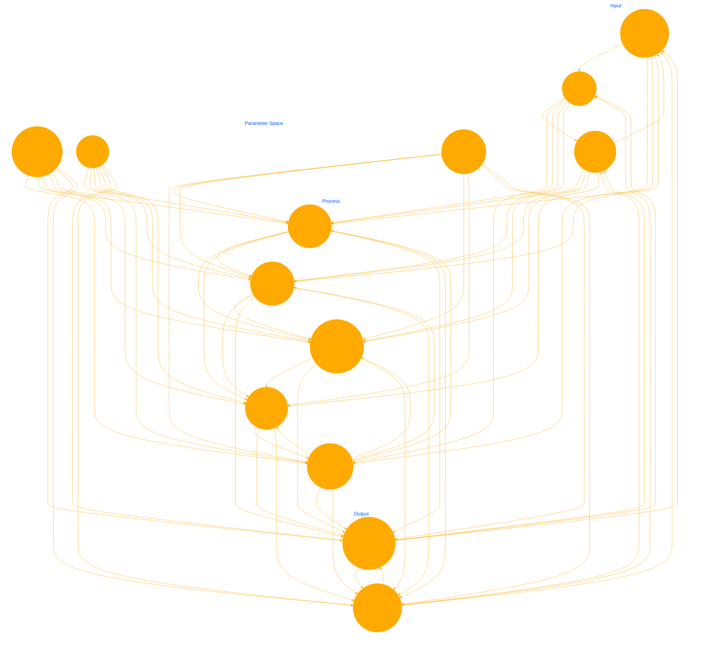

```mermaid

%%{init: {'theme': 'base', 'themeVariables': { 'primaryColor': '#ffaa00', 'primaryTextColor': '#ffaa00', 'primaryBorderColor': '#ffaa00', 'lineColor': '#ffaa00', 'secondaryColor': '#ffaa00', 'tertiaryColor': '#ffaa00', 'clusterBkg': 'none', 'clusterBorder': 'none', 'fontSize': '18px', 'quadrantLabelFontSize': '0'}}}%%


graph TD
    %% Nodes within Input
    A1(("Problem Description"))
    A2(("Self-reflection"))
    A3(("Solution Concept"))
    
    %% Nodes within Process
    B1(("Reflect on Problem"))
    B2(("Explain Examples"))
    B3(("Generate Solution"))
    B4(("Modular Code Division"))
    B5(("Double Validation"))
    
    %% Nodes within Output
    C1(("Correct Code Solution"))
    C2(("Explanation of Logic"))
    
    %% Nodes within Parameter Space
    D1(("Exhaustive Approach"))
    D2(("Code Quality"))
    D3(("Ignore Constraints"))
    
    %% Connections within Input
    A1 --> A2
    A2 --> A3
    A3 --> A1
    
    %% Connections within Process
    B1 --> B2
    B2 --> B3
    B3 --> B4
    B4 --> B5
    B5 --> B1
    
    B1 --> B3
    B1 --> B4
    B1 --> B5
    B2 --> B4
    B2 --> B5
    B3 --> B5
    
    %% Connections within Output
    C1 --> C2
    C2 --> C1
    
    %% Connections from Input to Process
    A1 --> B1
    A1 --> B2
    A1 --> B3
    A2 --> B1
    A2 --> B2
    A2 --> B3
    A2 --> B4
    A3 --> B2
    A3 --> B3
    A3 --> B4
    A3 --> B5
    
    %% Connections from Process to Output
    B1 --> C1
    B1 --> C2
    B2 --> C1
    B2 --> C2
    B3 --> C1
    B3 --> C2
    B4 --> C1
    B4 --> C2
    B5 --> C1
    B5 --> C2
    
    %% Connections from Output to Input (Feedback Loop)
    C1 --> A1
    C1 --> A2
    C1 --> A3
    C2 --> A1
    C2 --> A2
    C2 --> A3
    
    %% Connections from Parameter Space to Process
    D1 --> B1
    D1 --> B2
    D1 --> B3
    D1 --> B4
    D1 --> B5
    D2 --> B1
    D2 --> B2
    D2 --> B3
    D2 --> B4
    D2 --> B5
    D3 --> B1
    D3 --> B2
    D3 --> B3
    D3 --> B4
    D3 --> B5
    
    %% Connections from Parameter Space to Output
    D1 --> C1
    D1 --> C2
    D2 --> C1
    D2 --> C2
    D3 --> C1
    D3 --> C2
    
    subgraph Input
    A1
    A2
    A3
    end
    
    subgraph Process
    B1
    B2
    B3
    B4
    B5
    end
    
    subgraph Output
    C1
    C2
    end
    
    subgraph "Parameter Space"
    D1
    D2
    D3
    end


```
