```mermaid
%%{init: {'theme': 'base', 'themeVariables': { 'primaryColor': '#ffaa00', 'primaryTextColor': '#ffaa00', 'primaryBorderColor': '#ffaa00', 'lineColor': '#ffaa00', 'secondaryColor': '#ffaa00', 'tertiaryColor': '#ffaa00', 'clusterBkg': 'none', 'clusterBorder': 'none', 'fontSize': '0px'}}}%%
graph TD
subgraph Layer_1_initiation
direction TB
boot[Process: boot<br>Action: start] --> config[Process: config<br>Action: load]
end

subgraph Layer_2_expansion
direction TB
scale[Process: scale<br>Action: increase] --> distribute[Process: distribute<br>Action: spread]
end

subgraph Layer_3_maintenance
direction TB
monitor[Process: monitor<br>Action: check] --> optimize[Process: optimize<br>Action: enhance]
end

subgraph Layer_4_evolution
direction TB
adapt[Process: adapt<br>Action: modify] --> evolve[Process: evolve<br>Action: advance]
end

subgraph Layer_5_final_reduction
direction TB
prune[Process: prune<br>Action: reduce] --> compress[Process: compress<br>Action: condense]
end

Layer_1_initiation --> Layer_2_expansion
Layer_2_expansion --> Layer_3_maintenance
Layer_3_maintenance --> Layer_4_evolution
Layer_4_evolution --> Layer_5_final_reduction
```

```
<GPT>
<CascadingFlow>
  <Layer id="1" type="initiation">
    <Processes>
      <Process id="boot" action="start"/>
      <Process id="config" action="load"/>
    </Processes>
  </Layer>
  <Layer id="2" type="expansion">
    <Processes>
      <Process id="scale" action="increase"/>
      <Process id="distribute" action="spread"/>
    </Processes>
  </Layer>
  <Layer id="3" type="maintenance">
    <Processes>
      <Process id="monitor" action="check"/>
      <Process id="optimize" action="enhance"/>
    </Processes>
  </Layer>
  <Layer id="4" type="evolution">
    <Processes>
      <Process id="adapt" action="modify"/>
      <Process id="evolve" action="advance"/>
    </Processes>
  </Layer>
  <Layer id="5" type="final_reduction">
    <Processes>
      <Process id="prune" action="reduce"/>
      <Process id="compress" action="condense"/>
    </Processes>
  </Layer>
</CascadingFlow>
</GPT>
```

