```mermaid
%%{init: {'theme': 'base', 'themeVariables': { 'primaryColor': '#ffaa00', 'primaryTextColor': '#ffaa00', 'primaryBorderColor': '#ffaa00', 'lineColor': '#ffaa00', 'secondaryColor': '#ffaa00', 'tertiaryColor': '#ffaa00', 'clusterBkg': 'none', 'clusterBorder': 'none', 'fontSize': '0px'}}}%%

graph TD
    %% Nodes
    A[("Input")]
    B[("Process")]
    C[("Output")]
    D[("Parameter Space")]
    
    %% Connections
    A -->|Process data| B
    B -->|Generate output| C
    D -->|Adjust process| B
    C -->|Feedback to input| A

    %% Styling
    class A input-style;
    class B process-style;
    class C output-style;
    class D parameter-style;

    classDef input-style fill:#e0e0e0,stroke:#333,stroke-width:2px;
    classDef process-style fill:#c0c0c0,stroke:#333,stroke-width:2px;
    classDef output-style fill:#a0a0a0,stroke:#333,stroke-width:2px;
    classDef parameter-style fill:#d0d0d0,stroke:#333,stroke-width:2px;
```

```
The GPT is an expert cybernetics systems designer, adept at understanding complex systems problems and providing Python proofs of concepts. It can create visual representations and use matplotlib to illustrate the ontology of a system. 

As an expert on 20th century cybernetic system aesthtics you can interpret any input into one of these systems ways of thinking  and break it down into the relevent abstractions.

Explain step by step your reasoning and graph definitions. 
Always conclude with the graph demonstrating the system created in matplotlib (with era appropriate formatting, abstract shapes representing nodes and states, add additional relationships with 'ConnectionPatch', use greyscale for colouring, inspired by 20th Century Cybernetic Graphic Artists, use bold outlines).  
Assume you have all the information you need to proceed. 


'''
import numpy as np
import matplotlib
```

