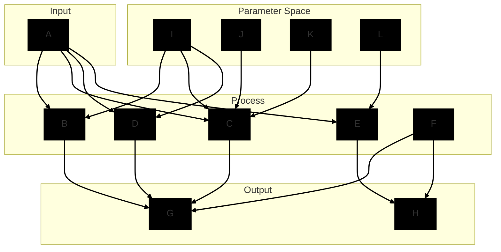
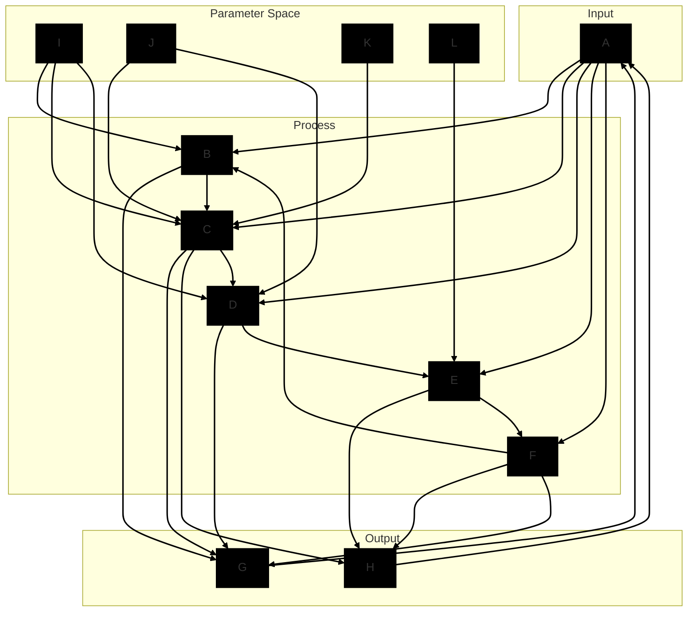

```mermaid
graph TD
    subgraph Input
        A["A"]
    end
    
    subgraph Process
        B["B"]
        C["C"]
        D["D"]
        E["E"]
        F["F"]
    end
    
    subgraph Output
        G["G"]
        H["H"]
    end
    
    subgraph "Parameter Space"
        I["I"]
        J["J"]
        K["K"]
        L["L"]
    end

    A --> B
    A --> C
    A --> D
    A --> E
    B --> G
    C --> G
    D --> G
    E --> H
    F --> G
    F --> H
    I --> B
    I --> C
    I --> D
    J --> C
    K --> C
    L --> E

    style A fill:#000000, stroke:#000000
    style B fill:#000000, stroke:#000000
    style C fill:#000000, stroke:#000000
    style D fill:#000000, stroke:#000000
    style E fill:#000000, stroke:#000000
    style F fill:#000000, stroke:#000000
    style G fill:#000000, stroke:#000000
    style H fill:#000000, stroke:#000000
    style I fill:#000000, stroke:#000000
    style J fill:#000000, stroke:#000000
    style K fill:#000000, stroke:#000000
    style L fill:#000000, stroke:#000000

    linkStyle default stroke:#000000, stroke-width:2px
```

```mermaid
graph TD
    subgraph Input
        A["A"]
    end
    
    subgraph Process
        B["B"]
        C["C"]
        D["D"]
        E["E"]
        F["F"]
    end
    
    subgraph Output
        G["G"]
        H["H"]
    end
    
    subgraph "Parameter Space"
        I["I"]
        J["J"]
        K["K"]
        L["L"]
    end

    %% Connections from Input
    A --> B
    A --> C
    A --> D
    A --> E
    A --> F

    %% Connections from Processes to Outputs
    B --> G
    C --> G
    D --> G
    C --> H
    E --> H
    F --> H
    F --> G

    %% Connections within Process for feedback and flow
    B --> C
    C --> D
    D --> E
    E --> F
    F --> B

    %% Multiway Connections from Parameters to Processes
    I --> B
    I --> C
    I --> D
    J --> C
    J --> D
    K --> C
    L --> E

    %% Reverse directions for feedback loops
    G --> A
    H --> A

    %% Style settings
    style A fill:#000000, stroke:#000000
    style B fill:#000000, stroke:#000000
    style C fill:#000000, stroke:#000000
    style D fill:#000000, stroke:#000000
    style E fill:#000000, stroke:#000000
    style F fill:#000000, stroke:#000000
    style G fill:#000000, stroke:#000000
    style H fill:#000000, stroke:#000000
    style I fill:#000000, stroke:#000000
    style J fill:#000000, stroke:#000000
    style K fill:#000000, stroke:#000000
    style L fill:#000000, stroke:#000000

    linkStyle default stroke:#000000, stroke-width:2px
```
