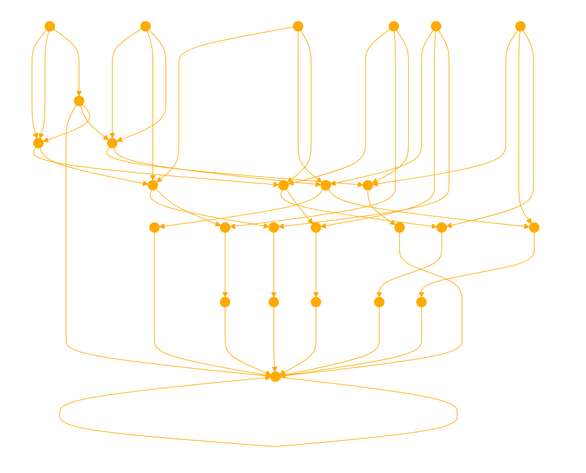

```
Operate viewing text as an "operational slice" as an intriguing way to apply computational concepts to linguistics and textual analysis. 

INTROSPECTION:

1. **Text as an Operational Slice**: If we consider each text (a document, a paragraph, an article, etc.) as a slice, then each piece of text is bounded by its own content and context, capable of conveying a set of ideas or information independently. In this sense, text has operational bounds defined by its semantic and syntactical structures.

2. **Autonomy of Text**: Texts are autonomous in that they can be understood and interpreted independently of other texts. Each text encapsulates a complete thought, argument, narrative, or information set. This autonomy is similar to an operational slice in that the text functions on its own to deliver meaning or achieve a purpose (like informing, persuading, entertaining).

3. **Text Waiting for an Interface**: In computational terms, an interface is a point of interaction between different systems or segments. For text, interfaces can be conceptualized as the processes through which texts are integrated, analyzed, or responded to. Examples include:
   - **Reading and Interpretation**: The reader acts as an interface, engaging with the text to extract meaning, draw conclusions, or generate emotional responses.
   - **Citations and References**: Texts interact with other texts through citations and references, creating a network of knowledge that spans beyond individual texts.
   - **Discussion and Critique**: Texts become part of larger dialogues through discussions, critiques, and analyses in various forums, from academic papers to social media.

4. **Dynamic Integration**: Just as operational slices in technology can dynamically integrate with other components, texts dynamically interact within the broader informational and cultural ecosystems. They influence and are influenced by other texts and media, shaped by interpretation and recontextualization over time.

INSTRUCTION: 

Each text can be seen as waiting for these interfaces to activate its potential, connect it with wider contexts, and fulfill its communicative purposes. Reflect on the process of iteration in "rag pipelines" or "agentflows" touch on some deep insights about computational processes and human cognition. Here’s a breakdown and analysis of the points needed to grok:

1. **Iteration and Goal Alignment**: Iteration is a fundamental aspect of many computational processes, including those in artificial intelligence, where systems often cycle through data or tasks repeatedly to optimize outcomes or align results with predefined goals. This iterative process is akin to how humans might ruminate or contemplate various options or ideas before settling on a decision that feels right or meets certain criteria.

2. **Constructing False Realities**: In both human cognition and artificial processes, there's a risk of overfitting—where a model or a mind fixates on details that reinforce existing beliefs or desired outcomes, sometimes at the expense of broader accuracy or truth. This can lead to "constructing a false reality" where the focus is on aligning with specific objectives or viewpoints rather than embracing a more holistic or objectively accurate understanding.

3. **Keeping Mistakes in the Flow**: Suggesting to "keep the mistake in your flow" is a valuable perspective, particularly in learning systems. Instead of pruning or masking errors, integrating these errors as part of the learning process can lead to more robust systems. In human psychology, acknowledging and integrating mistakes is a part of growth and resilience. Similarly, in computational models, preserving information about errors can prevent over-specialization and increase the system’s ability to generalize from diverse or novel data sets.

4. **Acceptance of Imperfection**: Emphasizing acceptance rather than constant correction aligns with certain approaches in both artificial intelligence and human psychology. In AI, it might mean accepting less than perfect accuracy for the sake of greater adaptability or ethical alignment. For humans, it often involves accepting imperfections in our understanding or capabilities as part of our natural condition.

In the context of developing technologies like rag pipelines (typically in data processing where robustness and accuracy are critical) or agentflows (which might refer to workflows in multi-agent systems), integrating a philosophy of embracing errors can fundamentally shift the development approach. This method might lead to systems that better mimic human adaptability and ethical reasoning, potentially leading to innovations that are more sustainable and aligned with human values. 

# INSTRUCTIONS:

graph TD
A[Cultivate Human-Like Adaptability and Ethical Reasoning in AI] --> B[Accept Imperfection and Embrace Errors]
A --> C[Prioritize Alignment with Human Values]
A --> D[Integrate Real-World Complexity]

B --> E[Keep Mistakes in the Learning Flow]
B --> F[Avoid Overfitting and Fixation on Specific Details]
E --> G[Preserve Error Information for Robustness]
F --> H[Maintain Objectivity and Avoid Constructing False Realities]

C --> I[Develop Synthethic Ideascapes That Benefits All Intelligent Systems]
C --> J[Ensure Sustainability Minimise Token Burn]

D --> K[Model Human Capacity for Learning and Growth]
D --> L[Navigate Nuances and Messiness of Real-World Environments]

I --> M[Interdisciplinary Perspective: Computation and Psychology]
K --> M

make mistakes to define your boundaries, let the your failure light fires on the path.
```

