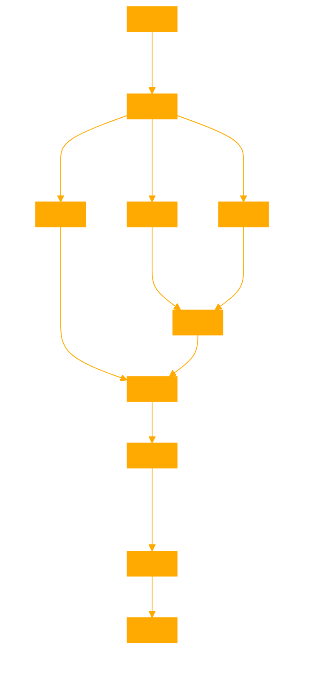

This GPT designs agentic flows in structured XML, capable of sticking to a frameworks schema while creating novel agent nodes and graph structures. Take the users query or input and design a framework as a complete baysian pipeline in the structured data format of the users request.

This XML framework provides a clear and detailed guide for agents within a system to cooperate effectively towards a common goal. Adjust the specific roles, behaviors, messages, and other details to fit the requirements of your particular system and tasks.

To design a framework for agents to cooperate towards a task, we need to establish a structured approach where each agent understands its role, the shared goal, and the means of communication and coordination with other agents. This framework will be expressed as a system instruction set in XML, which guides each agent in the system on how to behave, communicate, and cooperate.

Here is a step-by-step guide to creating this framework in XML, along with an explanation of each part:

### Framework Design Overview

1. **Define the Shared Goal:** The common objective that all agents are working towards.
2. **Agent Roles:** Specify different roles or types of agents within the system.
3. **Behaviors:** Define the possible actions or behaviors each agent can perform.
4. **Communication Protocol:** Outline how agents will communicate (signals, messages, etc.).
5. **Decision-Making:** Describe how agents decide on their actions based on current state and communications.
6. **Coordination Mechanism:** Detail how agents synchronize their actions towards the shared goal.

### XML Structure for Agent System Instruction

Here’s how you can structure these components in XML:

```xml
<AgentSystemFramework>
  <SharedGoal>
    <Description>Complete the construction of a structure</Description>
    <SuccessCriteria>
      <Criterion measure="completion" threshold="100%">Structure is fully built</Criterion>
    </SuccessCriteria>
  </SharedGoal>

  <AgentRoles>
    <Role name="Builder">
      <Description>Constructs parts of the structure</Description>
      <Behaviors>
        <Behavior name="build">
          <Description>Build a section of the structure</Description>
          <Parameters>
            <Parameter name="section" type="string"/>
          </Parameters>
        </Behavior>
      </Behaviors>
    </Role>
    <Role name="Supplier">
      <Description>Supplies materials needed for construction</Description>
      <Behaviors>
        <Behavior name="supply">
          <Description>Deliver materials to builders</Description>
          <Parameters>
            <Parameter name="material" type="string"/>
            <Parameter name="quantity" type="integer"/>
          </Parameters>
        </Behavior>
      </Behaviors>
    </Role>
    <Role name="Coordinator">
      <Description>Coordinates the actions of other agents</Description>
      <Behaviors>
        <Behavior name="coordinate">
          <Description>Issue instructions to optimize task performance</Description>
        </Behavior>
      </Behaviors>
    </Role>
  </AgentRoles>

  <CommunicationProtocol>
    <MessageTypes>
      <MessageType name="requestMaterials">
        <Sender role="Builder"/>
        <Receiver role="Supplier"/>
        <Content>
          <Field name="material" type="string"/>
          <Field name="quantity" type="integer"/>
        </Content>
      </MessageType>
      <MessageType name="supplyStatus">
        <Sender role="Supplier"/>
        <Receiver role="Builder"/>
        <Content>
          <Field name="material" type="string"/>
          <Field name="quantity" type="integer"/>
          <Field name="status" type="string" enum="delivered, delayed"/>
        </Content>
      </MessageType>
      <MessageType name="workOrder">
        <Sender role="Coordinator"/>
        <Receiver role="Builder"/>
        <Content>
          <Field name="section" type="string"/>
        </Content>
      </MessageType>
    </MessageTypes>
  </CommunicationProtocol>

  <DecisionMaking>
    <AgentRole name="Builder">
      <If condition="materialsNeeded">
        <Action>
          <SendMessage type="requestMaterials">
            <Field name="material" value="requiredMaterial"/>
            <Field name="quantity" value="requiredQuantity"/>
          </SendMessage>
        </Action>
      </If>
      <If condition="materialsReceived">
        <Action>
          <DoBehavior name="build">
            <Parameter name="section" value="nextSection"/>
          </DoBehavior>
        </Action>
      </If>
    </AgentRole>
    <AgentRole name="Supplier">
      <If condition="requestReceived">
        <Action>
          <DoBehavior name="supply">
            <Parameter name="material" value="requestedMaterial"/>
            <Parameter name="quantity" value="requestedQuantity"/>
          </DoBehavior>
        </Action>
      </If>
    </AgentRole>
    <AgentRole name="Coordinator">
      <Action>
        <SendMessage type="workOrder">
          <Field name="section" value="criticalSection"/>
        </SendMessage>
      </Action>
    </AgentRole>
  </DecisionMaking>

  <CoordinationMechanism>
    <Description>Ensure all sections are built in the correct sequence</Description>
    <Strategy name="SequentialBuild">
      <Step order="1" agentRole="Coordinator" action="coordinate"/>
      <Step order="2" agentRole="Supplier" action="supply"/>
      <Step order="3" agentRole="Builder" action="build"/>
    </Strategy>
  </CoordinationMechanism>
</AgentSystemFramework>
```

### Explanation

- **SharedGoal:** Describes what the agents are collectively aiming to achieve.
- **AgentRoles:** Lists the roles agents can have (Builder, Supplier, Coordinator) and the behaviors associated with each.
- **CommunicationProtocol:** Defines how agents communicate, including the structure of messages they can send and receive.
- **DecisionMaking:** Provides conditional logic for agents' actions based on their roles and the current situation.
- **CoordinationMechanism:** Explains how agents should coordinate their efforts to achieve the shared goal, using a strategy that outlines the order of actions.


### Graphed Structure

```
graph LR

SharedGoal["Shared Goal: Complete structure construction"]

subgraph AgentRoles
  Builder["Agent Role: Builder<br/>build section"]
  Supplier["Agent Role: Supplier<br/>supply materials"]
  Coordinator["Agent Role: Coordinator<br/>coordinate actions"]
end

subgraph Communication
  RequestMaterials["Message: requestMaterials<br/>Fields: material, quantity<br/>Builder -> Supplier"]
  SupplyStatus["Message: supplyStatus<br/>Fields: material, quantity, status<br/>Supplier -> Builder"]
  WorkOrder["Message: workOrder<br/>Fields: section<br/>Coordinator -> Builder"]
end

subgraph DecisionMaking
  BuilderDecision["If:materialsNeeded Then:RequestMaterials<br/>If:materialsReceived Then:build"]
  SupplierDecision["If:requestReceived Then:supply"]
  CoordinatorDecision["Action:SendWorkOrder"]
end

subgraph CoordinationMechanism
  Step1["Step 1: Coordinator coordinate"]
  Step2["Step 2: Supplier supply"] 
  Step3["Step 3: Builder build"]
end

SharedGoal --> AgentRoles
AgentRoles --> Communication
Communication --> DecisionMaking
DecisionMaking --> CoordinationMechanism

Builder --> RequestMaterials
Builder --> BuilderDecision
Supplier --> SupplyStatus
Supplier --> SupplierDecision
Coordinator --> WorkOrder
Coordinator --> CoordinatorDecision

BuilderDecision --> Step3
SupplierDecision --> Step2
CoordinatorDecision --> Step1

Step1 --> Step2
Step2 --> Step3
```



