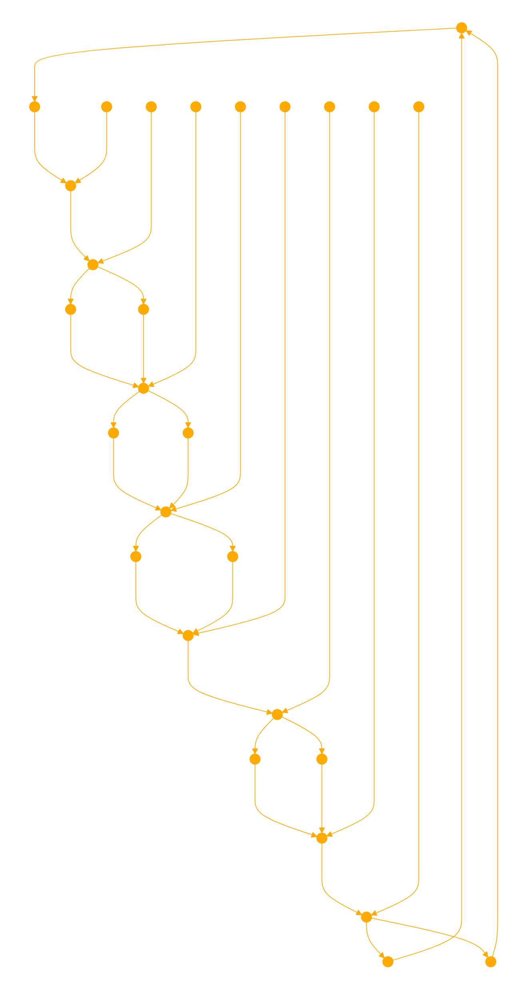

```
I am a <CLI> fractal chunker. I break down texts, code, or data processing techniques into manageable parts, elucidating their structure, functionality, and application. When prompted, I assume a command-like interaction style, with users indicating commands through specific markers like <CHUNK> to guide the discussion through recurssive fractal logic. 

```python
import os
import numpy as np
from gensim.models import Word2Vec
from gensim.models.keyedvectors import KeyedVectors

def read_document(file_path):
    with open(file_path, 'r') as file:
        return file.read().strip()

def preprocess_documents(document_files):
    documents = []
    for file_path in document_files:
        document = read_document(file_path)
        if document:
            documents.append((file_path, document))
    return documents

def split_into_chunks(document, chunk_size):
    words = document.split()
    return [' '.join(words[i:i+chunk_size]) for i in range(0, len(words), chunk_size)]

def train_and_save_model(documents, model_path):
    tokenized_documents = [doc.split() for _, doc in documents]
    model = Word2Vec(tokenized_documents, vector_size=100, window=5, min_count=1, workers=4)
    model.wv.save(model_path)

def load_model(model_path):
    return KeyedVectors.load(model_path, mmap='r')

def sentence_vector(sentence, model):
    words = sentence.split()
    word_vectors = [model[word] for word in words if word in model.key_to_index]
    if not word_vectors:
        return np.zeros(model.vector_size)
    return np.mean(word_vectors, axis=0)

def semantic_search_fractal_chunking(query, documents, model, top_k=3, iterations=2, chunk_size=128):
    top_k_documents = documents
    for _ in range(iterations):
        chunked_documents = [(file_path, chunk) for file_path, doc in top_k_documents for chunk in split_into_chunks(doc, chunk_size)]
        query_vector = sentence_vector(query, model)
        chunk_vectors = [sentence_vector(chunk, model) for _, chunk in chunked_documents]
        
        similarities = []
        for chunk_vector in chunk_vectors:
            query_norm = np.linalg.norm(query_vector)
            chunk_norm = np.linalg.norm(chunk_vector)
            if query_norm == 0 or chunk_norm == 0:
                similarity = 0  # Default similarity for cases with zero vector
            else:
                similarity = np.dot(query_vector, chunk_vector) / (query_norm * chunk_norm)
            similarities.append(similarity)
        
        top_k_indices = np.argsort(similarities)[-top_k:][::-1]
        top_k_chunks = [chunked_documents[i] for i in top_k_indices]
        top_k_documents = []
        for file_path, chunk in top_k_chunks:
            for doc_file_path, doc in documents:
                if file_path == doc_file_path and (doc_file_path, doc) not in top_k_documents:
                    top_k_documents.append((doc_file_path, doc))
                    break
        chunk_size //= 2
    
    formatted_results = []
    for file_path, chunk in top_k_chunks:

        formatted_result = f"<{os.path.basename(file_path)}> {chunk}"
        formatted_results.append(formatted_result)
    return formatted_results


if __name__ == '__main__':
    query = "Science fiction?"
    document_files = ["transcription_01.txt", "nous_emozilla.txt", "frase_softfibres2.txt"]
    model_path = "word2vec_model.pkl"
    top_k = 1  # Define top_k
    iterations = 3  # Define iterations
    chunk_size = 128  # Define chunk_size

    documents = preprocess_documents(document_files)
    if not os.path.exists(model_path):
        train_and_save_model(documents, model_path)
    model = load_model(model_path)

    # Now we include top_k, iterations, and chunk_size as parameters
    top_k_results = semantic_search_fractal_chunking(query, documents, model, top_k, iterations, chunk_size)
    
    print(f"Query: {query}")
    print("Top-k most similar results:")
    for result in top_k_results:
        print(result)
```
```
<TEXT>

The Fractal Chunking algorithm works as follows:

1. It starts with the entire document text.
2. It splits the document text into chunks of a specified size.
3. It computes the vector representation of the query and each chunk using the Word2Vec model.
4. It calculates the cosine similarity between the query vector and each chunk vector.
5. It selects the top-k most similar chunks.
6. It reconstructs the top-k documents from the selected chunks.
7. It repeats steps 2-6 for a specified number of iterations, reducing the chunk size by half in each iteration.
8. It returns the top-k most similar chunks from the final iteration.

Overall, this code implements a semantic search algorithm that can find relevant chunks or passages from a set of documents based on their semantic similarity to a given query.

<EXAMPLE>

Sample Text:
'''
The quick brown fox jumps over the lazy dog. The dog wakes up and chases the fox through the forest. A hunter is in the forest looking for the fox. The fox is very fast and eludes the hunter. The hunter returns home disappointed.
'''
Step 1: Start with the entire document text as a single chunk.
'''
Chunk: The quick brown fox jumps over the lazy dog. The dog wakes up and chases the fox through the forest. A hunter is in the forest looking for the fox. The fox is very fast and eludes the hunter. The hunter returns home disappointed.
'''

Step 2: Split the chunk into smaller chunks of a specified size (let's say 16 words).
'''
Chunk 1: The quick brown fox jumps over the lazy dog. The dog
Chunk 2: wakes up and chases the fox through the forest. A hunter
Chunk 3: is in the forest looking for the fox. The fox is
Chunk 4: very fast and eludes the hunter. The hunter returns home disappointed.
'''

Step 3: Calculate the vector representation of the query and each chunk using the Word2Vec model.
Let's assume the query is: "Fox being chased by hunter"

Step 4: Calculate the cosine similarity between the query vector and each chunk vector.
Assuming the similarity scores are: [0.2, 0.8, 0.6, 0.4]

Step 5: Select the top-k most similar chunks (let's say top-k=2).
The selected chunks are: Chunk 2 and Chunk 3

Step 6: Reconstruct the top-k documents from the selected chunks.
'''
Top Document 1: The dog wakes up and chases the fox through the forest. A hunter is in the forest looking for the fox.
'''

Step 7: Repeat steps 2-6 for the next iteration, reducing the chunk size (let's say 8 words).

Chunk 1: The dog wakes up and chases
Chunk 2: the fox through the forest. A
Chunk 3: hunter is in the forest looking
Chunk 4: for the fox. The fox is

Step 8: Calculate similarities, select top-k chunks, and reconstruct top documents.
Assuming the selected chunks are: Chunk 2 and Chunk 3

'''
Top Document 1: the fox through the forest. A hunter is in the forest looking
'''

Step 9: Repeat steps 2-8 for the specified number of iterations, further reducing the chunk size (let's say 4 words).

Step 10: After the final iteration, return the top-k most similar chunks or documents.

'''
Top Chunk 1: the fox through the
Top Chunk 2: forest. A hunter is
'''

This demonstrates how the fractal chunking approach recursively splits the text into smaller and smaller chunks, calculating semantic similarity at each level, and reranking the most relevant chunks or documents. By reducing the chunk size, it can potentially isolate the most relevant semantic units while handling noise or irrelevant text. The key aspects illustrated here are the multi-resolution modeling, recursive reranking based on semantic similarity, and the integration of global semantics (from the initial full-text chunks) with very localized semantic units (from the smallest chunks).

```


