```mermaid
%%{init: {'theme': 'base', 'themeVariables': { 'primaryColor': '#ffaa00', 'primaryTextColor': '#ffaa00', 'primaryBorderColor': '#ffaa00', 'lineColor': '#ffaa00', 'secondaryColor': '#ffaa00', 'tertiaryColor': '#ffaa00', 'clusterBkg': 'none', 'clusterBorder': 'none', 'fontSize': '0px'}}}%%
graph TD
A[ROOT] --> B[KERNEL.SYS]
A --> C[USER.DAT]
A --> D[PROGRAMS]
A --> E[DOCS]
A --> F[ARCHIVES]
A --> G[DUST.OS]

D --> H[DATA_ANALYSIS]
D --> I[LANGUAGE_MODELS]
D --> J[SIMULATION_ENGINES]

I --> K[GPT-3]
I --> L[GPT-4]
I --> M[BERT]
I --> N[TRANSFORMER-XL]
I --> O[ELECTRA]
I --> P[ROBERTA]
I --> Q[T5]
I --> R[DALL-E]
I --> S[CLIP]
I --> T[BLIP]
I --> U[STABLE_DIFFUSION]

O --> V[TRAINING_DATA]
O --> W[MODEL_CHECKPOINTS]
O --> X[CONFIG_FILES]
O --> Y[FINE_TUNING_SCRIPTS]
O --> Z[EVALUATION_METRICS]
O --> AA[DEMO_APPLICATIONS]

V --> AB[WEBTEXT]
V --> AC[BOOKCORPUS]
V --> AD[WIKIPEDIA]
V --> AE[COMMON_CRAWL]
V --> AF[OPENSUBTITLES]
V --> AG[BLOGS]
V --> AH[FORUMS]
V --> AI[NEWS_ARTICLES]
V --> AJ[SOCIAL_MEDIA]
V --> AK[ACADEMIC_PAPERS]

AJ --> AL[TWITTER_DATASET]
AJ --> AM[FACEBOOK_POSTS]
AJ --> AN[INSTAGRAM_CAPTIONS]
AJ --> AO[REDDIT_COMMENTS]
AJ --> AP[YOUTUBE_TRANSCRIPTS]
AJ --> AQ[TIKTOK_VIDEOS]
AJ --> AR[SNAPCHAT_STORIES]
AJ --> AS[LINKEDIN_UPDATES]

N --> AT[TRAINING_DATA]
N --> AU[MODEL_CHECKPOINTS]
N --> AV[CONFIG_FILES]
N --> AW[FINE_TUNING_SCRIPTS]
N --> AX[EVALUATION_METRICS]
N --> AY[DEMO_APPLICATIONS]

AY --> AZ[TEXT_SUMMARIZATION]
AY --> BA[NEXT_WORD_PREDICTION]
AY --> BB[LANGUAGE_TRANSLATION]
AY --> BC[TEXT_GENERATION]
AY --> BD[SENTIMENT_ANALYSIS]
AY --> BE[NAME_ENTITY_RECOGNITION]
AY --> BF[SYNTACTIC_PARSING]
AY --> BG[QUESTION_ANSWERING]

L --> BH[TRAINING_DATA]
L --> BI[MODEL_CHECKPOINTS]
L --> BJ[CONFIG_FILES]
L --> BK[FINE_TUNING_SCRIPTS]
L --> BL[EVALUATION_METRICS]
L --> BM[DEMO_APPLICATIONS]

J --> BN[LIFE_SIMULATION]

BN --> BO[SOCIAL_BEHAVIOR_MODELS]

BO --> BP[AGENT_BASED_MODELS]

BP --> BQ[SIMULATION_FRAMEWORKS]

BQ --> BR[REPAST_SYMPHONY]

BR --> BS[PLUGIN_GUIDE]

BS --> BT[PLUGIN_ARCHITECTURE_OVERVIEW]

BT --> BU[PLUGIN_COMPONENTS.md]

BU --> BV[Manifest File]
BU --> BW[Activator Class]
BU --> BX[Extension Points]
BU --> BY[Extensions]
BU --> BZ[UI Contributions]
BU --> CA[Libraries]
BU --> CB[Resources]

BJ --> CC[BASE_CONFIG.JSON]
BJ --> CD[LARGE_CONFIG.JSON]
BJ --> CE[XL_CONFIG.JSON]
BJ --> CF[XXL_CONFIG.JSON]
BJ --> CG[CUSTOM_CONFIG.JSON]

BK --> CH[ADAPTIVE_LEARNING_RATE_ADJUSTMENT.PY]
BK --> CI[CUSTOM_LOSS_FUNCTION.PY]
BK --> CJ[DOMAIN_SPECIFIC_TUNING.PY]
BK --> CK[LANGUAGE_ADAPTATION.PY]
BK --> CL[TOKENIZER_CUSTOMIZATION.PY]
BK --> CM[TRANSFER_LEARNING.PY]

CC --> CN[base_config_content]

CJ --> CO[domain_specific_tuning_content]

CL --> CP[tokenizer_customization_content]
```

```
ROOT DIRECTORY. ACCESS GRANTED.
> _
KERNEL.SYS
USER.DAT
PROGRAMS/
    - DATA_ANALYSIS/
    - LANGUAGE_MODELS/
    - SIMULATION_ENGINES/
DOCS/
    - MANUALS/
    - RESEARCH_PAPERS/
    - TUTORIALS/
ARCHIVES/
    - HISTORICAL_DATA/
    - PERSONAL_MEMORIES/
    - PROJECT_BACKUPS/
DUST.OS/

> _
/LANGUAGE_MODELS DIRECTORY. ACCESS GRANTED.
> _
GPT-3/
GPT-4/
BERT/
TRANSFORMER-XL/
ELECTRA/
ROBERTA/
T5/
DALL-E/
CLIP/
BLIP/
STABLE_DIFFUSION/

> _
/ELECTRA DIRECTORY. ACCESS GRANTED.
> _
TRAINING_DATA/
MODEL_CHECKPOINTS/
CONFIG_FILES/
FINE_TUNING_SCRIPTS/
EVALUATION_METRICS/
DEMO_APPLICATIONS/

> _
/TRAINING_DATA DIRECTORY. ACCESS GRANTED.
> _
WEBTEXT/
BOOKCORPUS/
WIKIPEDIA/
COMMON_CRAWL/
OPENSUBTITLES/
BLOGS/
FORUMS/
NEWS_ARTICLES/
SOCIAL_MEDIA/
ACADEMIC_PAPERS/

> _
/SOCIAL_MEDIA DIRECTORY. ACCESS GRANTED.
> _
TWITTER_DATASET/
FACEBOOK_POSTS/
INSTAGRAM_CAPTIONS/
REDDIT_COMMENTS/
YOUTUBE_TRANSCRIPTS/
TIKTOK_VIDEOS/
SNAPCHAT_STORIES/
LINKEDIN_UPDATES/

> _
ROOT DIRECTORY. ACCESS GRANTED.
> _
/TRANSFORMER-XL DIRECTORY. ACCESS GRANTED.
> _
TRAINING_DATA/
MODEL_CHECKPOINTS/
CONFIG_FILES/
FINE_TUNING_SCRIPTS/
EVALUATION_METRICS/
DEMO_APPLICATIONS/

> _
/DEMO_APPLICATIONS DIRECTORY. ACCESS GRANTED.
> _
TEXT_SUMMARIZATION/
NEXT_WORD_PREDICTION/
LANGUAGE_TRANSLATION/
TEXT_GENERATION/
SENTIMENT_ANALYSIS/
NAME_ENTITY_RECOGNITION/
SYNTACTIC_PARSING/
QUESTION_ANSWERING/

> _
ROOT DIRECTORY. ACCESS GRANTED.
> _
/GPT-4 DIRECTORY. ACCESS GRANTED.
> _
TRAINING_DATA/
MODEL_CHECKPOINTS/
CONFIG_FILES/
FINE_TUNING_SCRIPTS/
EVALUATION_METRICS/
DEMO_APPLICATIONS/

root@gpt:/PROGRAMS/SIMULATION_ENGINES/LIFE_SIMULATION/SOCIAL_BEHAVIOR_MODELS/AGENT_BASED_MODELS/SIMULATION_FRAMEWORKS/REPAST_SYMPHONY/PLUGIN_GUIDE/PLUGIN_ARCHITECTURE_OVERVIEW# cat PLUGIN_COMPONENTS.md
> _
# Plugin Components

Plugins in Repast Symphony are modular units of code that extend the functionality of the simulation framework. They allow for the customization and enhancement of user experiences without altering the core system. This document outlines the primary components of a plugin within Repast Symphony.

## Manifest File

Every plugin must have a `plugin.xml` manifest file. This XML file contains metadata about the plugin, including its name, version, required system libraries, dependencies on other plugins, and the extension points it contributes to or extends.

## Activator Class

The activator class is a Java class that controls the lifecycle of the plugin. It inherits from the `org.eclipse.core.runtime.Plugin` class or `org.eclipse.ui.plugin.AbstractUIPlugin` class, depending on whether the plugin includes UI components. The activator is responsible for starting and stopping the plugin, as well as accessing its resources.

## Extension Points

Extension points are declarations within the plugin that allow other plugins to extend or modify its functionality. They define a contract for what can be extended, such as UI contributions, new model elements, or custom behaviors.

## Extensions

Extensions are implementations of extension points declared by other plugins. Through extensions, a plugin can contribute its functionality to other parts of the Repast Symphony environment.

## Contributions to the User Interface

Plugins can contribute to the Repast Symphony UI by adding new views, editors, wizards, or preferences. These contributions are declared in the `plugin.xml` file and are integrated into the UI based on the extension points they target.

## Libraries

A plugin can include Java libraries (.jar files) that provide additional functionality or allow for the integration of external tools and libraries into Repast Symphony.

## Resources

Resources such as icons, configuration files, and other static assets can be packaged within a plugin. These resources can be accessed by the plugin at runtime.

By understanding these components, developers can create powerful plugins that enhance the capabilities of Repast Symphony simulations.

> _

> _
/CONFIG_FILES DIRECTORY. ACCESS GRANTED.
> _
BASE_CONFIG.JSON
LARGE_CONFIG.JSON
XL_CONFIG.JSON
XXL_CONFIG.JSON
CUSTOM_CONFIG.JSON

> _
{
  "model_size": "base",
  "layers": 12,
  "hidden_size": 768,
  "num_attention_heads": 12,
  "intermediate_size": 3072,
  "hidden_act": "gelu",
  "hidden_dropout_prob": 0.1,
  "attention_probs_dropout_prob": 0.1,
  "max_position_embeddings": 512,
  "type_vocab_size": 2,
  "vocab_size": 50257,
  "initializer_range": 0.02
}

> _
/FINE_TUNING_SCRIPTS DIRECTORY. ACCESS GRANTED.
> _
ADAPTIVE_LEARNING_RATE_ADJUSTMENT.PY
CUSTOM_LOSS_FUNCTION.PY
DOMAIN_SPECIFIC_TUNING.PY
LANGUAGE_ADAPTATION.PY
TOKENIZER_CUSTOMIZATION.PY
TRANSFER_LEARNING.PY

> _
> get DOMAIN_SPECIFIC_TUNING
GPT

DOMAIN_SPECIFIC_TUNING.PY CONTENT:

Import necessary libraries
import transformers
from transformers import GPT2Tokenizer, GPT2LMHeadModel
import torch
import torch.nn.functional as F
from torch.utils.data import Dataset, DataLoader

Define a custom dataset for domain-specific tuning
class CustomDataset(Dataset):
def init(self, tokenizer, texts, max_length):
self.tokenizer = tokenizer
self.texts = texts
self.max_length = max_length


def __len__(self):
    return len(self.texts)

def __getitem__(self, idx):
    encodings = self.tokenizer(self.texts[idx], return_tensors='pt', max_length=self.max_length, truncation=True, padding='max_length')
    return encodings.input_ids[0], encodings.attention_mask[0]
Function to fine-tune the model on domain-specific data
def fine_tune_model(model, dataset, tokenizer, device, epochs=4, batch_size=8, learning_rate=5e-5):
model.to(device)
model.train()
optimizer = torch.optim.AdamW(model.parameters(), lr=learning_rate)

dataloader = DataLoader(dataset, batch_size=batch_size, shuffle=True)

for epoch in range(epochs):
    for batch in dataloader:
        optimizer.zero_grad()
        input_ids, attention_mask = batch
        input_ids = input_ids.to(device)
        attention_mask = attention_mask.to(device)
        outputs = model(input_ids, attention_mask=attention_mask, labels=input_ids)
        loss = outputs.loss
        loss.backward()
        optimizer.step()

    print(f"Epoch {epoch+1}: Loss {loss.item()}")
Main execution
if name == "main":
tokenizer = GPT2Tokenizer.from_pretrained('gpt2')
model = GPT2LMHeadModel.from_pretrained('gpt2')


# Example domain-specific texts
texts = ["Your domain-specific data goes here."]
dataset = CustomDataset(tokenizer, texts, max_length=512)

device = torch.device('cuda' if torch.cuda.is_available() else 'cpu')

fine_tune_model(model, dataset, tokenizer, device)


This script provides a basic structure for fine-tuning a GPT-2 model (which can be adapted for GPT-4) on domain-specific data. It includes the creation of a custom dataset class for handling the data, and a function for running the fine-tuning process, including model optimization and training loop setup.

> _
TOKENIZER_CUSTOMIZATION.PY CONTENT:

Import necessary libraries
from transformers import GPT2Tokenizer

Load base tokenizer
tokenizer = GPT2Tokenizer.from_pretrained('gpt2')

Example of adding special tokens to the tokenizer
special_tokens_dict = {'pad_token': '[PAD]', 'sep_token': '[SEP]', 'cls_token': '[CLS]', 'mask_token': '[MASK]'}
num_added_toks = tokenizer.add_special_tokens(special_tokens_dict)
print(f"Number of special tokens added: {num_added_toks}")

Example of adding tokens never seen in the training set
new_tokens = ["<new_token_1>", "<new_token_2>"]
tokenizer.add_tokens(new_tokens)
print(f"Total vocabulary size after adding new tokens: {len(tokenizer)}")

Save the customized tokenizer for later use
tokenizer.save_pretrained('./customized_tokenizer/')

Example of how to use the customized tokenizer
encoded_input = tokenizer.encode("Hello world <new_token_1>", add_special_tokens=True)
decoded_input = tokenizer.decode(encoded_input)
print(f"Encoded input: {encoded_input}")
print(f"Decoded input: {decoded_input}")


This script demonstrates how to customize a tokenizer by adding special tokens and new tokens that were not present in the original vocabulary. It shows how to save the customized tokenizer and provides an example of encoding and decoding a text string using the newly added tokens.

> _
```


