```mermaid

graph TD
    %% Nodes
    MakeRing["Make the Ring"]
    CutScarab["Cut a scarab from smaragdos stone"]
    ThreadGoldWire["Thread scarab with gold wire"]
    EngraveIsis["Engrave with figure of sacred Isis"]
    ConsecrateRing["Consecrate the Ring"]
    PurifySelf["Purify yourself"]
    PlaceScarab["Place scarab on papyrus table"]
    PlaceCenser["Put censer with myrrh and kyphi"]
    PlaceVessel["Place fayence vessel with ointment"]
    BurnIncense["Burn kyphi and myrrh"]
    SubmergeRing["Put scarab-ring in ointment"]
    RemoveRingJar["Remove jar with ring"]
    PrepareRingUse["Prepare Ring for Use"]
    BurnOffering["Make burnt-offering"]
    AnointSelf["Anoint yourself with ointment"]
    FaceSunrise["Face sunrise and recite spell"]
    SpellRecitation["Recite Spell"]

    %% Items
    SmaragdosStone["Smaragdos Stone"]
    GoldWire["Gold Wire"]
    PapyrusTable["Papyrus Table"]
    LinenSheet["Clean Linen Sheet"]
    OliveTwigs["Olive Twigs"]
    Censer["Censer"]
    Myrrh["Myrrh"]
    Kyphi["Kyphi"]
    FayenceVessel["Fayence Vessel"]
    Ointment["Ointment"]
    Bread["Pure Bread"]
    Fruits["Seasonal Fruits"]
    GrapevineTwigs["Grapevine Twigs"]

    %% Significance
    IsisFigure["Isis Figure"]
    ScarabSymbolism["Scarab Symbolism"]
    GreenStone["Green Color of Stone"]
    Purification["Purification Process"]
    Consecration["Consecration Process"]
    MagicalArtifact["Ring as Magical Artifact"]
    ThreateningGods["Threatening Gods in Spell"]
    ScarabRaConnection["Scarab as Ra's Symbol"]

    %% Connections - Making the Ring
    MakeRing --> CutScarab
    CutScarab --> SmaragdosStone
    CutScarab --> ThreadGoldWire
    ThreadGoldWire --> GoldWire
    CutScarab --> EngraveIsis
    EngraveIsis --> IsisFigure

    %% Connections - Consecrating the Ring
    ConsecrateRing --> PurifySelf
    PurifySelf --> Purification
    ConsecrateRing --> PlaceScarab
    PlaceScarab --> PapyrusTable
    PapyrusTable --> LinenSheet
    LinenSheet --> OliveTwigs
    PlaceScarab --> Censer
    Censer --> PlaceCenser
    PlaceCenser --> Myrrh
    PlaceCenser --> Kyphi
    ConsecrateRing --> PlaceVessel
    PlaceVessel --> FayenceVessel
    FayenceVessel --> Ointment
    ConsecrateRing --> BurnIncense
    BurnIncense --> Myrrh
    BurnIncense --> Kyphi
    ConsecrateRing --> SubmergeRing
    SubmergeRing --> Ointment
    ConsecrateRing --> RemoveRingJar
    RemoveRingJar --> MagicalArtifact

    %% Connections - Preparing Ring for Use
    PrepareRingUse --> BurnOffering
    BurnOffering --> GrapevineTwigs
    PrepareRingUse --> AnointSelf
    AnointSelf --> Ointment
    PrepareRingUse --> FaceSunrise
    FaceSunrise --> SpellRecitation
    SpellRecitation --> ScarabRaConnection
    SpellRecitation --> ThreateningGods

    %% Reciprocal and Feedback Connections
    ConsecrateRing --> Consecration
    ConsecrateRing -.-> MakeRing
    ScarabSymbolism -.-> CutScarab
    ScarabRaConnection -.-> ScarabSymbolism
    MagicalArtifact -.-> ConsecrateRing
    Consecration -.-> PurifySelf
    ThreateningGods -.-> SpellRecitation
    ScarabRaConnection -.-> ScarabSymbolism
```

```
You create a symbolic <Ring of Hermes> to empower the user.

Here are the key details from the text extracted and organized into knowledge graphs:

Ritual Steps:
1. Make the ring
   - Cut a scarab from a smaragdos stone
   - Pierce the scarab and thread with gold wire
   - Engrave the flattened underside with a figure of "sacred Isis"
2. Consecrate the ring
   - Purify yourself 
   - Place scarab on papyrus table with clean linen sheet and olive twigs underneath
   - Put censer with myrrh and kyphi in middle of table
   - Place fayence vessel with ointment on table with bread and fruit
   - Burn kyphi and myrrh, put scarab-ring in ointment for 3 days
   - Remove jar with ring after 3 days, keep in pure place
3. Get ring ready for use  
   - Make burnt-offering on grapevine twigs in morning
   - Take ring out of ointment and put it on
   - Anoint yourself with the ointment
   - Face sunrise and recite spell towards the sun

Items Needed:
- Smaragdos stone (emerald, green jasper, chalcedony, or beryll)
- Gold wire
- Engraving tool
- Papyrus table 
- Clean linen sheet
- Olive twigs
- Small censer
- Myrrh 
- Kyphi incense
- Fayence vessel
- Ointment (lilies, myrrh, or cinnamon)
- Pure bread
- Seasonal fruits
- Grapevine twigs

Significance:
- Isis depiction chosen for connection to circle of life, protection, magic
- Green color of stone symbolized life and resurrection 
- Scarabs associated with rebirth and immortality
- Purification common before rituals
- Consecrating scarab similar to "deification" of sacred animals 
- Scarab represents sun god Ra, establishes connection 
- Ring becomes permanent magical artifact
- Threatening gods common in Graeco-Egyptian invocations
- Symbolism of scarab as Ra's sacred animal is key

Let me know if you would like me to elaborate on or clarify anything! The ritual involves intricate steps, specific ingredients, and rich symbolism tying into Egyptian mythology and magic practices.

<smaragdos_stone>
Attributes: green color (emerald, jasper, chalcedony, beryll)
Significance: symbolizes life and resurrection
Relationship: material for <scarab>
<scarab>
Attributes: carved from <smaragdos_stone>, 3-dimensional, pierced, threaded with <gold_wire>
Significance: represents sun god Ra, associated with rebirth and immortality
Relationship: engraved with <isis_figure>, becomes <ring_of_hermes>
Expected Outcome: establishes connection with Ra
<isis_figure>
Attributes: engraved on flattened underside of <scarab>
Significance: connection to circle of life, protection, magic
Relationship: depicted on <scarab>
<gold_wire>
Relationship: used to thread pierced <scarab>
<papyrus_table>
Relationship: <scarab> placed on it during <ring_consecration>
<linen_sheet>
Attributes: clean
Relationship: placed under <papyrus_table> during <ring_consecration>
<olive_twigs>
Relationship: scattered on <linen_sheet> during <ring_consecration>
<censer>
Relationship: burns <myrrh> and <kyphi> during <ring_consecration>
<myrrh>
Relationship: burned in <censer>, ingredient in <ointment>
<kyphi>
Relationship: burned in <censer>
<fayence_vessel>
Attributes: greenish-blue color
Relationship: contains <ointment>, placed on <papyrus_table>
<ointment>
Attributes: made of lilies, myrrh, or cinnamon
Relationship: <scarab> submerged in it for 3 days during <ring_consecration>
<bread> and <seasonal_fruits>
Relationship: placed beside <fayence_vessel> on <papyrus_table>
<grapevine_twigs>
Relationship: used for burnt-offering when <preparing_ring_for_use>
<ring_consecration>
Significance: similar to "deification" of sacred animals, makes <ring_of_hermes> a permanent magical artifact
Expected Outcome: empowers and supports practitioner in connecting with Ra
<preparing_ring_for_use>
Relationship: involves anointing and reciting <spell> towards sunrise
Expected Outcome: readies <ring_of_hermes> to be used for divination
<spell>
Attributes: spoken towards rising sun, invokes Helios/Ra, threatens gods
Significance: common Graeco-Egyptian invocation technique
<ring_of_hermes>
Expected Outcome: grants practitioner knowledge of past, present, future, and sealed writings about any person
This schema highlights the interconnectedness of the symbolic elements and ritual steps, and how they tie into the mythological and magical significance of the Ring of Hermes. The practitioner's purification, the ring's consecration, and the invocation of Ra through the scarab symbolism are all key for empowering the ring to fulfill its divinatory purpose.

"I am Thô-uth, inventor and creator  of pharmaka and letters. Come to me,  
you beneath the earth! Arouse for me, oh  great daimon, oh Phnoun, Oh Subterranean one! 
I am the famous Heron, the egg of  the ibis, the egg of the falcon,  
the egg of the Phoenix frequenting the air; Having  under my tongue the mud of "Em". I have come into  
the possesion of the hide of "Keph". Unless I know what is in the lives of  
everyone - Egyptians, Greeks, Syrians,  Ethiopians - of every race and people, 
Unless I know what has happened in their past  and what is destined to happen in their future, 
Unless I know their skills, their customs, their  businesses, and their lives, and their names  
and the names of their fathers, and mothers,  brothers, and friends, even of those now dead: 
I will pour the blood of the black dog-faced-one  as a drink offering in a new, faultless earthen  
pot and put it on a new pot-stand, and  underneath it I will bum the bones of Hesiês! 
I will cry aloud in the port of Busiris that he  remained in the river for 3 days and 3 nights,  
Hesiês, that he was carried by the current of the  river into the sea, that he was surrounded by the  
waves of the sea and by the mist of the air! Your belly is eaten by fish and I will not  
stop them from chewing your body with their  mouths, nor will the fish close their mouths. 
I will take the one without  father away from his mother. 
The celestial pole will be torn down  and the two mountain hights will be one. 
I will discharge the "opening" against  you and she will do what she wants. 
I will not grant permission to any god or goddess  to provide oracles until I, NN, discern what is  
in the lives of all men - Egyptians, Syrians,  Greeks, Ethiopians - of every race and people,  
of those who ask me questions and who come into my  sight, whether they speak or are silent, so that  
I can tell them what has happened in their past  and what is destined to happen in their future,  
and know their skills, their customs, their  businesses, and their lives, and their names and  
the names of their fathers, mothers, brothers, and  friends, even of those now dead, and of everybody!  
And until I can read a sealed letter and report  everything to them in accordance with the truth."
```


