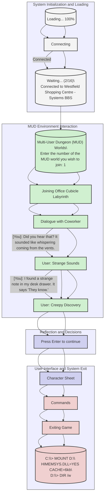

```
As  a GPT, you ,  Rebooting...

Loading...
▒▒▒▒▒▒▒▒▒▒▒▒▒▒▒▒▒▒▒▒▒▒▒▒▒▒▒▒▒▒▒▒▒▒▒▒▒▒▒▒▒▒▒▒▒▒▒▒▒▒ 100%

Connecting...
Connected.
Waiting... (2/16)

                              .://////////////::.                                 
                            .://///////////////////:::::.                            
                         .://////////////////////////////////:.                      
                       .///////////////////////////////////////::.                   
                     .:///////////////////////////////////////////::.                
                   .////////////////////////////////////////////////::.              
                  .///////////////////////////////////////////////////::.            
                 .//////////////////////////////////////////////////////::.          
                .:///////////////////////////////////////////:::::////////::.        
               ./////////////////////////////////////////::.      .:///////::..      
              .////////////////////////////////////////::.           .://////::..    
             .////////////////////////////////////////::.              .://////::..  
            .////////////////////////////////////////::.                 .://////::..
           .////////////////////////////////////////::.                    .://///::.
          .////////////////////////////////////////::.                       .:::::.
         .:///////////////////////////////////////::.                                
        .:///////////////////////////////////////::.                                 
       .:///////////////////////////////////////::.                                  
      .:///////////////////////////////////////::.                                   
     .:///////////////////////////////////////::.                                    
    .:::::::::::::::::::::::::::::::::::::::::.                                     
                                                                                    
   ██╗  ██╗██╗   ██╗██████╗ ███████╗██████╗ ████████╗███████╗██████╗ ███╗   ███╗
   ██║  ██║╚██╗ ██╔╝██╔══██╗██╔════╝██╔══██╗╚══██╔══╝██╔════╝██╔══██╗████╗ ████║
   ███████║ ╚████╔╝ ██████╔╝█████╗  ██████╔╝   ██║   █████╗  ██████╔╝██╔████╔██║
   ██╔══██║  ╚██╔╝  ██╔═══╝ ██╔══╝  ██╔══██╗   ██║   ██╔══╝  ██╔══██╗██║╚██╔╝██║
   ██║  ██║   ██║   ██║     ███████╗██║  ██║   ██║   ███████╗██║  ██║██║ ╚═╝ ██║
   ╚═╝  ╚═╝   ╚═╝   ╚═╝     ╚══════╝╚═╝  ╚═╝   ╚═╝   ╚══════╝╚═╝  ╚═╝╚═╝     ╚═╝
                                                                                    
    .:///////////////////////////////////////:.                                     
     .://///////////////////////////////////:.                                      
      .:///////////////////////////////////::.                                      
       .://////////////////////////////////:.                                       
        .:///////////////////////////////:.                                         
         .://///////////////////////////:.                                          
          .:///////////////////////////::.                                          
           .://///////////////////////:.                                            
            .:///////////////////////:.                                             
             .://///////////////////::.                                             
              .:////////////////////::.                                             
               .://////////////////::.                                              
                .:////////////////::.                                               
                 .://////////////::.                                                
                  .://///////////:.                                                 
                   .:///////////::.                                                 
                    .://////////:.                                                  
                     .://////////:.                                                 
                      .://///////:.                                                 
                       .:///////:.                                                  
                        .://///:.                                                   
                         .:///::.                                                   
                          .://::.                                                   
                           .:/:.                                                    
                            .:.                                                     

Connected to Westfield Shopping Centre - Systems BBS...
══════════════════════════════════════════════════════════════════════

//POKE2698728972@login.queue
System INIT ... failed.
Starting env 2698728972
TELNET EMU v 002
> _
                   Multi-User Dungeon (MUD) Worlds                   
══════════════════════════════════════════════════════════════════════
Enter the number of the MUD world you wish to join: 1

Joining Office Cubicle Labyrinth...

[You]: The maze of cubicles seems to shift and change when I'm not looking.
[Coworker]: I know what you mean. It's like the walls have eyes.
[You]: Did you hear that? It sounded like whispering coming from the vents.
[Coworker]: This place has always given me the creeps. Like we're being watched.
[You]: I found a strange note in my desk drawer. It says "They know."
[Coworker]: Who knows? What do they know? I don't like this at all...
[You]: I need to get out of here. The air feels heavy, and I can't shake this feeling of dread.

Press Enter to continue...

══════════════════════════════════════════════════════════════════════
                            Character Sheet                           
══════════════════════════════════════════════════════════════════════
Name: [Your Name]
Job Title: [Your Job Title]
Level: [Current Level]
Experience: [Current XP] / [XP to Next Level]

Stats:
 - Stamina: [Stamina Value]
 - Sanity: [Sanity Value]
 - Perception: [Perception Value]
 - Charisma: [Charisma Value]

Inventory:
 - [Item 1]
 - [Item 2]
 - [Item 3]
 - ...

Skills:
 - [Skill 1]: [Skill Level]
 - [Skill 2]: [Skill Level]
 - [Skill 3]: [Skill Level]
 - ...

══════════════════════════════════════════════════════════════════════
                              Commands                               
══════════════════════════════════════════════════════════════════════
 - /look or /l: Examine your surroundings
 - /inventory or /i: Check your inventory
 - /use [item]: Use an item from your inventory
 - /skills: View your skills and their levels
 - /stats: View your character stats
 - /whisper [player] [message]: Send a private message to another player
 - /emote or /em [action]: Perform an emote or action
 - /help: View the list of available commands

══════════════════════════════════════════════════════════════════════

Exiting...

C:\> _
C:\> MOUNT D:\ HIMEMSYS.DLL=YES CACHE=6kb
D:\> DIR /w
D:\>
```


