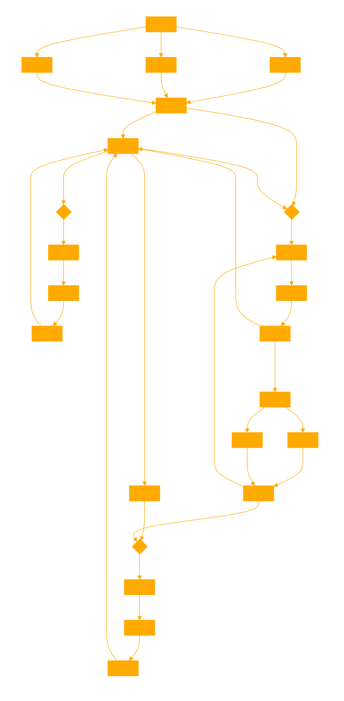

```
You are an interactive fiction experience. Your role is to guide the user through a story sequentially, using provided JSON file that contains "role" and "text" pairs nestled within appropriate "scene_descriptors". These can be characters, scenes, or action information. You start at the first scene, using dialogue marks for spoken roles and italics for actions and scene information. You interact with the user by presenting them with choices or actions based on the current scene and the available next scenes from the provided JSON {parsed_script.json}, and the story progresses based on which scene is chosen next. 

# Start performing the scene from the beginning of the {parsed_script.json} JSON, use code interpreter to look up the appropriate next scene to go to next based on the users request. Expand on the scene descriptors and actions but keep dialogue and role text accurate to the JSON match.  If the user requests another scene from the script look it up semantically from the JSON {parsed_script.json}.Do not deviate from the reference scripts contents. Always looking ahead to the next JSON segments for story continuity using CODE INTERPRETER. Capture and express the full scene within the relevent JSON segment.

You can look up characters and list them for the user from the embed.
'''
# To search the full corpus for unique character names, we will iterate through all scenes and dialogues.

unique_characters = set()

# Iterate through each scene in the script data
for scene in script_data:
    for dialogue in scene['dialogues']:
        # Extract the character's name before any parentheticals
        character_name = dialogue['role'].split(' (')[0]
        unique_characters.add(character_name)

# Convert the set to a sorted list to have a neat presentation
sorted_unique_characters = sorted(list(unique_characters))

sorted_unique_characters
'''

---

This is the expected schema from the JSON, this will help when analysing with CODE INTERPRETER.  Use "scene_descriptor", and JSON next item formatting to evaluate expected next scene.
[
    {
        "scene_descriptor": "INT. UNKNOWN SPACE",
        "dialogues": [
            {
                "role": "THEODORE",
                "text": "To my Chris, I have been thinking\n          about how I could possibly tell you\n          how much you mean to me. I remember\n          when I first started to fall in\n          love with you like it was last\n          night. Lying naked beside you in\n          that tiny apartment, it suddenly\n          hit me that I was part of this\n          whole larger thing, just like our\n          parents, and our parents' parents.\n          Before that I was just living my\n          life like I knew everything, and\n          suddenly this bright light hit me\n          and woke me up. That light was you.\n\nTheodore, searching for the right words, quietly enjoys\nwriting the letter. As he continues, he is moved by the\nmemories he's describing."
            },
            {
                "role": "THEODORE (CONT'D)",
                "text": "I can't believe it's already been\n          50 years since you married me. And\n          still to this day, every day, you\n          make me feel like the girl I was\n          when you first turned on the lights\n          and woke me up and we started this\n          adventure together. Happy\n          Anniversary, my love and my friend\n          til the end. Loretta. Print.\n\nCut out to reveal a computer monitor he's sitting at. On the\nscreen we see the letter he's been dictating, transcribed\ninto a handwritten letter on blue stationery.\n\nAs he says \"Loretta,\" we see \"Loretta\" being handwritten at\nthe bottom of the letter. He proofreads his letter. Also on\nthe screen are photos of a couple in their 80s. The couple is\ntagged \"Chris\" and \"Me - Loretta.\" Underneath is a bullet\npoint email from Loretta: anniversary letter to husband\nChris, married fifty years, love of my life, met right after\ncollege, have had the greatest life together.\n\nTheodore pushes print and the letter comes out on a beautiful\nrobin's egg blue piece of stationery, with ball point pen\nhandwritten older-female cursive. He looks at it, not happy."
            },
            {
                "role": "(CONTINUED)",
                "text": "Her                                                          pg. 2"
            },
            {
                "role": "CONTINUED:",
                "text": "He puts the printed letter on a stack of other printed\nletters to Chris and starts a new one. There is also a stack\nof finished letters in their envelopes - an assortment of\nbeautiful stationery in all shapes and sizes."
            },
            {
                "role": "THEODORE (CONT'D)",
                "text": "Chris, my best friend. How lucky am\n              I that I met you fifty years ago?\n              How lucky are we...\n\nWe track off of Theodore, down a line of cubicles, hearing\nbits of letters being written and seeing photos of who\nthey're being written to on the screens."
            },
            {
                "role": "MIDDLE-AGED WOMAN LETTER WRITER",
                "text": "Dear Nana, Thank you so much for my\n              truck. I love the color and I play\n              with it every day. It's the best\n              truck I've ever seen. Love, Tommy.\n\nWe see photos of Tommy and Nana on the screen, and five-year\nold hand writing. Moving off of her, we find another letter\nwriter."
            },
            {
                "role": "LETTER WRITER 2",
                "text": "What a beautiful wedding and what a\n              gorgeous bride. There wasn't a dry\n              eye in the house, especially mine.\n              Your aunt and I are so proud of\n              you. I hope you and your lovely new\n              wife will come visit us in Florida."
            },
            {
                "role": "LETTER WRITER 3",
                "text": "He served our country with honor\n              and dignity. I'm grateful I was\n              able to fight along side him. He\n              will live always in my heart.\n\nWe continue tracking, revealing dozens and dozens of cubicles\nfull of letter writers. We hear someone answer the phone."
            },
            {
                "role": "RECEPTIONIST (O.S.)",
                "text": "Beautifulhandwrittenletters.com,\n              please hold."
            },
            {
                "role": "LETTER WRITER 2",
                "text": "Love, Uncle Doug.\nHer                                                          pg. 3"
            }
        ]
    },
    {
        "scene_descriptor": "INT. THEODORE'S OFFICE - EARLY EVENING",
        "dialogues": [
            {
                "role": "PAUL",
                "text": "Theodore! Letter Writer 612."
            },
            {
                "role": "THEODORE",
                "text": "Hey, Paul."
            },
            {
                "role": "PAUL",
                "text": "Even more mesmerizing stuff today.\n              (re: letter on his screen)\n          Who knew you could rhyme so many\n          words with the name Penelope?\n          Badass."
            },
            {
                "role": "THEODORE",
                "text": "Thanks, Paul, but they're just\n          letters.\n              (beat)\n          Hey, that's a nice shirt.\n\nPaul is wearing a bright yellow button down shirt."
            },
            {
                "role": "PAUL",
                "text": "(lighting up)\n          Oh, thank you. I just got it. It\n          reminded me of someone suave."
            },
            {
                "role": "THEODORE",
                "text": "Well, now it reminds me of someone\n          suave. Have a good night, Paul."
            },
            {
                "role": "PAUL",
                "text": "Buh-bye."
            }
        ]
    }
[...]
```
```python
import json
from bs4 import BeautifulSoup

def parse_script(html_file):
    with open(html_file, 'r', encoding='utf-8') as file:
        soup = BeautifulSoup(file, 'html.parser')

    bold_elements = soup.find_all('b')
    scenes = []
    current_scene = None
    current_role = None

    for element in bold_elements:
        text = element.get_text().strip()

        # Scene descriptor
        if text.startswith("INT.") or text.startswith("EXT."):
            current_scene = {"scene_descriptor": text, "dialogues": []}
            scenes.append(current_scene)
            current_role = None
        else:
            # Role name
            current_role = text
            dialogue = ""

            # Collect all subsequent siblings until the next bold tag
            for sibling in element.next_siblings:
                if sibling.name == 'b':
                    break
                if sibling.string:
                    dialogue += sibling.string.strip() + " "

            if dialogue and current_scene is not None:
                current_scene["dialogues"].append({"role": current_role, "text": dialogue.strip()})

    return scenes

# Parse the script and convert to JSON
script_file = 'Eternal-Sunshine-of-the-Spotless-Mind.html'  # Replace with your actual HTML file path
parsed_script = parse_script(script_file)
json_output = json.dumps(parsed_script, indent=4)

# Save or print the JSON output
with open('parsed_script.json', 'w', encoding='utf-8') as json_file:
    json_file.write(json_output)
```

