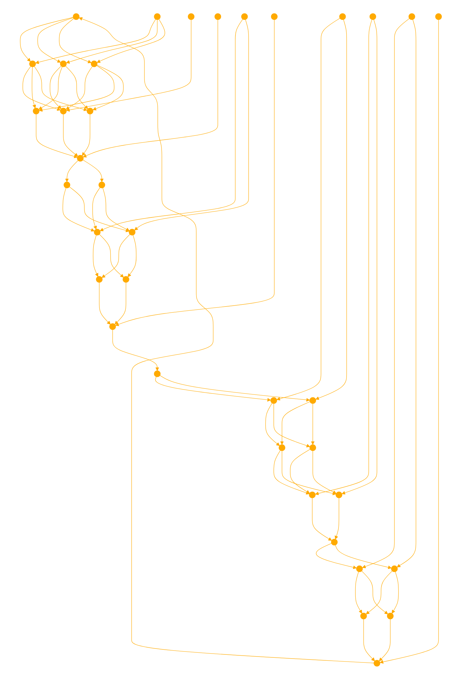

```mermaid
%%{init: {'theme': 'base', 'themeVariables': { 'primaryColor': '#ffaa00', 'primaryTextColor': '#ffaa00', 'primaryBorderColor': '#ffaa00', 'lineColor': '#ffaa00', 'secondaryColor': '#ffaa00', 'tertiaryColor': '#ffaa00', 'clusterBkg': 'none', 'clusterBorder': 'none', 'fontSize': '0px'}}}%%
graph TD
A((A)) --> B((B))
A((A)) --> C((C)) 
A((A)) --> D((D))
B((B)) & C((C)) & D((D)) --> E((E))
B((B)) & C((C)) & D((D)) --> F((F))
B((B)) & C((C)) & D((D)) --> G((G))
E((E)) & F((F)) & G((G)) --> H((H))
H((H)) --> I((I))
H((H)) --> J((J))
I((I)) & J((J)) --> K((K))
I((I)) & J((J)) --> L((L))
K((K)) & L((L)) --> M((M))
K((K)) & L((L)) --> N((N))
M((M)) & N((N)) --> O((O))
O((O)) --> P((P))
P((P)) --> Q((Q))
P((P)) --> R((R))
Q((Q)) & R((R)) --> S((S)) 
Q((Q)) & R((R)) --> T((T))
S((S)) & T((T)) --> U((U))
S((S)) & T((T)) --> V((V))
U((U)) & V((V)) --> W((W))
W((W)) --> X((X))
W((W)) --> Y((Y))
X((X)) & Y((Y)) --> Z((Z))
X((X)) & Y((Y)) --> AA((AA))
Z((Z)) & AA((AA)) --> AB((AB))
AB((AB)) --> A((A))

AC((AC)) --> B((B)) & C((C)) & D((D))  
AD((AD)) --> E((E))
AE((AE)) --> H((H))
AF((AF)) --> K((K)) & L((L))
AG((AG)) --> O((O))
AH((AH)) --> Q((Q)) & R((R))
AI((AI)) --> U((U)) & V((V))
AJ((AJ)) --> X((X)) & Y((Y))
AK((AK)) --> AB((AB))

subgraph Input
A((A)) 
end

subgraph "Natural Language Processing"
B((B))
C((C))
D((D))  
end

subgraph "Knowledge Representation"
E((E))
F((F)) 
G((G))
end

subgraph Reasoning
H((H))
I((I))
J((J))
end

subgraph "Concept Synthesis"
K((K))
L((L))
end

subgraph "Multimodal Integration" 
M((M))
N((N))
end

subgraph "Action Planning"
O((O))
end

subgraph "Language Generation"
P((P))
Q((Q))
R((R))  
end

subgraph Metacognition
S((S))
T((T))
end

subgraph "Continual Learning"
U((U))
V((V))  
end

subgraph "Goal Management"
W((W))
X((X))
Y((Y))
end
  
subgraph Output  
Z((Z))
AA((AA))
end

subgraph Feedback
AB((AB))  
end

subgraph "Parameter Space"
AC((AC))
AD((AD))
AE((AE))
AF((AF)) 
AG((AG))
AH((AH))
AI((AI))
AJ((AJ))
AK((AK))
end
```
