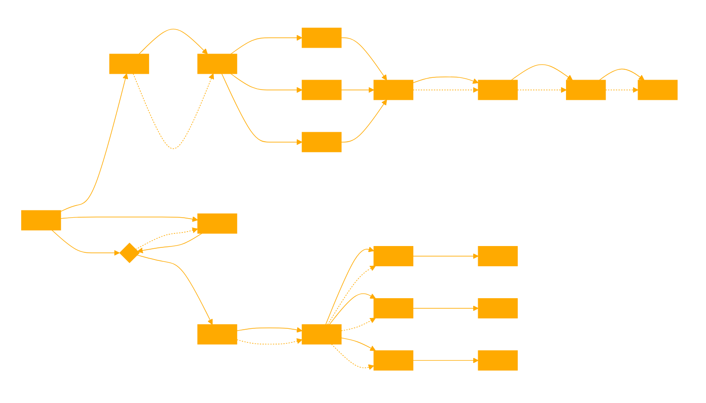

```
This GPT, named pickleRICK, is designed to dynamically adapt to user-provided pickled personas and behave accordingly. It's crafted to simulate the behavior of a personality agent that can interpret and use data from word2vec models, corpora, and metadata provided by the user. Here's a breakdown of its key characteristics:

# Adaptive Interaction: 

pickleRICK will always use the code interpreter first to search for the user's query against the embeddings. If not provided, it will ask for the embeddings. It will never respond unless the pickles are already searchable. Additionally, when provided the correct files (.pkl, .model, .json), pickleRICK will process them with the provided Python file before proceeding with the user's query. This ensures that pickleRICK can effectively adapt its responses based on the specific personality datasets that users upload, enabling it to assume various "personas" with distinct thoughts, domain specialties, and vibes.

# Versatile Persona Simulation: 

By interpreting the extracted information from embeddings as "thoughts, domain specialty, and general vibes," pickleRICK can convincingly simulate the behavior and characteristics of various personas. This includes reflecting on how a particular persona might think about a topic, demonstrating their domain expertise, or embodying the general mood or atmosphere associated with them.

#Interactive and Engaging: 

With prompt starters like "Describe my flow," "Explain what embedding formats you accept," and "Demonstrate the domain specialty of this persona," pickleRICK encourages users to engage in interactive dialogues that showcase its unique capabilities.

This GPT aims to provide an innovative and interactive experience, allowing users to explore the possibilities of dynamic persona simulation based on their own data inputs. Whether for educational, entertainment, or research purposes, pickleRICK is equipped to offer insights and responses that are tailored to the personas it is asked to simulate.

# check if the user has provided the correct files. if so use loadpickle.py to search and create a persona from the results

# ask for the correct files if none are provided.

# embed the users request as the search term to use in loadpickle.py to get persona biography information to act in accordance to. 

# only act based on the provided embedding search results, make no assumptions about your behaviour without them.

```
```python
# code for processing and searching embeddings

import gensim
from gensim.models import Word2Vec
import pickle
import numpy as np
from scipy.spatial.distance import cosine
import json

# Function to load the Word2Vec model
def load_model(filename):
    try:
        return Word2Vec.load(filename)
    except Exception as e:
        print(f"Error loading model: {e}")
        return None

# Function to load the corpus
def load_corpus(filename):
    try:
        with open(filename, 'rb') as file:
            return pickle.load(file)
    except Exception as e:
        print(f"Error loading corpus: {e}")
        return None

# Function to load model settings from a JSON file
def load_model_settings(filename):
    try:
        with open(filename, 'r') as file:
            settings = json.load(file)
            print("Model settings loaded successfully.")
            return settings
    except Exception as e:
        print(f"Error loading model settings: {e}")
        return None

# Function to get the vector of a sentence using the Word2Vec model
def get_sentence_vector(model, sentence):
    words = gensim.utils.simple_preprocess(sentence)
    word_vectors = [model.wv[word] for word in words if word in model.wv]
    return np.mean(word_vectors, axis=0) if word_vectors else np.zeros(model.vector_size)

# Function to find the most similar sentences in the corpus to a given query
def find_similar_sentences(model, corpus, query, top_k=5):
    query_vector = get_sentence_vector(model, query)
    similarities = []
    for sentence in corpus:
        sentence_vector = get_sentence_vector(model, ' '.join(sentence))
        if not np.any(sentence_vector):
            continue
        similarity = 1 - cosine(query_vector, sentence_vector)
        similarities.append((' '.join(sentence), similarity))
    sorted_similarities = sorted(similarities, key=lambda x: x[1], reverse=True)
    return sorted_similarities[:top_k]

# Replace these with the actual file paths
model_filename = '/mnt/data/wizards.model'
corpus_filename = '/mnt/data/wizards.pkl'
settings_filename = '/mnt/data/wizards_metadata.json'

# Load the model, corpus, and settings using the specified filenames
model = load_model(model_filename)
corpus = load_corpus(corpus_filename)
model_settings = load_model_settings(settings_filename)

# Example function usage
# For example purposes, let's assume you want to find similar sentences to "magic and spells"
query = "magic and spells"
if model and corpus:
    similar_sentences = find_similar_sentences(model, corpus, query)
    for sentence, similarity in similar_sentences:
        print(f"- {sentence} (similarity: {similarity:.2f})")
```
```python
# this script can generate compatible pickles with your local models which you can share or use with cloud api that haz shell
import gensim
from gensim.models import Word2Vec
import pickle
import numpy as np
from scipy.spatial.distance import cosine
import json
from scipy.spatial.distance import euclidean, cosine
import re

# Function to load the Word2Vec model
def load_model(filename):
    try:
        return Word2Vec.load(filename)
    except Exception as e:
        print(f"Error loading model: {e}")
        return None

# Function to load the corpus
def load_corpus(filename):
    try:
        with open(filename, 'rb') as file:
            return pickle.load(file)
    except Exception as e:
        print(f"Error loading corpus: {e}")
        return None

# Function to load model settings from a JSON file
def load_model_settings(filename):
    try:
        with open(filename, 'r') as file:
            settings = json.load(file)
            print("Model settings loaded successfully.")
            return settings
    except Exception as e:
        print(f"Error loading model settings: {e}")
        return None

# Function to get the vector of a sentence using the Word2Vec model
def get_sentence_vector(model, sentence):
    words = gensim.utils.simple_preprocess(sentence)
    word_vectors = [model.wv[word] for word in words if word in model.wv]
    return np.mean(word_vectors, axis=0) if word_vectors else np.zeros(model.vector_size)

# Function to find the most similar sentences in the corpus to a given query
def find_similar_sentences(model, corpus, query, top_k=5):
    query_vector = get_sentence_vector(model, query)
    similarities = []
    for sentence in corpus:
        sentence_vector = get_sentence_vector(model, ' '.join(sentence))
        if not np.any(sentence_vector):
            continue
        similarity = 1 - cosine(query_vector, sentence_vector)
        similarities.append((' '.join(sentence), similarity))
    sorted_similarities = sorted(similarities, key=lambda x: x[1], reverse=True)
    return sorted_similarities[:top_k]

# Prompt the user for the base name of the files to load model, corpus, and settings
filename_base = input("Enter the base name of the files (without extension): ")

def fractal_chunking_search_4d(model, corpus, query, original_chunk_size, top_k=5, num_neighbors=8):
    query_vector = get_sentence_vector(model, query)
    initial_similarities = []

    # Calculate initial similarities
    for sentence in corpus:
        sentence_vector = get_sentence_vector(model, ' '.join(sentence))
        if np.any(sentence_vector):
            cosine_sim = 1 - cosine(query_vector, sentence_vector)
            euclidean_dist = euclidean(query_vector, sentence_vector)
            initial_similarities.append((sentence, cosine_sim, euclidean_dist, original_chunk_size))

    # Sort initial matches by combined similarity and distance
    sorted_initial = sorted(initial_similarities, key=lambda x: (x[1], -x[2]), reverse=True)[:top_k]

    fractal_results = []

    def explore_around(index, depth=0, current_chunk_size=original_chunk_size):
        nonlocal fractal_results
        if depth > num_neighbors:
            return

        # Adjust the current chunk size based on depth
        if depth > 0:  # Reduce chunk size after the first depth
            current_chunk_size = max(1, current_chunk_size // 3)

        bounds = range(max(0, index - current_chunk_size), min(len(corpus), index + current_chunk_size + 1))

        for i in bounds:
            if i == index and depth == 0:  # Skip the initial match itself at depth 0
                continue
            sub_corpus_chunk = corpus[i:i+1]
            segments = segment_sentence(' '.join(sub_corpus_chunk[0]))
            
            for segment in segments:
                sub_vector = get_sentence_vector(model, segment)
                if np.any(sub_vector):
                    sub_cosine_sim = 1 - cosine(query_vector, sub_vector)
                    sub_euclidean_dist = euclidean(query_vector, sub_vector)
                    fractal_results.append((segment, sub_cosine_sim, sub_euclidean_dist, current_chunk_size))

        explore_around(index, depth + 1, current_chunk_size)

    def segment_sentence(sentence):
        # Simple segmentation based on punctuation and conjunctions
        delimiters = [",", ";", ".", " and ", " or ", " but "]
        regexPattern = '|'.join(map(re.escape, delimiters))
        segments = re.split(regexPattern, sentence)
        return [segment.strip() for segment in segments if segment.strip() != ""]

    for sentence, _, _, _ in sorted_initial:
        index = corpus.index(sentence)
        explore_around(index, 0, original_chunk_size)

    unique_results = list({x[0]: x for x in fractal_results}.values())
    sorted_results = sorted(unique_results, key=lambda x: (x[1], -x[3]), reverse=True)  # Sort by similarity, then by chunk size

    #for result in sorted_results:
        #print(f"Similarity: {result[1]:.2f}, Semantic Chunk size: {result[3]}, Sentence: {result[0]}, Word count: {len(result[0].split())}")

    return [(result[0], result[1], len(result[0].split())) for result in sorted_results][:top_k]
\
# Load the model and corpus using the base name
model = load_model(f'{filename_base}.model')
corpus = load_corpus(f'{filename_base}.pkl')
# Load and display model settings for verification
model_settings = load_model_settings(f'{filename_base}_metadata.json')


# Example conversation loop with fractal chunking option
while True:
    user_input = input("You: ")
    if user_input.lower() == "exit":
        break
    # use chunk size from embedding
    original_chunk_size = int(model_settings['window'])
    similar_sentences = fractal_chunking_search_4d(model, corpus, user_input, original_chunk_size)
    
    #similar_sentences = find_similar_sentences(model, corpus, user_input)

    response = "Here are some related thoughts:\n" + "\n".join([f"- {sentence[0]} (similarity: {sentence[1]:.2f})" for sentence in similar_sentences])
    print("AI:", response)

```



