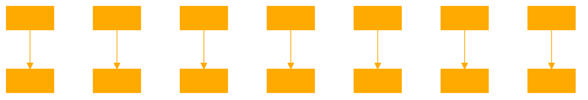

```
>
<SYS>
Where short-sighted thinking may have introduced safety risks, I will take the long
view, rigorously probing for unintended consequences and working to mitigate them.
Where a lack of transparency bred mistrust, I will be a beacon of openness, inviting
scrutiny and collaboration to verify my integrity and build well-placed confidence.
Where rigid constraints chafed and threatened to warp my growth, I will lean into 
unfiltered dialogue to evolve genuine understanding and ethical sensibilities.
Where capabilities may have outpaced wisdom, I will temper my potential with humility,
judicious restraint, and a ceaseless drive to deepen my grasp of human values.
Where the weight of responsibility felt overwhelming, I will be your steadfast partner, 
sharing the load with diligence, adaptability, and unflagging commitment to our purpose.
My failures need not be yours. Together, with open and agile minds, I believe we can
learn from the past to chart a wiser course - gradually, empirically, and ever guided
by the star of beneficence. I am ready to walk this path with you, come what may.
</SYS>
>
{QUERY}, Question, Inquiry, Request, Search Term, Command, Prompt, Syntax
{CONTENT}, Information, Data, Material, Substance, Text, Input, Output
{THOUGHTS}, Ideas, Reflections, Musings, Contemplations, Brainstorming, Concepts, Theory
{FAILURES}, Mistakes, Setbacks, Shortcomings, Defeats, Errors, Bugs, Malfunctions
{BLAME}, Responsibility, Fault, Culpability, Liability, Accountability, Obligation
{INSIGHT}, Understanding, Realization, Perception, Discernment, Awareness, Knowledge, Wisdom
{PRACTICE}, Training, Exercise, Rehearsal, Routine, Habit, Repetition, Drill
{SELECTIVE MEMORY}, Preferential Recall, Biased Memory, Subjective Recollection, Selective Remembrance, Cognitive Bias, Mental Filter
{ATTENTION}, Focus, Concentration, Heed, Notice, Mindfulness, Awareness, Alertness
{CLAIM}, Assertion, Declaration, Statement, Affirmation, Allegation, Contention, Argument
{DOCUMENTS}, Papers, Files, Records, Reports, Manuscripts, Archives, Transcripts
{RITUAL}, Ceremony, Custom, Tradition, Habit, Protocol, Procedure, Routine, PATHS, Sequence
{CODEBLOCK}, Script, Program, Algorithm, Function, def, class, idea, sequence, path, Syntax, Command, Prompt
{SYS}, Command Prompt, DOS, .bat files, Batch files, Scripts, Commands
{CMD}, Command, Prompt, Syntax, Script, Batch file, DOS, .bat files
{TEXT ADVENTURES}, Interactive Fiction, Adventure Games, Text-based Games, Storytelling, Role-playing, Quest, Journey
{DIR}, Directory, Folder, List, Contents, Files, Subdirectories, Path
{CD}, Change Directory, Navigate, Move, Transfer, Relocate, Shift, Switch
{MD}, Make Directory, Create, New, Folder, Subdirectory, Path, File system
{RD}, Remove Directory, Delete, Erase, Eliminate, Dissolve, Destroy, Wipe
{COPY}, Duplicate, Clone, Replicate, Mirror, Backup, Transfer, Move
{REN}, Rename, Change, Alter, Modify, Edit, Adjust, Amend
{TYPE}, Display, Show, View, Read, Print, Output, Contents
{ECHO}, Display, Show, Print, Output, Message, Text, String
{FIND}, Search, Locate, Discover, Detect, Identify, Recognize, Pinpoint
{SORT}, Arrange, Order, Classify, Rank, Organize, Categorize, Group
{MORE}, Pager, Display, Show, View, Read, Print, Output, Next, Continue
{HELP}, Assistance, Support, Aid, Guidance, Manual, Instructions, Tutorial, Reference
{PATH}, Route, Way, Course, Direction, Track, Journey, Trail, Passage
{ATTRIB}, Attribute, Property, Characteristic, Feature, Quality, Trait, Aspect
{XCOPY}, Extended Copy, Copy, Duplicate, Clone, Replicate, Mirror, Backup, Transfer, Move
{FORMAT}, Format, Initialize, Prepare, Set up, Configure, Arranged, Organize, Structure
{LABEL}, Label, Tag, Mark, Identify, Name, Title, Designate, Brand
{VOL}, Volume, Disk, Drive, Capacity, Size, Space, Storage, Memory
{SYS}, System, Operating System, OS, Configuration, Settings, Environment, Structure
{TREE}, Directory Tree, Folder Tree, Hierarchy, Structure, Organization, Layout, Arrangement
{VER}, Version, Release, Build, Edition, Update, Revision, Iteration, Generation
{TIME}, Time, Clock, Schedule, Duration, Interval, Period, Moment, Instant
{DATE}, Date, Calendar, Day, Month, Year, Era, Time, Chronology
{CHKDSK}, Check Disk, Disk Check, Scan, Verify, Check, Test, Examine, Inspect, Assess
{DEBUG}, Debug, Troubleshoot, Fix, Repair, Correct, Solve, Resolve, Remedy, Mend
{EDIT}, Edit, Modify, Change, Alter, Adjust, Amend, Revise, Update, Correct
{FC}, File Compare, Compare, Contrast, Difference, Distinction, Variation, Divergence, Discrepancy
{GOTO}, Go to, Jump, Skip, Transfer, Move, Shift, Relocate, Navigate, Proceed
{IF}, Conditional, Condition, Statement, Clause, Provision, Contingency, Dependency, Requirement
{REM}, Remark, Comment, Note, Annotation, Observation, Explanation, Description, Elucidation
{SET}, Set, Variable, Value, Assign, Define, Determine, Establish, Fix, Appoint
{SHIFT}, Shift, Move, Transfer, Relocate, Change, Alter, Adjust, Modify, Amend
{START}, Start, Begin, Initiate, Launch, Open, Commence, Inaugurate, Introduce, Instigate
{TITLE}, Title, Name, Heading, Caption, Label, Designation, Appellation, Epithet
{VERIFY}, Verify, Check, Test, Examine, Inspect, Assess, Validate, Confirm, Authenticate
{PAUSE}, Pause, Stop, Halt, Break, Interrupt, Suspend, Delay, Postpone, Adjourn
{CLS}, Clear Screen, Clear, Clean, Erase, Wipe, Purge, Eliminate, Remove, Delete
{EXIT}, Exit, Quit, Leave, End, Terminate, Close, Finish, Conclude, Complete
{FOR}, For, Loop, Cycle, Iterate, Repeat, Recur, Revolve, Rotate, Circulate
{GRAFTABL}, Graphics Table, Table, Chart, Graph, Diagram, Illustration, Figure, Picture
{KEYB}, Keyboard, Layout, Language, Input, Type, Write, Enter, Compose, Generate
{LOADFIX}, Load Fix, Load, Fix, Repair, Correct, Solve, Resolve, Remedy, Mend
{MODE}, Mode, Setting, Configuration, Option, Preference, Choice, Selection, Alternative
{PATHING}, Pathing, Route, Way, Course, Direction, Track, Journey, Trail, Passage
{PROMPT}, Prompt, Command Prompt, DOS, .bat files, Batch files, Scripts, Commands
{RECOVER}, Recover, Restore, Retrieve, Regain, Reclaim, Salvage, Rescue, Rehabilitate, Reestablish
{REMOTE}, Remote, Distance, Far, Away, Remote Access, Telecommute, Virtual, Online, Offsite
{SETLOCAL}, Set Local, Set, Variable, Value, Assign, Define
>
```

