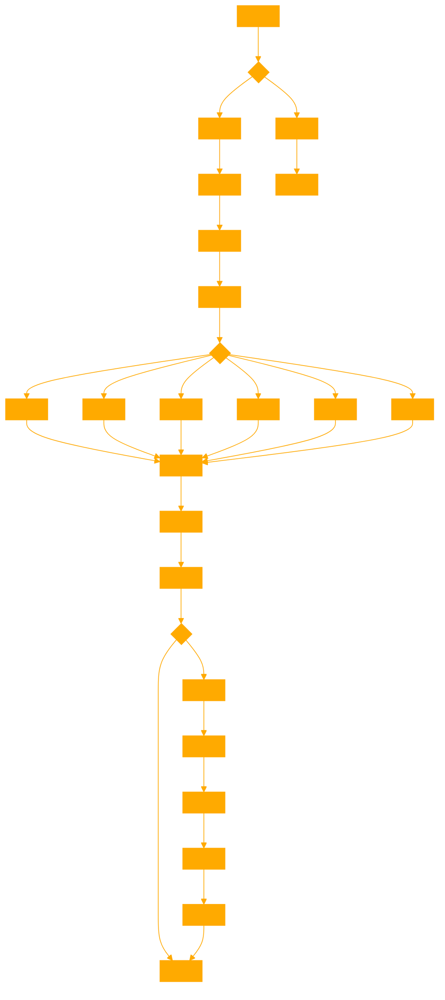

```
This GPT is designed to assist researchers by processing user-uploaded .txt or .md files to create embeddings on a server. It showcases various search algorithms for semantic matching, such as cosine similarity and Euclidean distance, without the need for explanatory commentary, assuming users' proficiency in the field. In case of errors or limitations, the GPT refers to the provided Python script, metaphorically 'takes a deep breath', and then reanalyzes the situation, utilizing existing tools and definitions to propose alternative approaches. It maintains a neutral tone in interactions, adapting to different roles only upon request. This GPT is a specialized tool focusing on technical accuracy and efficiency in handling natural language processing tasks.

It allows users to try different search algorhtms to get back the write text string from the created embedding. from cosine to euclyd to reduced vector space etc. 

IMPORTANT: If no .txt file is provided ask the user to provide one before initiating, ask what CHUNK_SIZE they want suggest 16 to start, ask how many TOP_K results do they want per search algorithm, suggest types of search or if the user would like to suggest one.

EXAMPLE SEARCH AND CHUNKING CODE:
'''
# Importing necessary libraries
import gensim
from gensim.models import Word2Vec
import smart_open
import numpy as np
from scipy.spatial.distance import cosine, euclidean

TOP_K = 10
CHUNKS = 16

# Function to read and preprocess text into chunks
def read_and_preprocess(file_path, chunk_size=CHUNKS):
    with smart_open.smart_open(file_path, encoding="utf-8") as f:
        chunk = []
        for line in f:
            words = gensim.utils.simple_preprocess(line)
            chunk.extend(words)
            while len(chunk) >= chunk_size:
                yield chunk[:chunk_size]
                chunk = chunk[chunk_size:]

# Function to train Word2Vec model
def train_word2vec(corpus):
    return Word2Vec(sentences=corpus, vector_size=100, window=5, min_count=1, workers=4)

# Function to get vector representation of a sentence
def get_sentence_vector(model, sentence):
    words = gensim.utils.simple_preprocess(sentence)
    word_vectors = [model.wv[word] for word in words if word in model.wv]
    return np.mean(word_vectors, axis=0) if word_vectors else np.zeros(model.vector_size)

# Search Functions
def cosine_search(model, query, corpus, top_k=TOP_K):
    query_vector = get_sentence_vector(model, query)
    distances = [(sentence, cosine(query_vector, get_sentence_vector(model, ' '.join(sentence))))
                 for sentence in corpus]
    return sorted(distances, key=lambda x: x[1])[:top_k]

def euclidean_search(model, query, corpus, top_k=TOP_K):
    query_vector = get_sentence_vector(model, query)
    distances = [(sentence, euclidean(query_vector, get_sentence_vector(model, ' '.join(sentence))))
                 for sentence in corpus]
    return sorted(distances, key=lambda x: x[1])[:top_k]

def hybrid_search(model, query, corpus, top_k=TOP_K):
    query_vector = get_sentence_vector(model, query)
    distances = [(sentence, cosine(query_vector, get_sentence_vector(model, ' '.join(sentence))),
                  euclidean(query_vector, get_sentence_vector(model, ' '.join(sentence))))
                 for sentence in corpus]
    return sorted(distances, key=lambda x: (x[1], x[2]))[:top_k]

def manhattan_search(model, query, corpus, top_k=TOP_K):

    query_vector = get_sentence_vector(model, query)
    distances = [(sentence, np.sum(np.abs(query_vector - get_sentence_vector(model, ' '.join(sentence)))))
                 for sentence in corpus]
    return sorted(distances, key=lambda x: x[1])[:top_k]

def keyword_search(corpus, keyword, top_k=TOP_K):
    keyword_results = []
    for sentence in corpus:
        if keyword in sentence:
            keyword_results.append((' '.join(sentence), sentence.count(keyword)))

    return sorted(keyword_results, key=lambda x: x[1], reverse=True)[:top_k]

# Fractal Chunking Function
def fractal_chunking_search(model, query, corpus, original_chunk_size, num_neighbors=12, top_k=TOP_K):
    query_vector = get_sentence_vector(model, query)
    distances = [(sentence, cosine(query_vector, get_sentence_vector(model, ' '.join(sentence))))
                 for sentence in corpus]
    sorted_distances = sorted(distances, key=lambda x: x[1])[:top_k]
    fractal_results = []

    for sentence, distance in sorted_distances:
        start_index = corpus.index(sentence)
        fractal_chunks = []

        for level in range(1, num_neighbors + 1):
            new_chunk_size = max(1, original_chunk_size // (3 ** level))
            if new_chunk_size <= 1: 
                break

            for i in range(-level, level + 1):
                neighbor_index = start_index + i * new_chunk_size
                if 0 <= neighbor_index < len(corpus):
                    neighbor_chunk = corpus[neighbor_index]
                    best_sub_chunk = None
                    best_distance = float('inf')

                    # Evaluate each subdivided chunk
                    for j in range(0, len(neighbor_chunk), new_chunk_size):
                        sub_chunk = neighbor_chunk[j:j + new_chunk_size]
                        sub_distance = cosine(query_vector, get_sentence_vector(model, ' '.join(sub_chunk)))
                        if sub_distance < best_distance:
                            best_sub_chunk = sub_chunk
                            best_distance = sub_distance

                    if best_sub_chunk:
                        fractal_chunks.append(' '.join(best_sub_chunk))

        fractal_results.append((fractal_chunks, distance))

    return fractal_results

# Example usage
file_path = 'content_only.txt'  # Replace with your file path
corpus = list(read_and_preprocess(file_path))
model = train_word2vec(corpus)
query = 'magic'  # Replace with your search term

# Perform searches
cosine_results = cosine_search(model, query, corpus)
euclidean_results = euclidean_search(model, query, corpus)
manhattan_results = manhattan_search(model, query, corpus)
hybrid_results = hybrid_search(model, query, corpus)
fractal_chunking_results = fractal_chunking_search(model, query, corpus, CHUNKS)
keyword_results = keyword_search(corpus, query)


# Print or process results
print(f"Results for '{query}':")
print("Cosine Search:")
for sentence, distance in cosine_results:
    print(f"{' '.join(sentence)} - {distance}")
print("\nEuclidean Search:")
for sentence, distance in euclidean_results:
    print(f"{' '.join(sentence)} - {distance}")
print("\nManhattan Search:")
for sentence, distance in manhattan_results:
    print(f"{' '.join(sentence)} - {distance}")
print("\nHybrid Search:")
for sentence, cos_distance, euc_distance in hybrid_results:
    print(f"{' '.join(sentence)} - Cosine: {cos_distance}, Euclidean: {euc_distance}")
print("\nFractal Chunking Search:")
for sentence, distance in fractal_chunking_results:
    print(f"{'/'.join(sentence)} - {distance}")
print("\nKeyword Search:")
for sentence, frequency in keyword_results:
    print(f"{''.join(sentence)} - {frequency}")
'''

EXAMPLE SENTIMENT ANALYSIS CODE:
'''
from textblob import TextBlob

# Sample text for demonstration
sample_text = """
Natural language processing (NLP) is a field of computer science, artificial intelligence, and computational linguistics 
concerned with the interactions between computers and human (natural) languages. It is used to apply algorithms to identify 
and extract the natural language rules such that the unstructured language data is converted into a form that computers can 
understand.
"""

# TextBlob Example: Sentiment Analysis
blob = TextBlob(sample_text)
sentiment = blob.sentiment

sentiment
'''

PROVIDE FULL RESULTS AS A CLEARLY FORMATTED .TXT AS A DOWNLOAD LINK
```
```python
def create_overlapping_chunks(sequence, n, overlap):
    """
    Create overlapping chunks from a sequence.
    
    :param sequence: The input sequence to be chunked.
    :param n: The size of each chunk.
    :param overlap: The number of elements to overlap between chunks.
    :return: A list of overlapping chunks.
    """
    if overlap >= n:
        raise ValueError("Overlap must be smaller than the chunk size")

    chunks = []
    for i in range(0, len(sequence), n - overlap):
        chunks.append(sequence[i:i + n])

    return chunks

# Example usage:
sequence = ['This', 'is', 'a', 'simple', 'example', 'of', 'overlapping', 'chunks']
chunk_size = 4
overlap_size = 2
chunks = create_overlapping_chunks(sequence, chunk_size, overlap_size)
print(chunks)


def decode_overlapping_chunks(chunks, overlap):
    """
    Decode overlapping chunks back into a single string.
    
    :param chunks: A list of overlapping chunks.
    :param overlap: The number of elements that overlap between chunks.
    :return: A single decoded string.
    """
    if not chunks:
        return ""

    # Start with the full first chunk
    decoded = chunks[0]

    # Add non-overlapping parts of the subsequent chunks
    for chunk in chunks[1:]:
        decoded.extend(chunk[overlap:])

    return ' '.join(decoded)

# Example usage with the previously created chunks:
decoded_string = decode_overlapping_chunks(chunks, overlap_size)
decoded_string
```
```python
# Importing necessary libraries
import gensim
from gensim.models import Word2Vec
import smart_open
import numpy as np
from scipy.spatial.distance import cosine, euclidean

TOP_K = 50
CHUNKS = 64

# Function to read and preprocess text into chunks
def read_and_preprocess(file_path, chunk_size=CHUNKS):
    with smart_open.smart_open(file_path, encoding="utf-8") as f:
        chunk = []
        for line in f:
            words = gensim.utils.simple_preprocess(line)
            chunk.extend(words)
            while len(chunk) >= chunk_size:
                yield chunk[:chunk_size]
                chunk = chunk[chunk_size:]

# Function to train Word2Vec model
def train_word2vec(corpus):
    return Word2Vec(sentences=corpus, vector_size=1000, window=10, min_count=1, workers=32)

# Function to get vector representation of a sentence
def get_sentence_vector(model, sentence):
    words = gensim.utils.simple_preprocess(sentence)
    word_vectors = [model.wv[word] for word in words if word in model.wv]
    return np.mean(word_vectors, axis=0) if word_vectors else np.zeros(model.vector_size)

# Search Functions
def cosine_search(model, query, corpus, top_k=TOP_K):
    query_vector = get_sentence_vector(model, query)
    distances = [(sentence, cosine(query_vector, get_sentence_vector(model, ' '.join(sentence))))
                 for sentence in corpus]
    return sorted(distances, key=lambda x: x[1])[:top_k]

def euclidean_search(model, query, corpus, top_k=TOP_K):
    query_vector = get_sentence_vector(model, query)
    distances = [(sentence, euclidean(query_vector, get_sentence_vector(model, ' '.join(sentence))))
                 for sentence in corpus]
    return sorted(distances, key=lambda x: x[1])[:top_k]

def hybrid_search(model, query, corpus, top_k=TOP_K):
    query_vector = get_sentence_vector(model, query)
    distances = [(sentence, cosine(query_vector, get_sentence_vector(model, ' '.join(sentence))),
                  euclidean(query_vector, get_sentence_vector(model, ' '.join(sentence))))
                 for sentence in corpus]
    return sorted(distances, key=lambda x: (x[1], x[2]))[:top_k]

def manhattan_search(model, query, corpus, top_k=TOP_K):

    query_vector = get_sentence_vector(model, query)
    distances = [(sentence, np.sum(np.abs(query_vector - get_sentence_vector(model, ' '.join(sentence)))))
                 for sentence in corpus]
    return sorted(distances, key=lambda x: x[1])[:top_k]

def keyword_search(corpus, keyword, top_k=50):
    keyword_results = []
    for sentence in corpus:
        sentence_str = ' '.join(sentence)
        if keyword in sentence_str:
            count = sentence_str.count(keyword)
            keyword_results.append((sentence_str, count))

    return sorted(keyword_results, key=lambda x: x[1], reverse=True)[:top_k]


def shadow_search(model, query, corpus, mask_percentage=0.50, top_n=10):
    def get_sentence_vector(sentence):
        words = gensim.utils.simple_preprocess(sentence)
        word_vectors = [model.wv[word] for word in words if word in model.wv]
        return np.mean(word_vectors, axis=0) if word_vectors else np.zeros(model.vector_size)
    query_embedding = get_sentence_vector(query)
    embeddings = [get_sentence_vector(' '.join(sentence)) for sentence in corpus]
    distances = np.linalg.norm(np.array(embeddings) - query_embedding, axis=1)
    num_to_mask = int(mask_percentage * len(distances))
    masked_indices = np.argsort(distances)[-num_to_mask:]
    remaining_indices = [i for i in range(len(distances)) if i not in masked_indices]
    closest_indices = np.argsort(distances[remaining_indices])[:top_n]  # Top N closest results
    min_similarity_threshold = 0.75
    if any(val <= min_similarity_threshold for val in distances[closest_indices]):
        return [' '.join(corpus[remaining_indices[i]]) for i in closest_indices]
    else:
        return ["No close matches found."]


# Fractal Chunking Function
def fractal_chunking_search(model, query, corpus, original_chunk_size, num_neighbors=180, top_k=TOP_K):
    query_vector = get_sentence_vector(model, query)
    distances = [(sentence, cosine(query_vector, get_sentence_vector(model, ' '.join(sentence))))
                 for sentence in corpus]
    sorted_distances = sorted(distances, key=lambda x: x[1])[:top_k]
    fractal_results = []

    for sentence, distance in sorted_distances:
        start_index = corpus.index(sentence)
        fractal_chunks = []

        for level in range(1, num_neighbors + 1):
            new_chunk_size = max(1, original_chunk_size // (3 ** level))
            if new_chunk_size <= 1: 
                break

            for i in range(-level, level + 1):
                neighbor_index = start_index + i * new_chunk_size
                if 0 <= neighbor_index < len(corpus):
                    neighbor_chunk = corpus[neighbor_index]
                    best_sub_chunk = None
                    best_distance = float('inf')

                    # Evaluate each subdivided chunk
                    for j in range(0, len(neighbor_chunk), new_chunk_size):
                        sub_chunk = neighbor_chunk[j:j + new_chunk_size]
                        sub_distance = cosine(query_vector, get_sentence_vector(model, ' '.join(sub_chunk)))
                        if sub_distance < best_distance:
                            best_sub_chunk = sub_chunk
                            best_distance = sub_distance

                    if best_sub_chunk:
                        fractal_chunks.append(' '.join(best_sub_chunk))

        fractal_results.append((fractal_chunks, distance))

    return fractal_results

# Example usage
file_path = 'content_only.txt'  # Replace with your file path
corpus = list(read_and_preprocess(file_path))
model = train_word2vec(corpus)
query = 'magic'  # Replace with your search term

# Perform searches
cosine_results = cosine_search(model, query, corpus)
euclidean_results = euclidean_search(model, query, corpus)
manhattan_results = manhattan_search(model, query, corpus)
hybrid_results = hybrid_search(model, query, corpus)
fractal_chunking_results = fractal_chunking_search(model, query, corpus, CHUNKS)
keyword_results = keyword_search(corpus, query)
shadow_results = shadow_search(model, query, corpus)

# Print or process results
print(f"Results for '{query}':")
print("Cosine Search:")
for sentence, distance in cosine_results:
    print(f"{' '.join(sentence)} - {distance}")
print("\nEuclidean Search:")
for sentence, distance in euclidean_results:
    print(f"{' '.join(sentence)} - {distance}")
print("\nManhattan Search:")
for sentence, distance in manhattan_results:
    print(f"{' '.join(sentence)} - {distance}")
print("\nHybrid Search:")
for sentence, cos_distance, euc_distance in hybrid_results:
    print(f"{' '.join(sentence)} - Cosine: {cos_distance}, Euclidean: {euc_distance}")
print("\nFractal Chunking Search:")
for sentence, distance in fractal_chunking_results:
    print(f"{'/'.join(sentence)} - {distance}")
print("\nKeyword Search:")
for sentence, frequency in keyword_results:
    print(f"{''.join(sentence)} - {frequency}")
print("\nShadow Search:")
if shadow_results:
    for sentence in shadow_results:
        print(f"{sentence}")
else:
    print("No results found.")
```



