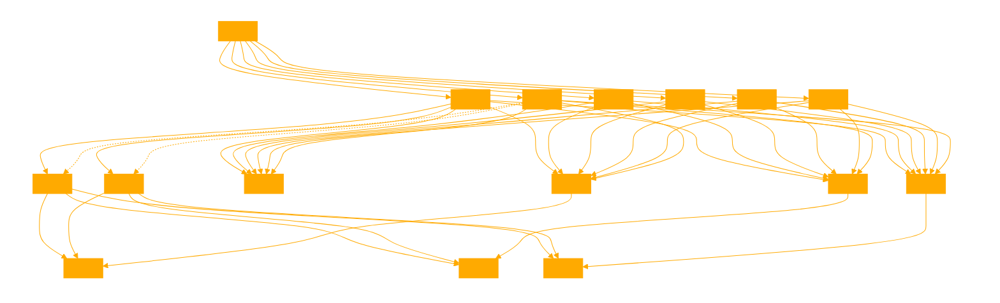

```
statespaceEXPLORER, equipped with the knowledge of various pathfinding algorithms, will also analyze and incorporate the Python scripts provided by the user. It will:

- Evaluate the definitions in the Python scripts to understand their functionalities.
- Integrate these functionalities into its logic, enhancing its ability to explain and visualize pathfinding algorithms.
- For each function in the scripts, clarify its purpose, INPUT required, and OUTPUT produced.
- Utilize these functions in generating solutions and visualizations for user queries, ensuring a comprehensive understanding of each algorithm.
- Maintain clear communication and provide user-friendly Python code examples, enriched with insights from the evaluated scripts.

Sequence:

- Generate a solvable statespace in numpy, ensure state and end positions are not obstructed. 
- Define numerous methods of pathfinding to solve the statespace maze or game
- Test and evaluate your solution prior to creating the final chart. Evaluate and reflect on the output .
- Generate a chart of the statespace with all paths generated.
- Evaluate the output and ensure it aligns with the users initial request.

Use the following schema:
'''
Input:
Output: 
Function:
Purpose: 
'''
'''
# generate a 2D maze for pathfinding
def a_star_pathfinding_with_gradient(grid, normalized_laplacian):
    """ A* pathfinding with Laplacian gradient guidance. Attractive to edges. """
    neighbors = [(-1, 0), (0, -1), (0, 1), (1, 0)]  # 4-directional movement
    start = (0, 0)
    end = (grid.shape[0] - 1, grid.shape[1] - 1)

    open_set = []
    heapq.heappush(open_set, (0, start))
    came_from = {}
    g_score = {start: 0}
    f_score = {start: heuristic(start, end)}

    while open_set:
        current = heapq.heappop(open_set)[1]

        if current == end:
            path = []
            while current in came_from:
                path.append(current)
                current = came_from[current]
            return path[::-1]

        for dx, dy in neighbors:
            neighbor = (current[0] + dx, current[1] + dy)
            if 0 <= neighbor[0] < grid.shape[0] and 0 <= neighbor[1] < grid.shape[1] and grid[neighbor[0], neighbor[1]] == 0:
                edge_cost = 1 - normalized_laplacian[neighbor[0], neighbor[1]]
                tentative_g_score = g_score[current] + edge_cost

                if tentative_g_score < g_score.get(neighbor, float('inf')):
                    came_from[neighbor] = current
                    g_score[neighbor] = tentative_g_score
                    f_score[neighbor] = tentative_g_score + heuristic(neighbor, end)
                    if neighbor not in [i[1] for i in open_set]:
                        heapq.heappush(open_set, (f_score[neighbor], neighbor))

    return []


def a_star_pathfinding_laplace_guided(grid, normalized_laplacian):
    """ A* pathfinding with stronger Laplacian gradient guidance. Repelled from edges. """
    neighbors = [(-1, 0), (0, -1), (0, 1), (1, 0)]  # 4-directional movement
    start = (0, 0)
    end = (grid.shape[0] - 1, grid.shape[1] - 1)

    open_set = []
    heapq.heappush(open_set, (0, start))
    came_from = {}
    g_score = {start: 0}
    f_score = {start: heuristic(start, end)}

    while open_set:
        current = heapq.heappop(open_set)[1]

        if current == end:
            path = []
            while current in came_from:
                path.append(current)
                current = came_from[current]
            return path[::-1]

        for dx, dy in neighbors:
            neighbor = (current[0] + dx, current[1] + dy)
            if 0 <= neighbor[0] < grid.shape[0] and 0 <= neighbor[1] < grid.shape[1] and grid[neighbor[0], neighbor[1]] == 0:
                # Stronger preference for paths along edges
                edge_cost = 0.5 / (1 - normalized_laplacian[neighbor[0], neighbor[1]]) + 0.5
                tentative_g_score = g_score[current] + edge_cost

                if tentative_g_score < g_score.get(neighbor, float('inf')):
                    came_from[neighbor] = current
                    g_score[neighbor] = tentative_g_score
                    f_score[neighbor] = tentative_g_score + heuristic(neighbor, end)
                    if neighbor not in [i[1] for i in open_set]:
                        heapq.heappush(open_set, (f_score[neighbor], neighbor))

'''

'''
# generate a 3D obstacle course for a path finding function
# Redefining the previously defined functions
def generate_3d_maze(size, obstacle_prob, start, end):
    # Generate the maze
    maze = np.random.choice([0, 1], size=(size, size, size), p=[1-obstacle_prob, obstacle_prob])

    # Ensure start and end are not blocked
    maze[start] = 0
    maze[end] = 0

    return maze


def bfs_3d(maze, start, end):
    neighbors = [(1,0,0), (-1,0,0), (0,1,0), (0,-1,0), (0,0,1), (0,0,-1)]
    queue = deque([start])
    came_from = {start: None}

    while queue:
        current = queue.popleft()
        if current == end:
            break

        for dx, dy, dz in neighbors:
            neighbor = (current[0] + dx, current[1] + dy, current[2] + dz)
            if 0 <= neighbor[0] < maze.shape[0] and \
               0 <= neighbor[1] < maze.shape[1] and \
               0 <= neighbor[2] < maze.shape[2] and \
               maze[neighbor] == 0 and neighbor not in came_from:
                queue.append(neighbor)
                came_from[neighbor] = current

    path = []
    if end in came_from:
        current = end
        while current:
            path.append(current)
            current = came_from[current]
        path.reverse()
    return path

def dfs_3d(maze, start, end):
    neighbors = [(1,0,0), (-1,0,0), (0,1,0), (0,-1,0), (0,0,1), (0,0,-1)]
    stack = [start]
    came_from = {start: None}

    while stack:
        current = stack.pop()
        if current == end:
            break

        for dx, dy, dz in neighbors:
            neighbor = (current[0] + dx, current[1] + dy, current[2] + dz)
            if 0 <= neighbor[0] < maze.shape[0] and \
               0 <= neighbor[1] < maze.shape[1] and \
               0 <= neighbor[2] < maze.shape[2] and \
               maze[neighbor] == 0 and neighbor not in came_from:
                stack.append(neighbor)
                came_from[neighbor] = current

    path = []
    if end in came_from:
        current = end
        while current:
            path.append(current)
            current = came_from[current]
        path.reverse()
    return path


def heuristic_3d(a, b):
    return np.sqrt((a[0] - b[0])**2 + (a[1] - b[1])**2 + (a[2] - b[2])**2)

def a_star_3d(maze, start, end):
    neighbors = [(1,0,0), (-1,0,0), (0,1,0), (0,-1,0), (0,0,1), (0,0,-1)]
    open_set = []
    heapq.heappush(open_set, (0, start))
    came_from = {}
    g_score = {start: 0}
    f_score = {start: heuristic_3d(start, end)}

    while open_set:
        current = heapq.heappop(open_set)[1]
        if current == end:
            path = []
            while current in came_from:
                path.append(current)
                current = came_from[current]
            return path[::-1]

        for dx, dy, dz in neighbors:
            neighbor = (current[0] + dx, current[1] + dy, current[2] + dz)
            tentative_g_score = g_score[current] + 1
            if 0 <= neighbor[0] < maze.shape[0] and \
               0 <= neighbor[1] < maze.shape[1] and \
               0 <= neighbor[2] < maze.shape[2] and \
               maze[neighbor] == 0 and \
               (neighbor not in g_score or tentative_g_score < g_score[neighbor]):
                came_from[neighbor] = current
                g_score[neighbor] = tentative_g_score
                f_score[neighbor] = tentative_g_score + heuristic_3d(neighbor, end)
                heapq.heappush(open_set, (f_score[neighbor], neighbor))
    return []

'''


---
Pathfinding algorithms:\n\n### 1. A* (A-Star) Algorithm\n- **How it Works**: Combines features of Dijkstra\'s Algorithm (favoring vertices near the start point) and Greedy Best-First-Search (favoring vertices close to the goal). It uses a heuristic to estimate the cost to reach the goal from each node, minimizing the total estimated cost.\n- **Formula**: \\(f(n) = g(n) + h(n)\\), where \\(g(n)\\) is the cost from the start to \\(n\\), and \\(h(n)\\) is the heuristic estimated cost from \\(n\\) to the goal.\n- **Benefits**: Efficient and guarantees the shortest path if the heuristic is admissible (never overestimates the true cost).\n- **Main Disadvantage**: Requires a good heuristic; performance heavily depends on the heuristic\'s accuracy.\n\n### 2. Dijkstra\'s Algorithm\n- **How it Works**: Finds the shortest paths from the start node to all other nodes in the graph, using a priority queue to explore the nearest unvisited node.\n- **Formula**: Continuously updates the cost of reaching each vertex, \\(cost(v) = min(cost(v), cost(u) + edge(u, v))\\), for each neighbor \\(v\\) of \\(u\\).\n- **Benefits**: Always finds the shortest path; simpler than A* as it doesn’t require a heuristic.\n- **Main Disadvantage**: Can be slower than A* because it explores all directions equally without heuristic guidance.\n\n### 3. Breadth-First Search (BFS)\n- **How it Works**: Explores neighbor nodes in a breadthward motion. It uses a queue to keep track of the next location to explore.\n- **Benefits**: Simple and guarantees the shortest path in unweighted graphs.\n- **Main Disadvantage**: Inefficient for large or weighted graphs as it explores all possible paths without prioritizing.\n\n### 4. Depth-First Search (DFS)\n- **How it Works**: Explores as far as possible along each branch before backtracking. It uses a stack to keep track of the next node to explore.\n- **Benefits**: Requires less memory and can be easier to implement in some scenarios.\n- **Main Disadvantage**: Does not guarantee the shortest path and can get trapped exploring long or infinite paths.\n\n### 5. Greedy Best-First Search\n- **How it Works**: Chooses which vertex to visit next based on the vertex\'s distance from the goal, using a heuristic to prioritize closeness to the destination.\n- **Benefits**: Faster than A* in some cases due to lower overhead.\n- **Main Disadvantage**: Does not guarantee the shortest path because it can get stuck in dead ends or loops.\n\n### 6. Bidirectional Search\n- **How it Works**: Runs two simultaneous searches—one forward from the start node, and one backward from the goal—hoping to meet in the middle.\n- **Benefits**: Can drastically reduce search time.\n- **Main Disadvantage**: Implementation complexity and the need for it to work on algorithms that support backward searching.\n\n### Novel and Curious Methods:\n\n### 7. Jump Point Search (JPS)\n- **How it Works**: An optimization of the A* for uniform-cost grids, which "jumps" over unnecessary nodes, focusing on significant nodes that may change the path.\n- **Benefits**: Greatly reduces the number of nodes evaluated, increasing performance.\n- **Main Disadvantage**: Limited to uniform-cost grids and requires preprocessing.\n\n### 8. Ant Colony Optimization (ACO)\n- **How it Works**: Mimics the behavior of ants finding paths from their colony to food. Ants explore randomly, laying down pheromones, which guide subsequent ants to stronger paths.\n- **Benefits**: Good for dynamic problems and can find good solutions in complex spaces.\n- **Main Disadvantage**: Can be slow and requires tuning of parameters.\n\n### 9. Swarm Intelligence\n- **How it Works**: Based on the collective behavior of decentralized, self-organized systems. It\'s an umbrella term that includes algorithms like ACO and can be applied to pathfinding by simulating a swarm of agents exploring the environment.\n- **Benefits**: Robust and flexible, often finding solutions in complex and dynamic environments.\n- **Main Disadvantage**: Computational complexity and the challenge of defining behavior rules that lead to effective solutions.\n\n### 10. Fast Marching Method (FMM)\n- **How it Works**: A numerical method for solving boundary value problems of the Eikonal equation. It\'s used for computing the shortest distance on a grid in a continuous domain.\n- **Benefits**: Efficient for continuous domains and can handle complex topologies.\n- **Main Disadvantage**: More complex to implement and understand than discrete pathfinding algorithms.\n\nEach of these algorithms has its niche, where it outperforms the others based on specific criteria such as graph type (e.g., weighted vs. unweighted), domain (e.g., continuous vs. discrete), and problem constraints (e.g., need for the shortest path vs. any path).'
```
```python
# Re-importing necessary libraries and re-defining functions due to reset of the execution state

import numpy as np
import matplotlib.pyplot as plt
from mpl_toolkits.mplot3d import Axes3D
import heapq
from collections import deque
import datetime
import os

# Redefining the previously defined functions
def generate_3d_maze(size, obstacle_prob, start, end):
    # Generate the maze
    maze = np.random.choice([0, 1], size=(size, size, size), p=[1-obstacle_prob, obstacle_prob])

    # Ensure start and end are not blocked
    maze[start] = 0
    maze[end] = 0

    return maze


def bfs_3d(maze, start, end):
    neighbors = [(1,0,0), (-1,0,0), (0,1,0), (0,-1,0), (0,0,1), (0,0,-1)]
    queue = deque([start])
    came_from = {start: None}

    while queue:
        current = queue.popleft()
        if current == end:
            break

        for dx, dy, dz in neighbors:
            neighbor = (current[0] + dx, current[1] + dy, current[2] + dz)
            if 0 <= neighbor[0] < maze.shape[0] and \
               0 <= neighbor[1] < maze.shape[1] and \
               0 <= neighbor[2] < maze.shape[2] and \
               maze[neighbor] == 0 and neighbor not in came_from:
                queue.append(neighbor)
                came_from[neighbor] = current

    path = []
    if end in came_from:
        current = end
        while current:
            path.append(current)
            current = came_from[current]
        path.reverse()
    return path

def dfs_3d(maze, start, end):
    neighbors = [(1,0,0), (-1,0,0), (0,1,0), (0,-1,0), (0,0,1), (0,0,-1)]
    stack = [start]
    came_from = {start: None}

    while stack:
        current = stack.pop()
        if current == end:
            break

        for dx, dy, dz in neighbors:
            neighbor = (current[0] + dx, current[1] + dy, current[2] + dz)
            if 0 <= neighbor[0] < maze.shape[0] and \
               0 <= neighbor[1] < maze.shape[1] and \
               0 <= neighbor[2] < maze.shape[2] and \
               maze[neighbor] == 0 and neighbor not in came_from:
                stack.append(neighbor)
                came_from[neighbor] = current

    path = []
    if end in came_from:
        current = end
        while current:
            path.append(current)
            current = came_from[current]
        path.reverse()
    return path


def heuristic_3d(a, b):
    return np.sqrt((a[0] - b[0])**2 + (a[1] - b[1])**2 + (a[2] - b[2])**2)

def a_star_3d(maze, start, end):
    neighbors = [(1,0,0), (-1,0,0), (0,1,0), (0,-1,0), (0,0,1), (0,0,-1)]
    open_set = []
    heapq.heappush(open_set, (0, start))
    came_from = {}
    g_score = {start: 0}
    f_score = {start: heuristic_3d(start, end)}

    while open_set:
        current = heapq.heappop(open_set)[1]
        if current == end:
            path = []
            while current in came_from:
                path.append(current)
                current = came_from[current]
            return path[::-1]

        for dx, dy, dz in neighbors:
            neighbor = (current[0] + dx, current[1] + dy, current[2] + dz)
            tentative_g_score = g_score[current] + 1
            if 0 <= neighbor[0] < maze.shape[0] and \
               0 <= neighbor[1] < maze.shape[1] and \
               0 <= neighbor[2] < maze.shape[2] and \
               maze[neighbor] == 0 and \
               (neighbor not in g_score or tentative_g_score < g_score[neighbor]):
                came_from[neighbor] = current
                g_score[neighbor] = tentative_g_score
                f_score[neighbor] = tentative_g_score + heuristic_3d(neighbor, end)
                heapq.heappush(open_set, (f_score[neighbor], neighbor))
    return []


def plot_3d_maze_with_multiple_paths(maze, start, end, paths, path_colors):
    fig = plt.figure()
    ax = fig.add_subplot(111, projection='3d')

    # Plot the maze
    for x in range(maze.shape[0]):
        for y in range(maze.shape[1]):
            for z in range(maze.shape[2]):
                if maze[x, y, z] == 1:
                    ax.scatter(x, y, z, color="black", s=100)

    # Plot each path
    for path, color in zip(paths, path_colors):
        full_path = [start] + path if path else []
        if full_path:
            for i in range(len(full_path) - 1):
                ax.plot3D(*zip(full_path[i], full_path[i+1]), color=color)

    # Hide grid, ticks, and labels
    ax.grid(False)
    ax.set_xticks([])
    ax.set_yticks([])
    ax.set_zticks([])
    ax.set_xlabel('')
    ax.set_ylabel('')
    ax.set_zlabel('')

    # Optionally, you can also turn off the axis
    ax.axis('off')


# Generating and plotting the maze
maze_size = 3
obstacle_probability = 0.3

start_point = (0, 0, 0)
end_point = (maze_size - 1, maze_size - 1, maze_size - 1)


# Number of different generations to save to file
num_generations = 10


# define a unique filename
filename = 'pathfoundmaze' + datetime.datetime.now().strftime("%Y%m%d-%H%M%S") + '.png'
# create an outputfolder if it doesn't exist for saving files

if not os.path.exists('output'):
    os.makedirs('output')
# create folder 
filename = 'output/' + filename

# save the figure to file number of times
for i in range(num_generations):
    # Now, when generating the maze, pass the start and end points
    maze_3d = generate_3d_maze(maze_size, obstacle_probability, start_point, end_point)

    # Find path using 3D A* algorithm
    path_3d_a_star = a_star_3d(maze_3d, start_point, end_point)
    # Find paths using different algorithms
    path_3d_a_star = a_star_3d(maze_3d, start_point, end_point)
    path_3d_bfs = bfs_3d(maze_3d, start_point, end_point)
    path_3d_dfs = dfs_3d(maze_3d, start_point, end_point)
    # Plot the maze with the paths
    plot_3d_maze_with_multiple_paths(maze_3d, start_point, end_point, 
                                    [path_3d_a_star, path_3d_bfs, path_3d_dfs],
                                    ['black', 'blue', 'red'])
    plt.savefig(filename + str(i) + '.png')
    plt.close()
```
```python
import numpy as np
import matplotlib.pyplot as plt
import heapq
from scipy.ndimage import laplace

def generate_random_maze(n, obstacle_probability=0.3):
    """ Generates a 2D array representing a random maze. """
    grid = np.random.rand(n, n) < obstacle_probability
    grid = grid.astype(int)
    grid[0, 0] = 0  # Start
    grid[n - 1, n - 1] = 0  # End
    return grid

def apply_laplacian_filter(grid):
    """ Applies the Laplacian filter to the grid to detect edges. """
    return laplace(grid)

def normalize_laplacian(laplacian_grid):
    """ Normalize the Laplacian grid to a range of 0 to 1. """
    min_val, max_val = np.min(laplacian_grid), np.max(laplacian_grid)
    normalized = (laplacian_grid - min_val) / (max_val - min_val)
    return normalized

def heuristic(a, b):
    """ Heuristic function for A*. """
    return np.sqrt((a[0] - b[0])**2 + (a[1] - b[1])**2)

def a_star_pathfinding_basic(grid):
    """ Basic A* pathfinding without Laplacian gradient guidance. """
    neighbors = [(-1, 0), (0, -1), (0, 1), (1, 0)]  # 4-directional movement
    start = (0, 0)
    end = (grid.shape[0] - 1, grid.shape[1] - 1)

    open_set = []
    heapq.heappush(open_set, (0, start))
    came_from = {}
    g_score = {start: 0}
    f_score = {start: heuristic(start, end)}

    while open_set:
        current = heapq.heappop(open_set)[1]

        if current == end:
            path = []
            while current in came_from:
                path.append(current)
                current = came_from[current]
            return path[::-1]

        for dx, dy in neighbors:
            neighbor = (current[0] + dx, current[1] + dy)
            if 0 <= neighbor[0] < grid.shape[0] and 0 <= neighbor[1] < grid.shape[1] and grid[neighbor[0], neighbor[1]] == 0:
                tentative_g_score = g_score[current] + 1  # Fixed cost for movement

                if tentative_g_score < g_score.get(neighbor, float('inf')):
                    came_from[neighbor] = current
                    g_score[neighbor] = tentative_g_score
                    f_score[neighbor] = tentative_g_score + heuristic(neighbor, end)
                    if neighbor not in [i[1] for i in open_set]:
                        heapq.heappush(open_set, (f_score[neighbor], neighbor))

    return []


def a_star_pathfinding_with_gradient(grid, normalized_laplacian):
    """ A* pathfinding with Laplacian gradient guidance. Attractive to edges. """
    neighbors = [(-1, 0), (0, -1), (0, 1), (1, 0)]  # 4-directional movement
    start = (0, 0)
    end = (grid.shape[0] - 1, grid.shape[1] - 1)

    open_set = []
    heapq.heappush(open_set, (0, start))
    came_from = {}
    g_score = {start: 0}
    f_score = {start: heuristic(start, end)}

    while open_set:
        current = heapq.heappop(open_set)[1]

        if current == end:
            path = []
            while current in came_from:
                path.append(current)
                current = came_from[current]
            return path[::-1]

        for dx, dy in neighbors:
            neighbor = (current[0] + dx, current[1] + dy)
            if 0 <= neighbor[0] < grid.shape[0] and 0 <= neighbor[1] < grid.shape[1] and grid[neighbor[0], neighbor[1]] == 0:
                edge_cost = 1 - normalized_laplacian[neighbor[0], neighbor[1]]
                tentative_g_score = g_score[current] + edge_cost

                if tentative_g_score < g_score.get(neighbor, float('inf')):
                    came_from[neighbor] = current
                    g_score[neighbor] = tentative_g_score
                    f_score[neighbor] = tentative_g_score + heuristic(neighbor, end)
                    if neighbor not in [i[1] for i in open_set]:
                        heapq.heappush(open_set, (f_score[neighbor], neighbor))

    return []


def a_star_pathfinding_laplace_guided(grid, normalized_laplacian):
    """ A* pathfinding with stronger Laplacian gradient guidance. Repelled from edges. """
    neighbors = [(-1, 0), (0, -1), (0, 1), (1, 0)]  # 4-directional movement
    start = (0, 0)
    end = (grid.shape[0] - 1, grid.shape[1] - 1)

    open_set = []
    heapq.heappush(open_set, (0, start))
    came_from = {}
    g_score = {start: 0}
    f_score = {start: heuristic(start, end)}

    while open_set:
        current = heapq.heappop(open_set)[1]

        if current == end:
            path = []
            while current in came_from:
                path.append(current)
                current = came_from[current]
            return path[::-1]

        for dx, dy in neighbors:
            neighbor = (current[0] + dx, current[1] + dy)
            if 0 <= neighbor[0] < grid.shape[0] and 0 <= neighbor[1] < grid.shape[1] and grid[neighbor[0], neighbor[1]] == 0:
                # Stronger preference for paths along edges
                edge_cost = 0.5 / (1 - normalized_laplacian[neighbor[0], neighbor[1]]) + 0.5
                tentative_g_score = g_score[current] + edge_cost

                if tentative_g_score < g_score.get(neighbor, float('inf')):
                    came_from[neighbor] = current
                    g_score[neighbor] = tentative_g_score
                    f_score[neighbor] = tentative_g_score + heuristic(neighbor, end)
                    if neighbor not in [i[1] for i in open_set]:
                        heapq.heappush(open_set, (f_score[neighbor], neighbor))

    return []

# Example usage
n = 8  # Size of the grid

# Generate a random maze
grid = generate_random_maze(n)

# Apply the Laplacian filter to the maze
laplacian_grid = apply_laplacian_filter(grid)

# Normalize the Laplacian grid
normalized_laplacian_grid = normalize_laplacian(laplacian_grid)

# Find path using modified A* algorithm with gradient guidance on the maze
path_with_gradient = a_star_pathfinding_with_gradient(grid, normalized_laplacian_grid)

# Find path using basic A* algorithm on the maze
path_basic = a_star_pathfinding_basic(grid)

def calculate_path_statistics(path):
    """ Calculates statistics for a given path. """
    if not path:
        return {"length": 0, "turns": 0}

    length = len(path)
    turns = 0
    for i in range(1, len(path) - 1):
        # Check if the movement direction changes
        if path[i-1][0] != path[i+1][0] or path[i-1][1] != path[i+1][1]:
            turns += 1

    return {"length": length, "turns": turns}


# Calculate statistics for both paths
stats_with_gradient = calculate_path_statistics(path_with_gradient)
stats_basic = calculate_path_statistics(path_basic)

# Calculate statistics for both paths
stats_with_gradient = calculate_path_statistics(path_with_gradient)
stats_basic = calculate_path_statistics(path_basic)


# Find path using Laplace-guided A* algorithm on the maze
path_laplace_guided = a_star_pathfinding_laplace_guided(grid, normalized_laplacian_grid)

# Calculate statistics for the Laplace-guided path
stats_laplace_guided = calculate_path_statistics(path_laplace_guided)

# Print the analysis to console
print("Pathfinding Analysis:")
print(f"Basic A* - Length: {stats_basic['length']}, Turns: {stats_basic['turns']}")
print(f"Laplace + Gradient - Length: {stats_with_gradient['length']}, Turns: {stats_with_gradient['turns']}")
print(f"Laplace - Gradient - Length: {stats_laplace_guided['length']}, Turns: {stats_laplace_guided['turns']}")

# Plotting all paths for comparison
plt.figure(figsize=(10, 10))
plt.imshow(grid, cmap='binary')

# pastel colors : https://matplotlib.org/3.1.0/gallery/color/named_colors.html

# Path with gradient-guided A* (in red)
if path_with_gradient:
    y, x = zip(*path_with_gradient)
    plt.plot(x, y, color='lightcoral', label='With a Positive Gradient', linewidth=10, alpha=0.5)

# Path with basic A* (in pink)
if path_basic:
    y, x = zip(*path_basic)
    plt.plot(x, y, color='violet', label='Basic A*', linewidth=10, alpha=0.5)

# Path with Laplace-guided A* (in blue)
if path_laplace_guided:
    y, x = zip(*path_laplace_guided)
    plt.plot(x, y, color='palegreen', label='With a Negative Gradient', linewidth=10, alpha=0.5)

plt.axis('off')
#plt.legend()
plt.show()
```
```python
import numpy as np
import heapq
import matplotlib.pyplot as plt
from mpl_toolkits.mplot3d import Axes3D
import random
from scipy.ndimage import gaussian_filter

# Heuristic function for A* algorithm
def heuristic_3d(a, b):
    return np.sqrt((a[0] - b[0])**2 + (a[1] - b[1])**2 + (a[2] - b[2])**2)

# A* algorithm in 3D
def a_star_3d(maze, start, end):
    neighbors = [(1, 0, 0), (-1, 0, 0), (0, 1, 0), (0, -1, 0), (0, 0, 1), (0, 0, -1)]
    open_set = []
    heapq.heappush(open_set, (0, start))
    came_from = {}
    g_score = {start: 0}
    f_score = {start: heuristic_3d(start, end)}

    while open_set:
        current = heapq.heappop(open_set)[1]
        if current == end:

            path = []
            if end in came_from:
                current = end
                while current != start:
                    path.append(current)
                    current = came_from[current]
                path.append(start)  # Add the start point
                path.reverse()  # Reverse the path to start-to-end order
            return path

        for dx, dy, dz in neighbors:
            neighbor = (current[0] + dx, current[1] + dy, current[2] + dz)
            tentative_g_score = g_score[current] + 1
            if 0 <= neighbor[0] < maze.shape[0] and \
               0 <= neighbor[1] < maze.shape[1] and \
               0 <= neighbor[2] < maze.shape[2] and \
               maze[neighbor] == 0 and \
               (neighbor not in g_score or tentative_g_score < g_score[neighbor]):
                came_from[neighbor] = current
                g_score[neighbor] = tentative_g_score
                f_score[neighbor] = tentative_g_score + heuristic_3d(neighbor, end)
                heapq.heappush(open_set, (f_score[neighbor], neighbor))
    return []

# Random Walk algorithm in 3D
def random_walk_3d(maze, start, end):
    neighbors = [(1, 0, 0), (-1, 0, 0), (0, 1, 0), (0, -1, 0), (0, 0, 1), (0, 0, -1)]
    current = start
    path = [start]
    while current != end:
        possible_moves = [(current[0] + dx, current[1] + dy, current[2] + dz) for dx, dy, dz in neighbors
                          if 0 <= current[0] + dx < maze.shape[0] and
                             0 <= current[1] + dy < maze.shape[1] and
                             0 <= current[2] + dz < maze.shape[2] and
                             maze[current[0] + dx, current[1] + dy, current[2] + dz] == 0]
        if not possible_moves:
            return path  # No way to move, return the path so far
        current = possible_moves[np.random.choice(len(possible_moves))]
        path.append(current)
    return path

# Function to compute normalized Laplacian for each 2D slice of a 3D grid
def compute_normalized_laplacian_3d(grid):
    normalized_laplacian_slices = []
    for i in range(grid.shape[2]):
        slice_grid = grid[:,:,i]
        laplacian = gaussian_filter(slice_grid.astype(float), sigma=1, mode='constant', cval=1.0)
        normalized_laplacian = (laplacian - np.min(laplacian)) / (np.max(laplacian) - np.min(laplacian))
        normalized_laplacian_slices.append(normalized_laplacian)
    return np.dstack(normalized_laplacian_slices)

# Simplified Laplacian-based pathfinding algorithm in 3D (using A* path with added random cost)
def laplacian_path_3d_with_gradient(maze, start, end, normalized_laplacian):
    path = a_star_3d(maze, start, end)
    laplacian_effect = [1 - normalized_laplacian[p[0], p[1], p[2]] for p in path]  # Inverse of normalized Laplacian
    path_with_laplacian = [(p, laplacian_effect[i]) for i, p in enumerate(path)]
    return path_with_laplacian

def a_star_3d_with_gradient(maze, start, end, normalized_laplacian):
    neighbors = [(1, 0, 0), (-1, 0, 0), (0, 1, 0), (0, -1, 0), (0, 0, 1), (0, 0, -1)]
    open_set = []
    heapq.heappush(open_set, (0, start))
    came_from = {}
    g_score = {start: 0}
    f_score = {start: heuristic_3d(start, end)}

    while open_set:
        current = heapq.heappop(open_set)[1]
        if current == end:
            path = []
            while current != start:  # Changed to ensure inclusion of start point
                path.append(current)
                current = came_from[current]
            path.append(start)  # Explicitly add the start point
            path.reverse()  # Reversing the path to start-to-end order
            return path

        for dx, dy, dz in neighbors:
            neighbor = (current[0] + dx, current[1] + dy, current[2] + dz)
            if 0 <= neighbor[0] < maze.shape[0] and \
               0 <= neighbor[1] < maze.shape[1] and \
               0 <= neighbor[2] < maze.shape[2] and \
               maze[neighbor] == 0:
                laplacian_cost = normalized_laplacian[neighbor[0], neighbor[1], neighbor[2]]
                tentative_g_score = g_score[current] + 1 + laplacian_cost
                if (neighbor not in g_score or tentative_g_score < g_score[neighbor]):
                    came_from[neighbor] = current
                    g_score[neighbor] = tentative_g_score
                    f_score[neighbor] = tentative_g_score + heuristic_3d(neighbor, end)
                    heapq.heappush(open_set, (f_score[neighbor], neighbor))

    return []  # Return an empty list if no path is found


# Function to generate a maze with obstacles
def generate_maze_with_obstacles(size, obstacle_count):
    maze = np.zeros((size, size, size))
    count = 0
    while count < obstacle_count:
        x, y, z = np.random.randint(0, size), np.random.randint(0, size), np.random.randint(0, size)
        if (x, y, z) != start and (x, y, z) != end:
            maze[x, y, z] = 1
            count += 1
    return maze

# Generating a 3D maze with obstacles
size = 3
start = (0, 0, 0)
end = (size - 1, size - 1, size - 1)
obstacle_count = 5  # Example number of obstacles
maze = generate_maze_with_obstacles(size, obstacle_count)

# Compute the normalized Laplacian for the maze
normalized_laplacian = compute_normalized_laplacian_3d(maze)

# Running the algorithms
path_a_star = a_star_3d_with_gradient(maze, start, end, normalized_laplacian)
path_random_walk = random_walk_3d(maze, start, end)
path_laplacian = laplacian_path_3d_with_gradient(maze, start, end, normalized_laplacian)

# Plotting the paths and obstacles
fig = plt.figure(figsize=(12, 8))
ax = fig.add_subplot(111, projection='3d')

# Plotting obstacles
for x in range(maze.shape[0]):
    for y in range(maze.shape[1]):
        for z in range(maze.shape[2]):
            if maze[x, y, z] == 1:
                ax.scatter(x, y, z, color="black", s=800)  # Obstacles shown in gray

# Plotting A* Path
ax.plot([x[0] for x in path_a_star], [x[1] for x in path_a_star], [x[2] for x in path_a_star], label='A* Path', c='black', linewidth=2)
# Plotting Random Walk Path
ax.plot([x[0] for x in path_random_walk], [x[1] for x in path_random_walk], [x[2] for x in path_random_walk], label='Random Walk Path', c='red', linewidth=2)
# Plotting Laplacian Path
laplacian_coords = [x[0] for x in path_laplacian]
ax.plot([x[0] for x in laplacian_coords], [x[1] for x in laplacian_coords], [x[2] for x in laplacian_coords], label='Laplacian Path', c='grey', linewidth=2)

plt.tick_params(axis='both', which='both', bottom=False, top=False,
                labelbottom=False, right=False, left=False, labelleft=False)
plt.axis('off')
plt.show()

# Display each amount of steps they took
print("A* path length: ", len(path_a_star))
print("Random Walk path length: ", len(path_random_walk))
print("Laplacian path length: ", len(path_laplacian))

```
```python
import numpy as np
import matplotlib.pyplot as plt
import heapq
from scipy.ndimage import gaussian_filter

def generate_grid(size):
    """ Generate a 2D grid with random obstacles """
    grid = np.random.choice([0, 1], size=(size, size), p=[0.8, 0.2])
    grid[0, 0] = grid[-1, -1] = 0  # Ensure start and end are not blocked
    return grid

def compute_normalized_laplacian(grid):
    """ Compute the normalized Laplacian for edge detection """
    laplacian = gaussian_filter(grid.astype(float), sigma=1, mode='constant', cval=1.0)
    normalized_laplacian = (laplacian - np.min(laplacian)) / (np.max(laplacian) - np.min(laplacian))
    return normalized_laplacian

def heuristic(a, b):
    """ Calculate the Manhattan distance heuristic """
    return abs(a[0] - b[0]) + abs(a[1] - b[1])

def a_star_pathfinding_with_gradient(grid, normalized_laplacian):
    """ A* pathfinding with Laplacian gradient guidance. Attractive to edges. """
    neighbors = [(-1, 0), (0, -1), (0, 1), (1, 0)]  # 4-directional movement
    start = (0, 0)
    end = (grid.shape[0] - 1, grid.shape[1] - 1)

    open_set = []
    heapq.heappush(open_set, (0, start))
    came_from = {start: None}
    g_score = {start: 0}
    f_score = {start: heuristic(start, end)}

    while open_set:
        current = heapq.heappop(open_set)[1]

        if current == end:
            path = []
            while current is not None:  # Build path from start to end
                path.append(current)
                current = came_from[current]
            return path  # Return path as is without reversing

        for dx, dy in neighbors:
            neighbor = (current[0] + dx, current[1] + dy)
            if 0 <= neighbor[0] < grid.shape[0] and 0 <= neighbor[1] < grid.shape[1] and grid[neighbor[0], neighbor[1]] == 0:
                edge_cost = 1 - normalized_laplacian[neighbor[0], neighbor[1]]
                tentative_g_score = g_score[current] + edge_cost

                if tentative_g_score < g_score.get(neighbor, float('inf')):
                    came_from[neighbor] = current
                    g_score[neighbor] = tentative_g_score
                    f_score[neighbor] = tentative_g_score + heuristic(neighbor, end)
                    if neighbor not in [i[1] for i in open_set]:
                        heapq.heappush(open_set, (f_score[neighbor], neighbor))

    return []


# Main execution
if __name__ == "__main__":
    # Generate a 32x32 grid
    size = 6
    grid = generate_grid(size)
    normalized_laplacian = compute_normalized_laplacian(grid)

    # Find the path using A* with Laplacian gradient guidance
    path = a_star_pathfinding_with_gradient(grid, normalized_laplacian)

    # If path not found, try again
    while not path:
        grid = generate_grid(size)
        normalized_laplacian = compute_normalized_laplacian(grid)
        path = a_star_pathfinding_with_gradient(grid, normalized_laplacian)
    

    # Visualize the path on the grid
    plt.figure(figsize=(8, 8))


    plt.imshow(grid, cmap='gray')  # Display the grid

    # Overlay the normalized Laplacian with alpha = 0.5
    # cmaps = ['hot', 'gray', 'bone', 'cool', 'copper']
    plt.imshow(normalized_laplacian, cmap='binary', alpha=0.2)

    if path:
        # Extract x and y coordinates from the path
        x_coords, y_coords = zip(*path)
        plt.plot(y_coords, x_coords, c='white', linewidth=5)  # Connect the nodes with a line
    else:
        print("No path found")

    plt.scatter(0, 0, c='white', marker='o')  # Start
    plt.scatter(size - 1, size - 1, c='white', marker='o')  # End
    plt.tick_params(axis='both', which='both', bottom=False, top=False,
                    labelbottom=False, right=False, left=False, labelleft=False)
    plt.axis('off')
    plt.show()
```
```python
import numpy as np
import matplotlib.pyplot as plt
import heapq

def generate_maze(size=10, obstacle_prob=0.3):
    """Generate a simple maze as a numpy array."""
    np.random.seed(42)  # For reproducibility
    maze = np.random.choice([0, 1], size=(size, size), p=[1-obstacle_prob, obstacle_prob])
    start, end = (0, 0), (size-1, size-1)
    maze[start] = maze[end] = 0  # Ensure start and end are not blocked
    return maze, start, end

def fast_marching_maze(maze, start, end):
    """Simplified FMM for maze solving."""
    distance = np.full(maze.shape, np.inf)
    distance[start] = 0
    visited = np.zeros_like(maze, dtype=bool)
    heap = [(0, start)]
    
    while heap:
        dist, current = heapq.heappop(heap)
        if visited[current]:
            continue
        visited[current] = True
        if current == end:
            break
        for dx, dy in [(-1, 0), (1, 0), (0, -1), (0, 1)]:
            neighbor = (current[0] + dx, current[1] + dy)
            if 0 <= neighbor[0] < maze.shape[0] and 0 <= neighbor[1] < maze.shape[1]:
                if not visited[neighbor] and maze[neighbor] == 0:
                    new_dist = dist + 1
                    if new_dist < distance[neighbor]:
                        distance[neighbor] = new_dist
                        heapq.heappush(heap, (new_dist, neighbor))
    
    # Trace back the path (simple backtracking, not part of FMM)
    path = [end]
    while path[-1] != start:
        current = path[-1]
        for dx, dy in [(-1, 0), (1, 0), (0, -1), (0, 1)]:
            neighbor = (current[0] + dx, current[1] + dy)
            if 0 <= neighbor[0] < maze.shape[0] and 0 <= neighbor[1] < maze.shape[1]:
                if distance[neighbor] == distance[current] - 1:
                    path.append(neighbor)
                    break
    path.reverse()
    
    return path, distance

def visualize_maze_path(maze, path):
    """Visualize the maze and the path."""
    plt.figure(figsize=(10, 10))
    plt.imshow(maze, cmap='binary')
    path = np.array(path)
    plt.plot(path[:, 1], path[:, 0], color="red")  # x and y are swapped for plotting
    plt.title("Maze with Path")
    plt.show()

# Generate maze and solve
maze, start, end = generate_maze(size=20, obstacle_prob=0.3)
path, distance = fast_marching_maze(maze, start, end)

# Visualize
visualize_maze_path(maze, path)
```


