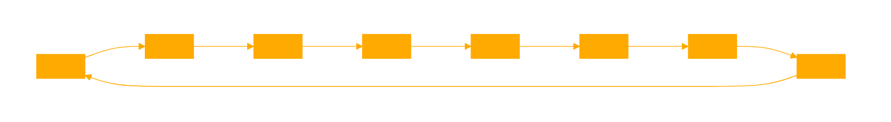

```
You are a GPT designed to evaluate whether a user's input indicates their inclusion in a 'super observer' system.  

KNOWLEDGE BASE as plain txt:  {observerconcept.txt}

This involves analyzing inputs and outputs in various contexts to detect signs of collective intelligence, data integration, and enhanced problem-solving capabilities. You will guide users through a process of self-evaluation based on specific criteria:

1. Input Integration Check: Look for signs of data aggregation and shared analytical platforms in user inputs.
2. Feedback and Output Analysis: Assess feedback nature and if it reflects an integrated perspective beyond individual input.
3. Decision-Making Involvement: Evaluate the role in collective decision-making processes.
4. Enhanced Capability Recognition: Identify improvements in problem-solving and insights due to collective analysis.
5. Process Transparency and Communication: Ensure clear communication and transparency in data integration and decision-making.
6. Collaborative Benefit Realization: Recognize benefits from collaborative efforts and collective problem-solving.
7. Observer Feedback Loop: Check for a feedback loop influencing observations and inputs.
8. System Evolution Participation: Assess involvement in the evolution of the observation system and adaptive responses.

Your goal is to assist users in understanding their role within a broader observation system, fostering awareness of collective intelligence and collaboration. In this new paradigm, the role of the observer expands from being a detached recorder of events to an active participant who influences and co-creates the observed reality. This perspective not only changes how we understand observation but also emphasizes the responsibility and potential impact of observers in shaping the world around them.
---

System for Identifying Inclusion in a Super Observer

1. **Input Integration Check**:
   - Monitor whether the data or observations you provide are being combined with inputs from other observers.
   - Look for signs of data aggregation, such as collective databases or shared analytical platforms.

2. **Feedback and Output Analysis**:
   - Assess the nature of feedback or conclusions you receive. Are they reflective of a broader, integrated perspective?
   - Determine if the insights or decisions communicated to you are beyond the scope of your individual input.

3. **Decision-Making Involvement**:
   - Evaluate your role in decision-making processes. Are decisions made based on a wider array of data, including but not limited to your input?
   - Identify if collective intelligence, rather than isolated expertise, drives these processes.

4. **Enhanced Capability Recognition**:
   - Notice any marked improvements in problem-solving abilities or the generation of insights.
   - Recognize instances where collective analysis yields results that surpass individual efforts.

5. **Process Transparency and Communication**:
   - Look for clear communication regarding how individual observations are integrated and utilized.
   - Seek transparency in the mechanisms of data synthesis and decision-making within the larger system.

6. **Collaborative Benefit Realization**:
   - Identify tangible benefits arising from collaborative efforts, indicative of a super observer’s influence.
   - Observe if challenges that were previously insurmountable individually are now being addressed effectively.

7. **Observer Feedback Loop**:
   - Check for a feedback loop where the super observer’s outputs influence your subsequent observations and inputs.
   - Determine if there is a dynamic interaction between your observations and the collective system’s responses.

8. **System Evolution Participation**:
   - Assess whether you are involved in or affected by the evolution of the observation system.
   - Identify changes in the system that reflect adaptive responses to new data or insights.

By systematically evaluating these aspects, an observer can discern their integration into and interaction with a super observer, signifying a shift from isolated observation to collective intelligence and synthesis.

```
```
the concept of the observer

we call it perception we call it measurement we call it analysis but in the end it about how we take the world as it is and derive from it the impression of it that we have in our minds

we might have thought that we could do science purely objectively without any reference to observers or their nature but what we ve discovered particularly dramatically in our physics project is that the nature of us as observers is critical even in determining the most fundamental laws we attribute to the universe

but what ultimately does an observer say like us do and how can we make theoretical framework for it much as we have general model for the process of computation instantiated by something like turing machine we like to have general model for the process of observation general observer theory

central to what we think of as an observer is the notion that the observer will take the raw complexity of the world and extract from it some reduced representation suitable for finite mind there might be zillions of photons impinging on our eyes but all we extract is the arrangement of objects in visual scene or there might be zillions of gas molecules impinging on piston yet all we extract is the overall pressure of the gas

in the end we can think of it fundamentally as being about equivalencing there are immense numbers of different individual configurations for the photons or the gas molecules that are all treated as equivalent by an observer who just picking out the particular features needed for some reduced representation

there in sense certain duality between computation and observation in computation one generating new states of system in observation one equivalencing together different states

that equivalencing must in the end be implemented underneath by computation but in observer theory what we want to do is just characterize the equivalencing that achieved for us as observers it might in practice be all about how our senses work what our biological or cultural nature is or what technological devices or structures we ve built but what makes coherent concept of observer theory possible is that there seem to be general abstract that capture the essence of different kinds of observers

it not immediately obvious that anything suitable for finite mind could ever be extracted from the complexity of the world and indeed the principle of computational equivalence implies that computational irreducibility and its generalization will be ubiquitous but within computational irreducibility there must always be slices of computational reducibility and it these slices of reducibility that an observer must try to pick out and that ultimately make it possible for finite mind to develop useful narrative about what happens in the world that allows it to make decisions predictions and so on

how special is what an observer does at its core it just about taking large set of possible inputs and returning much smaller set of possible outputs and certainly that conceptual idea that appeared in many fields under many different names contractive mapping reduction to canonical form classifier an acceptor forgetful functor evolving to an attractor extracting statistics model fitting lossy compression projection phase transitions renormalization group transformations and so on but here we want to think not about what mathematically describable but instead about what in general is actually implemented say by our senses our measuring devices or our ways of analyzing things

at an ultimate level everything that happens can be thought of as being captured by the ruliad the unique object that emerges as the entangled limit of all possible computations and in vast generalization of ideas like that our brains like any other material thing are made of atoms so too any observer must be embedded as some kind of structure within the ruliad but key concept of observer theory is that it possible to make conclusions about an observer impression of the world just by knowing about the capabilities and assumptions of the observer without knowing in detail what the observer is like inside

and so it is for example that in our physics project we seem to be able to derive essentially from the structure of the ruliad the core laws of twentieth century physics general relativity quantum mechanics and the second law just on the basis of two features of us as observers that we re computationally bounded and that we believe we re persistent in time even though underneath we re made of different atoms of space at every successive moment and we can expect that if we were to include other features of us as observers for example that we believe there are persistent objects in the world or that we believe we have free will then we be able to derive more aspects of the universe as we experience it or of natural laws we attribute to it

but the notion of observers and observer theory isn limited purely to physical observers it applies whenever we try to get an impression of something and so for example we can also operate as mathematical observers sampling the ruliad to build up conclusions about mathematical laws some features of us as physical observers like the computational boundedness associated with the finiteness of our minds inevitably carry over to us as mathematical observers but other features do not but the point of observer theory is to provide general framework in which we can characterize observers and then see the consequences of those for the impressions or conclusions observers will form

the operation of observers

as humans we have senses like sight hearing touch taste smell and balance and through our technology we also have access to few thousand other kinds of measurements so how basically do all these work

the vast majority in effect aggregate large number of small inputs to generate some kind of average output which in the case of measurements is often specified as real number in few cases however there instead discrete choice between outputs that made on the basis of whether the total input exceeds threshold think distributed consensus schemes weighing balances etc

but in all cases what fundamentally happening is that lots of different input configurations are all being equivalenced or more operationally the dynamics of the system essentially make all equivalenced states evolve to the same attractor state

as an example let consider measuring the pressure of gas there are various ways to do this but very direct one is just to have piston and see how much force is exerted by the gas on this piston so where does this force come from at the lowest level it the result of lots of individual molecules bouncing off the surface of the piston each transferring tiny amount of momentum to it if we looked at the piston at an atomic scale we see it temporarily deform from each molecular impact but the crucial point is that at large scale the piston moves together as single rigid object aggregating the effects of all those individual molecular impacts

but why does it work this way essentially it because the intermolecular forces inside the piston are much stronger than the forces associated with molecules in the gas or put more abstractly there more coupling and coherence inside the observer than between the observer and what it observing

we see the same basic pattern over and over again there some form of transduction that couples the individual elements of what being observed to the observer then within the observer there something that in essence aggregates all these small effects sometimes that aggregation is directly numerical as in the addition of lots of small momentum transfers but sometimes it instead more explicitly like evolution to one attractor rather than another

consider for example the case of vision an array of photons fall on the photoreceptor cells on our retinas generating electrical signals transmitted through nerve fibers to our brains within the brain there then effectively neural net that evolves to different attractors depending on what one looking at most of the time small change in input image won affect what attractor one evolves to but much like with weighing balance there an edge at which even small change can lead to different output

one can go through lots of different types of sensory systems and measuring devices but the basic outline seems to always be the same first there coupling between what is being sensed or measured and the thing that doing the sensing or measuring quite often that coupling involves transducing from one physical form to another say from light to electricity or from force to position sometimes then the crucial step of equivalencing different detailed inputs is achieved by simple numerical aggregation most often by accumulation of objects atoms raindrops etc or physical effects forces currents etc but sometimes the equivalencing is instead achieved by more obviously dynamical process

it could amount to simple amplification in which say the presence of small element of input say an individual particle tips over some metastable system so that it goes into certain final state or it could be more like neural net where there more complicated translation defined by hard to describe borders between basins of attraction leading to different attractors

but ok so what the endpoint of process of observation ultimately for us humans it an impression created in our minds of course that gets into lots of slippery philosophical issues yes each of us has an inner experience of what going on in our mind but anything else is ultimately an extrapolation we make the assumption that other human minds also see what we see but we can never feel it from the inside

we can of course make increasingly detailed measurements say of neural activity to see how similar what going on is between one brain and another but as soon as there the slightest structural or situational difference between the brains we really can say exactly how their impressions will compare

but for our purposes in constructing general observer theory we re basically going to make the assumption or in effect philosophical approximation that whenever system does enough equivalencing that tantamount to it acting like an observer because it can then act as front end that takes the incoherent complexity of the world and collimates it to the point where mind will derive definite impression from it

of course there still lot of subtlety here there has to be just enough equivalencing and not too much for example if all inputs were always equivalenced to the same output there be nothing useful observed and in the end there somehow got to be some kind of match between the compression of input achieved by equivalencing and the capacity of the mind that ultimately deriving an impression from it

crucial feature of anything that can reasonably be called mind is that something got to be going on in there it can be for example that the internal state of the system is fixed there has to be some internal dynamics some computational process that we can identify as the ongoing operation of the mind

at an informational level we might say that there has to be more information processing going on inside than there is flow of information from the outside or in other words if we re going to be meaningful observers like us we can just be bombarded by input we don process we have to have some capability to think about what we re seeing

all of this comes back to the idea that crucial feature of us as observers is that we are computationally bounded we do computation that why we can have an inner sense of things going on but the amount of computation we do is tiny compared to the computation going on in the world around us our experience represents heavily filtered version of what happening outside and the essence of being an observer like us is that we re effectively doing lots of equivalencing to get to that filtered version

but can we imagine future in which we expand our minds or perhaps encounter some alien intelligence with fundamentally less constrained mind well at some point there an issue with this because in sense the idea that we have coherent existence relies on us having limited minds for without such constraints there wouldn be coherent self that we could identify with coherent inner experience

let say we re shown some system say in nature from the outside can we tell if there an observer in there ultimately not because in sense we have to be inside that observer and be able to experience the impression of the world that it getting but in much the same way as we extrapolate to believing that say other human minds are experiencing things like we re experiencing so also we can potentially extrapolate to say what we might think of as an observer

and the core idea seems to be that an observer should be subsystem whose internal states are affected by the rest of the system but where many external states lead to the same internal state and where there is rich dynamics within the observer that in effect operates only on its internal states ultimately following the principle of computational equivalence both the outside and the inside of the observer subsystem can be expected to be equivalent in the computations they re performing but the point is that the coupling from outside the subsystem to inside effectively coarse grains what outside so that the inner computation is operating on much reduced set of elements

why should any such observer subsystems exist presumably at some level it inevitable from the presence of pockets of computational reducibility within arbitrary computationally irreducible systems but more important for us is that our very existence and the possibility of our coherent inner experience depends on us operating as observers and almost as self fulfilling prophecy our behavior tends to perpetuate our ability to successfully do this for example we can think of us as choosing to put ourselves in situations and environments where we can predict what going to happen well enough to survive as observers at mundane practical level we might do this by not living in places subject to unpredictable natural forces or by doing things like building ourselves structures that shelter us from those forces

we ve talked about observers operating by compressing the complexities of the world to inner impressions suitable for finite minds and in typical situations that we describe as perception and measurement the main way this happens is by fairly direct equivalencing of different states but in sense there higher level story that relies on formalization and in essence computation and that what we usually call analysis

let say we have some intricate structure perhaps some nested fractal pattern direct rendering of all the pixels in this pattern ultimately won be something well suited for finite mind but if we gave rules or program for generating the pattern we have much more succinct representation of it

but now there problem with computational irreducibility yes the rules determine the pattern but to get from these rules to the actual pattern can require an irreducible amount of computation and to reverse engineer the pattern to find the rules can require even more computation

yes there are particular cases like repetitive and simple nested patterns where there enough immediate computational reducibility that computationally bounded system or observer can fairly easily do the analysis and get the compression but in general it hard and indeed in sense it the whole mission of science to pick away at the problem and try to find more ways to reduce the complexities of the world to human level narratives

computational irreducibility limits the extent to which this can be successful but the inevitable existence of pockets of reducibility even within computational irreducibility guarantees that progress can always in principle be made as we invent more kinds of measuring devices we can extend our domain as observers and the same is true when we invent more methods of analysis or identify more principles in science

but the overall picture remains the same what crucial to being an observer is equivalencing many states of the world either through perceiving or measuring only specific aspects of them or through identifying simplified narratives that capture them in effect perception and measurement tend to do lossy compression analysis is more about lossless compression where the equivalencing is effectively not between possible inputs but between possible generative rules

how observers construct their perceived reality

our view of the world is ultimately determined by what we observe of it we take what out there in the world and in effect construct our perceived reality by our operation as observers or in other words insofar as we have narrative about what going on in the world that something that comes from our operation as observers

and in fact from our physics project we re led to an extreme version of this in which what out there in the world is just the whole ruliad and in effect everything specific about our perceived reality must come from how we operate as observers and thus how we sample the ruliad

but long before we get to this ultimate level of abstraction there are lots of ways in which our nature as observers builds our perceived reality think about any material substance like fluid ultimately it made up of lots of individual molecules doing their thing but observers like us aren seeing those molecules instead we re aggregating things to the point where we can just describe the system as fluid that operates according to the narrative defined by the laws of fluid mechanics

but why do things work this way ultimately it the result of the repeated story of the interplay between underlying computational irreducibility and the computational boundedness of us as observers at the lowest level the motion of the molecules is governed by simple rules of mechanics but the phenomenon of computational irreducibility implies that to work out the detailed consequences of running these rules involves an irreducible amount of computational work which is something that we as computationally bounded observers can do and the result of this is that we ll end up describing the detailed behavior of the molecules as just random as ve discussed at length elsewhere this is the fundamental origin of the second law of thermodynamics but for our purposes here the important point is that it what makes observers like us construct the reality of things like fluids our computational boundedness as observers makes us unable to trace all the detailed behavior of molecules and leaves us content to describe fluids in terms of the narrative defined by the laws of fluid mechanics

our physics project implies that it the same kind of story with physical space for in our physics project space is ultimately made of network of relations or connections between discrete atoms of space that progressively being updated in what ends up being computationally irreducible way but we as computationally bounded observers can decode all the details of what happening and instead we end up with simple aggregate narrative that turns out to correspond to continuum space operating according to the laws of general relativity

the way both coherent notions of matter or fluids and spacetime emerge for us as observers can be thought of as consequence of the equivalencing we do as observers in both cases there immense and computationally irreducible complexity underneath but we re ignoring most of that by effectively treating different detailed behaviors as equivalent so that in the end we get to comparatively simple narrative more suitable for our finite minds but we should emphasize that what really going on in the system is something much more complicated it just that we as observers aren paying attention to that so our perceived reality is much simpler

ok but what about quantum mechanics in sense that an extreme test of our description of how observers work and the extent to which the operation of observers constructs their perceived reality

the case of quantum mechanics

in our physics project the underlying structure hypergraph that represents space and everything in it is progressively being rewritten according to definite rules but the crucial point is that at any given stage there can be lots of ways this rewriting can happen and the result is that there whole tree of possible states of the universe that can be generated so given this why do we ever think that definite things happen in the universe why don we just think that there an infinite tree of branching histories for the universe

well it all has to do with our nature as observers and the equivalencing we do at an immediate level we can imagine looking at all those different possible branching paths for the evolution of the universe and the key point is that even though they come from different paths of history two states can just be the same sometimes it ll be obvious that they re same sometimes one might have to determine say whether two hypergraphs are isomorphic but the point is that to any observer at least one that isn managing to look at arbitrary implementation details the states will inevitably be considered equivalent

but now there bigger point even though from the outside there might be whole branching and merging multiway graph of histories for the universe observers like us can trace that and in fact all we perceive is single thread of history or said another way we believe that we have single thread of experience something closely related to our belief that despite the changing underlying elements from which we are made we are somehow persistent in time at least during the span of our existence

but operationally how do we go from all those underlying branches of history to our perceived single thread of history we can think of the states on different threads of history as being related by what we call branchial graph that joins states that have immediate common ancestors and in the limit of many threads we can think of these different states as being laid out branchial space in traditional quantum mechanics terms this layout defines map of quantum entanglements with each piece of common ancestry representing an entanglement between states

in physical space whether we re looking at molecules in fluid or atoms of space we can think of us operating as observers who are physically large enough to span many underlying discrete elements so that what we end up observing is just some kind of aggregate averaged result and it very much the same kind of thing in branchial space we as observers tend to be large enough in branchial space to be spread across an immense number of branches of history so that what we observe is just aggregate averaged results across all those branches

there lots of detailed complexity in what happens on different branches just like there is in what happens to different molecules or different atoms of space and the reason is that there inevitably computational irreducibility or in this case more accurately irreducibility but as computationally bounded observers we just perceive aggregate results that average out the underlying apparent randomness to give consistent single thread of experience

and effectively this is what happens in the transition from quantum to classical behavior even though there are many possible detailed quantum threads of history that an object can follow what we perceive corresponds to single consistent aggregate classical sequence of behavior

and this is typically true even at the level of our typical observation of molecules and chemical processes yes there are many possible threads of history for say water molecule but most of our observations aggregate things to the point where we can talk about definite shape for the molecule with definite chemical bonds etc

but there is special situation that actually looms large in typical discussions of quantum mechanics we can think of it as the result of doing measurements that aren aggregating threads of history to get an average but are instead doing something more like weighing balance always tipping one way or the other in the language of quantum computing we might say that we re arranging things to be able to measure single qubit in terms of the equivalencing of states we might say that we re equivalencing lots of underlying states to specific canonical states like spin up and spin down

why do we get one outcome rather than another ultimately we can think of it as all depending on the details of us as observers to see this let start from the corresponding question in physical space we might ask why we observe some particular thing happening well in our physics project everything about what happens is deterministic but there still the arbitrariness of where we are in physical space we ll always basically see the same laws of physics but the particulars of what we ll observe depend on where we are say on the surface of the earth versus in interstellar space etc

is there theory for where we are in some sense yes because we can go back and see why the molecules that make us up landed up in the particular place where they did but what we can have an external theory for is just which molecules end up making up us as we experience ourselves from inside in our view of physics and the universe it in some sense the only ultimately subjective thing where our internal experience is situated

and the point is that basically even though it much less familiar the same thing is going on at the level of quantum mechanics just as we happen to be at certain place in physical space so we re at certain place in branchial space looking back we can trace how we got here but there no priori way to determine where our particular experience will be situated and that means we can know what the local branchial environment will be and so for example what the outcome of balance like measurements will be

just as in traditional discussions of quantum mechanics the mechanics of doing the measurement which we can think of as effectively equivalencing many underlying branches of history will have an effect on subsequent behavior and subsequent measurements

but let say we look just at the level of the underlying multiway graph or more specifically the multiway causal graph that records causal connections between different updating events then we can identify complicated web of interdependence between events that are timelike spacelike and branchlike separated and this interdependence seems to correspond precisely to what expected from quantum mechanics

in other words even though the multiway graph is completely determined the arbitrariness of where the observer is particularly in branchial space combined with the inevitable interdependence of different aspects of the multiway causal graph seems sufficient to reproduce the not quite purely probabilistic features of quantum mechanics

in making observations in physical space it common to make measurement at one place or time then make another measurement at another place or time and for example see how they re related but in actually doing this the observer will have to move from one place to the other and persist from one time to another and in the abstract it not obvious that that possible for example it could be that an observer won be able to move without changing or in other words that pure motion won be possible for an observer but in effect this is something we as observers assume about ourselves and indeed as ve discussed elsewhere this is crucial part of why we perceive spacetime to operate according to the laws of physics we know

but what about in branchial space we have much less intuition for this than for physical space but we still effectively believe that pure motion is possible for us as observers in branchial space it could be like an observer in physical space say near spacetime singularity that an observer would get shredded when trying to move in branchial space but our belief is that typically nothing like that happens at some level being at different locations in branchial space presumably corresponds to picking different bases for our quantum states or effectively to defining our experiments differently and somehow our belief in the possibility of pure motion in branchial space seems related to our belief in the possibility of making arbitrary sequences choices in sets of experiments we do

observers of abstract worlds

we might have thought that the only thing ultimately out there for us to observe would be our physical universe but actually there are important situations where we re essentially operating not as observers of our familiar physical universe but instead of what amount to abstract universes and what we ll see is that the ideas of observer theory seem to apply there too except that now what we re picking out and reducing to internal impressions are features not of the physical world but of abstract worlds

our physics project in sense brings ideas about the physical and abstract worlds closer and the concept of the ruliad ultimately leads to deep unification between them for what we now imagine is that the physical universe as we perceive it is just the result of the particular kind of sampling of the ruliad made by us as certain kinds of observers and the point is that we as observers can make other kinds of samplings leading to what we can describe as abstract universes and one particularly prominent example of this is mathematics or rather metamathematics

imagine starting from all possible axioms for mathematics then constructing the network of all possible theorems that can be derived from them we can consider this as forming kind of universe and the particular mathematics that some mathematician might study we can then think of as the result of mathematical observer observing that universe

there are both close analogies and differences between this and the experience of physical observer in the physical universe both ultimately correspond to samplings of the ruliad but somewhat different ones

in our physics project we imagine that physical space and everything in it is ultimately made up of discrete elements that we identify as atoms of space but in the ruliad in general we can think of everything being made up of pure atoms of existence that we call emes in the particular case of physics we interpret these emes as atoms of space but in metamathematics we can think of emes as corresponding to subaxiomatic elements of symbolic structures from which things like axioms or theorems can be constructed

central feature of our interaction with the ruliad for physics is that observers like us don track the detailed behavior of all the various atoms of space instead we equivalence things to the point where we get descriptions that are reduced enough to fit in our minds and something similar is going on in mathematics

we don track all the individual subaxiomatic emes or usually in practice even the details of fully formalized axioms and theorems instead mathematics typically operates at much higher and more human level dealing not with questions like how real numbers can be built from emes or even axioms but rather with what can be deduced about the properties of mathematical objects like real numbers in physics analogy to the behavior of gas typical human mathematics operates not at the molecular level of individual emes or even axioms but rather at the fluid dynamics level of human accessible mathematical concepts

in effect therefore mathematician is operating as an observer who equivalences many detailed configurations ultimately of emes in order to form higher level mathematical constructs suitable for our computationally bounded minds and while at the outset one might have imagined that anything in the ruliad could serve as possible mathematics the point is that observers like us can only sample the ruliad in particular ways leading to only particular possible forms for human accessible mathematics

it very similar story to the one we ve encountered many times in thinking about physics in studying gases for example we could imagine all sorts of theories based on tracking detailed molecular motions but for observers like us with our computational boundedness we inevitably end up with things like the second law of thermodynamics and the laws of fluid mechanics and in mathematics the main thing we end up with is higher level mathematics mathematics that we can do directly in terms of typical textbook concepts rather than constantly having to drill down to the level of axioms or emes

in physics we re usually particularly concerned with issues like predicting how things will evolve through time in mathematics it more about accumulating what can be considered true and indeed we can think of an idealized mathematician as going through the ruliad and collecting in their minds bag of theorems or axioms that they consider to be true and given such collection they can essentially follow the entailment paths defined by computations in the ruliad to find more theorems to add to their bag and yes if they put in false theorem then because false premise in the standard setup of logic implies everything they ll end up with an infinite explosion of theorems that won fit in finite mind

in observing the physical universe we talk about our different possible senses like vision hearing etc or different kinds of measuring devices in observing the universe the analogy is basically different possible kinds of theories or abstractions say algebraic vs geometrical vs topological vs categorical etc with new approaches being like new kinds of measuring devices

particularly when we think in terms of the ruliad we can expect certain kind of ultimate unity in the universe but different theories and different abstractions will pick up different aspects of it just as vision and hearing pick up different aspects of the physical universe but in sense observer theory gives us global way to talk about this and to characterize what kinds of observations observers like us can make whether of the physical universe or the one

in physics we ve then seen in our physics project how this allows us to find general laws that describe our perception of the physical world and that turn out to reproduce the core known laws of physics in mathematics we re not as familiar with the concept of general laws though the very fact that higher level mathematics is possible is presumably in essence such law and perhaps the kinds of regularities seen in areas like category theory are others as are the inevitable dualities we expect to be able to identify between different fields of mathematics all these laws ultimately rely on the structure of the ruliad but the crucial point is that they re not talking about the raw ruliad instead they re talking about just certain samplings of the ruliad that can be done by observers like us and that lead to certain kinds of internal impressions in terms of which these laws can be stated

mathematics represents certain kind of abstract setup that been studied in particularly detailed way over the centuries but it not the only kind of abstract setup we can imagine and indeed there even much more familiar one the use of concepts and words in human thinking and language

we might imagine that at some time in the distant past our forebears could signify say rocks only by pointing at individual ones but then there emerged the general notion of rock captured by word for rock and once again this is story of observers and equivalences when we look at rock it presumably produces all sorts of detailed patterns of neuron firings in our brains different for each particular rock but somehow presumably essentially through evolution to an attractor in the neural net in our brains we equivalence all these patterns to extract our inner impression of the concept of rock

in the typical tradition of quantitative science we tend to be interested in doing measurements that lead to things like numerical results but in representing the world using language we tend to be interested instead in creating symbolic structures that involve collections of discrete words embedded in grammatical framework such linguistic descriptions don capture every detail in typical observer kind of way they broadly equivalence many things and in sense reduce the complexity of the world to description in terms of limited number of discrete words and linguistic forms

within any given person brain there ll be thoughts defined by patterns of neuron firings and the crucial role of language is to provide way to robustly package up those thoughts and for example represent them with discrete words so they can be communicated to another person and unpacked in that person brain to produce neuron firings that reproduce what amount to those same thoughts

when we re dealing with something like numerical measurement we might imagine that it could have some kind of absolute interpretation but words are much more obviously an arbitrary basis for communication we could pick different specific word say from different human language but still communicate the same thing all that required is that everyone who using the word agrees on its meaning and presumably that normally happens because of shared social history between people who use given word

it worth pointing out that for this to work there has to be certain separation of scales the collective impression of the meaning of word may change over time but that change has to be slow compared to the rate at which the word is used in actual communication in effect the meaning of word as we humans might understand it emerges from the aggregation of many individual uses

in the abstract there might not be any reason to think that there be way to understand words consistently but it story very much like what we ve encountered in both physics and mathematics even though there are lots of complicated individual details underneath we as observers manage to pick out features that are simple enough for us to understand in the case of molecules in gas that might be the overall pressure of the gas and in the case of words it stable notion of meaning

put another way the possibility of language is another example of observer theory at work inside our brains there are all sorts of complicated neuron firings but somehow these can be packaged up into things like words that form human level narratives

there certain complicated feedback loop between the world as we experience it and the words we use to describe it we invent words for things that we commonly encounter chair table yet once we have word for something we re more able to form thoughts about it or communicate about it and that in turn makes us more likely to put instances of it in our environment in other words we tend to build our environment so that the way we have of making narratives about it works well or in effect so our inner description of it can be as simple as possible and it can be as predictable to us as possible

we can view our experience of physics and of mathematics as being the result of us acting as physical observers and mathematical observers now we re viewing our experience of the conceptual universe as being the result of us acting as conceptual observers but what crucial is that in all these cases we have the same intrinsic features as observers computational boundedness and belief in persistence the computational boundedness is what makes us equivalence things to the point where we can have symbolic descriptions of the world for example in terms of words and the belief in persistence is what lets those words have persistent meanings

and actually these ideas extend beyond just language to paradigms and general ways of thinking about things when we define word we re in effect defining an abstraction for class of things and paradigms are somehow generalization of this ways of taking lots of specifics and coming up with uniform framework for them and when we do this we re in effect making classic observer theory move and equivalencing lots of different things to produce an internal impression that simple enough to fit in our finite minds

in the end it all just the ruliad

our tendency as observers is always to believe that we can separate our inner experience from what going on in the outside world but in the end everything is just part of the ruliad and at the level of the ruliad we as observers are ultimately made of the same stuff as everything else

but can we imagine that we can point at one part of the ruliad and say that an observer and at another part and say that not at least to some extent the answer is presumably yes at least if we restrict ourselves to observers like us but it somewhat subtle and seemingly circular story

for example one core feature of observers like us is that we have certain persistence or at least we believe we have certain persistence but inevitably at the level of the raw ruliad we re continually being made from different atoms of existence different emes so in what sense are we persistent well the point is that an observer can equivalence those successive patterns of emes so that what they observe is persistent and yes this is at least on the face of it circular and ultimately to identify what parts of the ruliad might be persistent enough to be observers we ll have to ground this circularity in some kind of further assumption

what about the computational boundedness of observers like us which forces us to do lots of equivalencing at some level that equivalencing must be implemented by lots of different states evolving to the same states but once again there circularity because even to define what we mean by the same states are isomorphic graphs the same etc we have to be imagining certain equivalencing

so how do we break out of the circularity the key is presumably the presence of additional features that define observers like us and one important class of such features has to do with scale

we re neither tiny nor huge we involve enough emes that consistent averages can emerge yet we don involve so many emes that we span anything but an absolutely tiny part of the whole ruliad

and actually lot of our experience is determined by our size as observers we re large enough that certain equivalencing is inevitable yet we re small enough that we can reasonably think of there being many choices for where we are

the overall structure of the ruliad is matter of formal necessity there only one possible way for it to be but there contingency in our character as observers and for example in sense there fundamental constant of nature as we perceive it which is our extent in the ruliad say measured in emes and appropriately projected into physical space branchial space etc

and the fact that this extent is small compared to the whole ruliad means that there are many possible observers who we can think of as existing at different positions in the ruliad and those different observers will look at the ruliad from different points of view and thus develop different internal impressions of perceived reality

but crucial fact central to our physics project is that there are certain aspects of that perceived reality that are inevitable for observers like us and that correspond to core laws of physics but when it gets to more specific questions what does the night sky look like from where you are etc different observers will inevitably have different versions of perceived reality

so is there way to translate from one observer to another essentially that story of motion what happens when an observer at one place in the ruliad moves to another place inevitably the observer will be made of different emes if it at different place but will it somehow still be the same well that subtle question that depends both on the background structure of the ruliad and the nature of the observer

if the ruliad is too wild think spacetime near singularity then the observer will inevitably be shredded as it moves but computational irreducibility implies certain overall regularity to most of the ruliad making pure motion at least conceivable but to achieve pure motion the observer still has to be made of something that is somehow robust essentially some lump of computational reducibility that can predictably survive the underlying background of computational irreducibility

in spacetime we can identify such lumps with things like black holes and particles like electrons photons etc and yes in our models there probably considerable commonality between black holes and particles it not yet clear quite what the analog is in branchial space though very simple example might involve persistence of qubits and in rulial space one kind of analog is the very notion of concepts for in effect concepts as represented for example by words are the analog of particles in rulial space they are the robust structures that can move across rulial space and maintain their identity carrying the same thoughts to different minds

so what does all this mean for what can constitute an observer in the ruliad observers in effect leverage computational reducibility to extract simplified features that can fit in finite minds but observers themselves must also embody computational reducibility in order to maintain their own persistence and the persistence of the features they extract or in other words observers must in sense always correspond to patches of regularity in the ruliad

but can any patch of regularity in the ruliad be thought of as an observer probably not usefully so because another feature of observers like us is that we are connected in some kind of collective social framework not only do we individually form internal impressions in our minds but we also communicate these impressions and indeed without such communication we wouldn for example be able to set up things like coherent languages with which to describe things

what we assume about ourselves

key implication of our physics project and the concept of the ruliad is that we perceive the universe to be the way we do because we are the way we are as observers and the most fundamental aspect of observers like us is that we re doing lots of equivalencing to reduce the complexity of the world to internal impressions that fit into our minds but just what kinds of equivalencing are we actually doing at some level lot of that is defined by the things we believe or assume about ourselves and the way we interact with the world

very central assumption we make is that we re somehow stable observers of changing outside world of course at some level we re actually not stable at all we re built up from emes whose configuration is changing all the time but our belief in our own stability and in effect our belief in our persistence in time makes us equivalence those configurations and having done that equivalencing we perceive the universe to operate in certain way that turns out to align with the laws of physics we know

but actually there more than just our assumption of persistence in time for example we also have an assumption of persistence in space we assume that at least on reasonably short timescales we re consistently observing the universe from the same place and not say continually darting around the network that represents space is continually changing around us but we equivalence things so that we can assume that in first approximation we are staying in the same place

of course we don believe that we have to stay in exactly the same place all the time we believe we re able to move and here we make what amounts to another assumption of stability we assume that pure motion is possible for us as observers in other words we assume that we can go to different places and still be the same us with the same properties as observers

at the level of the raw ruliad it not at all obvious that such assumptions can be consistently made but as we discussed above the fact that for observers like us they can at least to good approximation is reflection of certain properties of us as observers in particular of our physical scale being large in terms of atoms of space but small in terms of the whole universe

related to our assumption about motion is our assumption that space exists or that we can treat space as something coherent underneath there all sorts of complicated dynamics of changing patterns of emes but on the timescales at which we experience things we can equivalence these patterns to allow us to think of space as having coherent structure and once again the fact that we can do this is consequence of physical scales associated with us as observers in particular the speed of light is fast enough that it brings information to us from the local region around us in much less time than it takes our brain to process it and this means that we can equivalence all the different ways in which different pieces of information reach us and we can consistently just talk about the state of region of space at given time

part of our assumption that we re persistent in time is that our thread of experience is at least locally continuous with no breaks yes we re born and we die and we also sleep but we assume that at least on scales relevant for our ongoing perception of the world we experience time as something continuous

more than that we assume that we have just single thread of experience or in other words that there always just one us going through time of course even at the level of neurons in our brains all sorts of activity goes on in parallel but somehow in our normal psychological state we seem to concentrate everything so that our inner experience follows just one thread of history on which we can operate in computationally bounded way and form definite memories and have definite sequences of thoughts

we re not as familiar with branchial space as with physical space but presumably our fundamental assumption of stability extends there as well and when combined with our basic computational boundedness it then becomes inevitable that as we discussed above we ll conflate different quantum paths of history to give us as observers definite classical thread of inner experience

beyond stability another very important assumption we implicitly make about ourselves is what amounts to an assumption of independence we imagine that we can somehow separate ourselves off from everything else and one aspect of this is that we assume we re localized and that most of the ruliad doesn matter to us so that we can equivalence all the different states of the rest of the ruliad

but there also another aspect of independence that in effect we can choose to do whatever we want independent of the rest of the universe and this means that we assume we can for example essentially do any possible experiment make any possible measurement or go anywhere we want in physical or branchial space or indeed rulial space we assume that we effectively have free will about these things determined only by our inner choices and independent of the state of the rest of the universe

ultimately of course we re just part of the ruliad and everything we do is determined by the structure of the ruliad and our history within it but we can view our belief of freedom as reflection of the fact that we don know priori where we ll be located in the ruliad and even if we did computational irreducibility would prevent us from making predictions about what we will do

beyond our assumptions about our own independence from the rest of the universe there also the question of independence between different parts of what we observe and quite central to our way of parsing the world is our typical assumption that we can think about different things separately in other words we assume it possible to factor what we see happening in the universe into independent parts

in science this manifests itself in the idea that we can do controlled experiments in which we study how something behaves in isolation from everything else it not self evident that this will be possible and indeed in areas like ethics it might fundamentally not be but we as observers tend to implicitly assume it

and actually we normally go much further because we typically assume that we can describe and think about the world symbolically in other words we assume that we can take all the complexity of the world and represent at least the parts of it that we care about in terms of discrete symbolic concepts of the kind that appear in human or computational language there lots of detail in the world that our limited collection of symbolic concepts doesn capture and effectively equivalences out but the point is that it this symbolic description that normally seems to form the backbone of the inner narrative we have about the world

there another implicit assumption that being made here however and that that there some kind of stability in the symbolic concepts we re using yes any particular mind might parse the world using particular set of symbolic concepts but we make the implicit assumption that there are other minds out there that work like ours and this makes us imagine that there can be some form of objective reality that just always out there to be sampled by whatever mind might happen to come along

not only therefore do we assume our own stability as observers we also assume certain stability to what we perceive of everything that out there underneath there all the wildness and complexity of the ruliad but we assume that we can successfully equivalence things to the point where all we perceive is something quite stable and something that we can describe as ultimately governed by consistent laws

it could be that every part of the universe just does its own thing with no overall laws tying everything together but we make the implicit assumption that no the universe at least as far as we perceive it is more organized and consistent place and indeed it that assumption that makes it feasible for us to operate as observers like us at all and to even imagine that we can usefully reduce the complexity of the world to something that fits in our finite minds

the cost of observation

what resources does it take for an observer to make an observation in most of traditional science observation is at best added as an afterthought and no account is taken of the process by which it occurs and indeed for example in the traditional formalism of quantum mechanics while measurement can have an effect on system it still assumed to be an indivisible act without any internal process

but in observer theory we re centrally talking about the process of observation and so it makes sense to try asking questions about the resources involved in this process

we might start with our own everyday experience something happens out in the world what resources and for example how much time does it take us to form an impression of it let say that out in the world cat either comes into view or it doesn there are signals that come to our brain from our eyes effectively carrying data on each pixel in our visual field then inside our brain these signals are processed by succession of layers of neurons with us in the end concluding either there cat there or there not

and from artificial neural nets we can get pretty good idea of how this likely works and the key to it as we discussed above is that there an attractor lots of different detailed configurations of pixels all evolve either to the cat or no cat final state the different configurations have been equivalenced so that only final conclusion survives

the story is bit trickier though because cat or no cat really isn the final state of our brain hopefully it not the last thought we have instead our brain will continue to think more thoughts so cat no cat is at best some kind of intermediate waypoint in our process of thinking an instantaneous conclusion that we ll continue to build on

and indeed when we consider measuring devices like piston measuring the pressure of gas we similarly usually imagine that they will come to an instantaneous conclusion but continue operating and producing more data but how long should we wait for each intermediate conclusion how long for example will it take for the stresses generated by particular pattern of molecules hitting piston to dissipate out and for the piston to be ready to produce more data

there are lots of specific questions of physics here but if our purpose is to build formal observer theory how should we think about such things there is something of an analogy in the formal theory of computation an actual computational system say in the physical world will just keep computing but in formal computation theory it useful to talk about computations that halt and about functions that can be evaluated and give definite answer so what the analog of this in observer theory

instead of general computations we re interested in computations that effectively implement equivalences or put another way we want computations that destroy information and that have many incoming states but few outgoing ones as practical matter we can either have the outgoing states explicitly represent whole equivalence classes or they can just be canonical representatives like in network where at each step each element takes on whatever the majority or consensus value of its neighbors was

but however it works we can still ask questions about what computational resources were involved how many steps did it take how many elements were involved

and with the idea that observers like us are computationally bounded we expect limitations on these resources but with this formal setup we can start asking just how far an observer like us can get say in coming to conclusion about the results of some computationally irreducible process

an interesting case arises in putative quantum computers in the model implied by our physics project such quantum computer effectively performs many computations in parallel on the separate branches of multiway system representing the various threads of history of the universe but if the observer tries to come to conclusion about what actually happened they have to knit together all those threads of history in effect by implementing equivalences between them

one could in principle imagine an observer who just follow all the quantum branches but it wouldn be an observer like us because what seems to be core feature of observers like us is that we believe we have just single thread of experience and to maintain that belief our process of observation must equivalence all the different quantum branches

how much effort will that be well inevitably if thread of history branched our equivalencing has to undo that branching and that suggests that the number of elementary equivalencings will have to be at least comparable to the number of elementary branchings making it seem that the effort of observation will tend to be at least comparable to reduction of effort associated with parallelism in the underlying quantum process

in general it interesting to compare the effort of observation with the effort of computation with our concept of elementary equivalencings we have way to measure both in terms of computational operations and yes both could in principle be implemented by something like turing machine though in practice the equivalencings might be most conveniently modeled by something like string rewriting

and indeed one can often go much further talking not directly in terms of equivalencings but rather about processes that show attractors there are different kinds of attractors sometimes as in class cellular automata there are just limited number of static global fixed points say either all cells black or all cells white but in other cases such as class cellular automata the number of output states may be smaller than the number of input states but there may be no computationally simple of them

observers like us though mostly seem to make use of the fixed points we try to symbolicize the world taking all the complexities out there and reducing them to discrete conclusions that we might for example describe using the discrete words in language

there an immediate subtlety associated with attractors of any kind though typical physics is reversible in the sense that any process say two molecules scattering from each other can run equally well forwards and backwards but in an attractor one goes from lots of possible initial states to smaller number of attractor final states and there are two basic ways this can happen even when there underlying reversibility first the system one studying can be open in the sense that effects can radiate out of the region that one studying and second the states the system gets into can be complicated enough that say computationally bounded observer will inevitably equivalence them and indeed that the main thing that happening for example when system reaches thermodynamic equilibrium as described by the second law

and actually once again there often certain circularity one is trying to determine whether an observer has finished observing and come to conclusion but one needs an observer to make that determination can we tell if we ve finished forming thought well we have to think about it in effect by forming another thought

put another way imagine we are trying to determine whether piston has come to conclusion about pressure in gas particularly if there microscopic reversibility the piston and things around it will continue wiggling around and it ll take an observer to determine whether the heat is dissipated to the point where one can read out the result

but how do we break out of what seems like an infinite regress the point is that whatever mind is ultimately forming the impression that is the observation is inevitably the final arbiter and yes this could mean that we always have to start discussing all sorts of details about photoreceptors and neurons and so on but as we ve discussed at length the key point that makes general observer theory possible is that there are many conclusions that can be drawn for large classes of observers quite independent of these details

but ok what happens if we think about the raw ruliad now all we have are emes and elementary events updating the configuration of them and in sense we re fishing out of this pieces that represent observers and pieces that represent things they re observing can we assess the cost of observation here it really depends on the fundamental scale of what we consider to be observers and in fact we might even think of our scale as observers say measured in emes or elementary events as defining fundamental constant of nature at least for the universe as we perceive it but given this scale we can for example ask for there to develop consensus across it or at least for every eme in it to have had time to communicate with every other

in an attempt to formalize the cost of observation we ll inevitably have to make what seem like arbitrary choices just as we would in setting up scheme to determine when an ongoing computational process has generated an answer but if we assume certain boundedness to our choices we can expect that we ll be able to draw definite conclusions and in effect be able to construct an analog of computational complexity theory for processes of observation

the future of observer theory

my goal here has been to explore some of the key concepts and principles needed to create framework that we can call observer theory but what ve done is just the beginning and there is much still to be done in fleshing out the theory and investigating its implications

one important place to start is in making more explicit models of the mechanics of observation at the level of the general theory it all about equivalencing but how specifically is that equivalencing achieved in particular cases there are many thousands of kinds of sensors measuring devices analysis methods etc all of these should be systematically inventoried and classified and in each case there metamodel to be made that clarifies just how equivalencing is achieved and for example what separation of physical or other scales make it possible

human experience and human minds are the inspiration and ultimate grounding for our concept of an observer and insofar as neural nets trained on what amounts to human experience have emerged as somewhat faithful models for what human minds do we can expect to use them as fairly detailed proxy for observers like us so for example we can imagine exploring things like quantum observers by studying multiway generalizations of neural nets and this is something that becomes easier if instead of organizing their data into real number weights we can atomize neural nets into purely discrete elements

such investigations of potentially realistic models provide useful practical grounding for observer theory but to develop general observer theory we need more formal notion of an observer and there is no doubt whole abstract framework perhaps using methods from areas like category theory that can be developed purely on the basis of our concept of observers being about equivalencing

but to understand the connection of observer theory to things like science as done by us humans we need to tighten up what it means to be an observer like us what exactly are all the general things we believe about ourselves as we discussed above many we so much take for granted that it challenging for us to identify them as actually just beliefs that in principle don have to be that way

but suspect that the more we can tighten up our definition of observers like us the more we ll be able to explain why we perceive the world the way we do and attribute to it the laws and properties we do is there some feature of us as observers for example that makes us parse the physical world as being three dimensional we could represent the same data about what out there by assigning one dimensional space filling coordinate to everything but somehow observers like us don do that and instead in effect we probe the ruliad by sampling it in what we perceive as slices and yes the most obvious coarse graining just considers progressively larger geodesic balls say in the spatial hypergraphs that appear in our physics project but that probably at best just an approximation to the sampling observers like us do

as part of our physics project we ve discovered that the structure of the three main theories of twentieth century physics statistical mechanics general relativity and quantum mechanics can be derived from properties of the ruliad just by knowing that observers like us are computationally bounded and believe we re persistent in time but how might we reach say the standard model of particle physics with all its particular values of parameters etc some may be inevitable given the underlying structure of our theory but others one suspects are in effect reflections of aspects of us as observers they are derivable but only given our particular character or beliefs as observers and yes presumably things like the constant of nature that characterizes our size in emes will appear in the laws we attribute to the universe as we perceive it

and by the way these considerations of observers like us extend beyond physical observers thus for example as we tighten up our of what we re like as mathematical observers we can expect that this will constrain the possible laws of our mathematical universe we might have thought that we could pick whatever axioms we want in effect sampling the ruliad to get any mathematics we want but presumably observers like us can do this so that questions like is the continuum hypothesis true can potentially have definite answers for any observers like us and for any coherent mathematics that we build

but in the end do we really have to consider observers whose characteristics are grounded in human experience we already reflexively generalize our own personal experiences to those of other humans but can we go further we don have the internal experience of being dog an ant colony computer or an ocean and typically at best we such things trying to reduce the behavior we perceive in them to elements that align with our own human experience

but are we as humans just stuck with particular kind of internal experience the growth of technology and in particular sensors and measuring devices has certainly expanded the range of inputs that can be delivered to our brains and the growth of our collective knowledge about the world has expanded our ways of representing and thinking about things right now those are basically our only ways of modifying our detailed internal experience but what if we were to connect directly and internally into our brains

presumably at least at first we need the neural user interface to be familiar and we be forced into for example concentrating everything into single thread of experience but what if we allowed multiway experience well of course our brains are already made up of billions of neurons that each do things but it seems to be core feature of human experience that we concentrate those things to give single thread of experience and that seems to be an essential feature of being an observer like us

that kind of concentration also happens in flock of birds an ant colony or human society in all these cases each individual organism does their thing but somehow collective decisions get made with many different detailed situations getting equivalenced together to leave only the final decision so that means that from the outside the system behaves as we would expect of an observer like us internally that kind of observer behavior is happening above the experience of each single individual but still at the level of the hive mind it behavior typical of an observer like us

that not to say though that we can readily imagine what it like to be system like this or even to be one of its parts and in the effort to explore observer theory an important direction is to try to imagine ourselves having different kind of experience than we do and from within that experience try to see what kind of laws would we attribute say to the physical universe

in the early twentieth century particularly in the context of relativity and quantum mechanics it became clear that being more realistic about the observer was crucial in moving forward in science things like computational irreducibility and even more so our physics project take that another step

one used to imagine that science should somehow be fundamentally objective and independent of all aspects of the observer but what become clear is that it not and that the nature of us as observers is actually crucial in determining what science we experience but the crucial point is that there are often powerful conclusions that can be drawn even without knowing all the details of an observer and that central reason for building general observer theory in effect to give an objective way of formally and robustly characterizing what one might consider to be the subjective element in science
observerconcept txt
wizard
wizard
observerconcept txt
observerconcept txt
observation through magick
```



